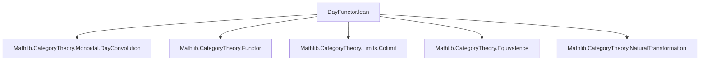

### Technical Brief: `DayFunctor.lean`

---

#### **1. Key Definitions & Theorems**

| Name | Type / Structure | Purpose |
|------|------------------|---------|
| `DayFunctor C V` | `Type (u₁ ⊔ u₂ ⊔ v₁ ⊔ v₂)` (one-field structure) | Type synonym for the functor category `C ⥤ V`, equipped with the *Day convolution* monoidal structure. |
| `Hom F G` | Structure with field `natTrans : F.functor ⟶ G.functor` | Morphisms in `C ⊛⥤ V` are natural transformations of underlying functors. |
| `Category (C ⊛⥤ V)` | Instance | Defines identity and composition via underlying natural transformations. |
| `equiv C V` | `C ⊛⥤ V ≌ C ⥤ V` | Tautological equivalence of categories; underlying functor is `F ↦ F.functor`. |
| `η F G` | `F.functor ⊠ G.functor ⟶ tensor C ⋙ (F ⊗ G).functor` | Unit of the Day convolution: exhibits `(F ⊗ G).functor` as left Kan extension of `F ⊠ G`. |
| `tensorDesc α` | `F ⊗ G ⟶ H` | Universal property: morphism induced by `α : F ⊠ G ⟶ tensor C ⋙ H`. |
| `isoPointwiseLeftKanExtension F G` | `(F ⊗ G).functor ≅ (tensor C).pointwiseLeftKanExtension (F.functor ⊠ G.functor)` | Shows `(F ⊗ G).functor` is the pointwise left Kan extension of `F ⊠ G`. |
| `ν C V` | `𝟙_ V ⟶ (𝟙_ (C ⊛⥤ V)).functor.obj (𝟙_ C)` | Unit morphism for Day convolution monoidal structure. |
| `νNatTrans C V` | `Functor.fromPUnit (𝟙_ V) ⟶ (𝟙_ C) ⋙ (𝟙_ (C ⊛⥤ V)).functor` | Reinterpretation of `ν` as a natural transformation. |
| `unitDesc φ` | `𝟙_ (C ⊛⥤ V) ⟶ F` | Universal property for unit: morphism induced by `φ : 𝟙_ V ⟶ F.obj (𝟙_ C)`. |

**Theorems (used as lemmas/instances):**
- `tensor_hom_ext`: Extensionality for morphisms out of `F ⊗ G`, using universal property of left Kan extension.
- `unit_hom_ext`: Extensionality for morphisms out of unit object `𝟙_ (C ⊛⥤ V)`.
- `η_comp_tensorDesc_app`, `ν_comp_unitDesc`, `η_comp_isoPointwiseLeftKanExtension_hom`, etc.: Explicit component-wise descriptions of universal morphisms.
- `instance : MonoidalCategory (C ⊛⥤ V)`: Constructs Day convolution monoidal structure on `C ⊛⥤ V`.
- `instance : LawfulDayConvolutionMonoidalCategoryStruct C V (C ⊛⥤ V)`: Ensures coherence with LawfulDayConvolution framework.

---

#### **2. Naming Conventions**

| Pattern | Examples | Meaning |
|--------|----------|---------|
| `*_desc` | `tensorDesc`, `unitDesc` | Universal morphism induced by a universal property (e.g., left Kan extension). |
| `*_ext` | `tensor_hom_ext`, `unit_hom_ext` | Extensionality lemmas for morphisms defined via universal properties. |
| `*_app` | `η F G .app (x, y)`, `ν C V` | Component of natural transformation or morphism at an object. |
| `iso*_` | `isoPointwiseLeftKanExtension` | Isomorphism witnessing equivalence of constructions. |
| `*_NatTrans` | `νNatTrans` | Natural transformation version of a morphism. |
| `isLeftKanExtension` | `instance : (F ⊗ G).functor.IsLeftKanExtension (η F G)` | Instance asserting a functor is a left Kan extension. |

---

#### **3. Tactic Stack**

| Tactic | Usage Frequency | Purpose |
|--------|-----------------|---------|
| `ext` / `ext1` | High | Hom-extensionality (via `hom_ext`, `Functor.ext`, etc.). |
| `simp` / `simpa` | Very High | Simplification using `@[simp]` lemmas (e.g., `η_comp_tensorDesc_app`, `ν_comp_unitDesc`). |
| `grind` | Medium | Automated equality proof (used in `hom_ext`). |
| `cases` | Medium | Destructuring structures (e.g., `cases α`, `cases β`). |
| `apply ...` | Medium | Applying lemmas like `Functor.hom_ext_of_isLeftKanExtension`. |
| `exact` / `refine` | Low | Direct proof steps. |
| `rw`, `rewrite` | Low | Rewriting using definitional equalities. |

No heavy automation (e.g., `aesop`, `ring`, `linarith`) is used — proofs rely on categorical universal properties and explicit component-wise reasoning.

---

#### **4. Proof Logic**

The logical flow follows a **universal property–driven pattern**:

1. **Define underlying category**: `DayFunctor` as type synonym for `C ⥤ V`, with morphisms as natural transformations.
2. **Establish equivalence**: `equiv : C ⊛⥤ V ≌ C ⥤ V` to transfer structure.
3. **Assume existence of Day convolutions**:
   - `hasDayConvolution`: existence of left Kan extensions for `F ⊠ G` along `tensor C`.
   - `hasDayConvolutionUnit`: existence for unit.
   - Colimit preservation assumptions for tensor functors.
4. **Transport monoidal structure** via `equiv` using `monoidalOfHasDayConvolutions`.
5. **Verify coherence** via `lawfulDayConvolutionMonoidalCategoryStructOfHasDayConvolutions`.
6. **Construct universal morphisms**:
   - `tensorDesc`, `unitDesc`: induced by left Kan extension universal properties.
7. **Prove extensionality**:
   - `tensor_hom_ext`, `unit_hom_ext`: morphisms are determined by components at generating objects.
8. **Relate to pointwise Kan extensions**:
   - `isoPointwiseLeftKanExtension`: shows `(F ⊗ G).functor` is the canonical pointwise Kan extension.
9. **Verify component-wise behavior**:
   - Lemmas like `η_comp_isoPointwiseLeftKanExtension_hom` ensure compatibility with colimit cocones.

Induction or case analysis is minimal; most arguments are *abstract categorical* (via universal properties), not syntactic.

---

#### **5. Imports**

| Import | Role |
|--------|------|
| `Mathlib.CategoryTheory.Monoidal.DayConvolution` | Core definitions: `DayConvolution`, `hasDayConvolution`, `LawfulDayConvolutionMonoidalCategoryStruct`, `isoPointwiseLeftKanExtension`, etc. |
| `Mathlib.CategoryTheory.Functor` | Basic functor calculus (`Functor.fromPUnit`, `⊠`, ` whiskerLeft`, etc.). |
| `Mathlib.CategoryTheory.Limits.Colimit` | For left Kan extensions via colimits (`CostructuredArrow`, `colimit.ι`, etc.). |
| `Mathlib.CategoryTheory.Equivalence` | For `equiv`, `unitIso`, `counitIso`. |
| `Mathlib.CategoryTheory.NaturalTransformation` | For `natTrans`, `η`, `νNatTrans`. |

---

#### **6. Mermaid Diagrams**

##### **Dependency Graph (Module-Level)**



##### **Conceptual Overview of `DayFunctor` Construction**

```mermaid
flowchart LR
  subgraph "Input"
    C[Monoidal Category C]
    V[Monoidal Category V]
  end

  subgraph "Construction"
    F[C ⥤ V] -->|type synonym| D[DayFunctor C V := C ⊛⥤ V]
    D -->|transport along equiv| M[MonoidalCategory (C ⊛⥤ V)]
    M -->|via hasDayConvolution| DC[Day Convolution Structure]
  end

  subgraph "Universal Properties"
    η["η F G : F ⊠ G ⇒ tensor ⋙ (F ⊗ G)"]
    ν["ν : 𝟙_V ⇒ 𝟙_{C⊛⥤V}.obj (𝟙_C)"]
    tensorDesc["tensorDesc : F ⊠ G ⇒ tensor ⋙ H ⇒ F ⊗ G ⇒ H"]
    unitDesc["unitDesc : 𝟙_V ⇒ F.obj 𝟙_C ⇒ 𝟙_{C⊛⥤V} ⇒ F"]
  end

  subgraph "Coherence"
    isoPLK["isoPointwiseLeftKanExtension"]
    homExt["tensor_hom_ext", "unit_hom_ext"]
  end

  D --> M
  M --> DC
  DC --> η
  DC --> ν
  η --> tensorDesc
  ν --> unitDesc
  η --> isoPLK
  tensorDesc --> homExt
  unitDesc --> homExt
```

##### **Relationship to Yoneda & Future Work (TODOs)**

```mermaid
flowchart LR
  subgraph "Current"
    D[C ⊛⥤ V]
  end

  subgraph "Future (TODO)"
    Y[Yoneda: C → (Cᵒᵖ ⊛⥤ Type)]
    U[Universal Property: colim-preserving monoidal (Cᵒᵖ ⊛⥤ Type) ⥤ W ≃ monoidal C ⥤ W]
    L[LawfulDayConvolution ⇒ ι: D ⥤ (C ⊛⥤ V) monoidal]
  end

  D -->|specialize V := Type| Y
  Y --> U
  D -->|underlying structure| L
```

---

### Summary

This file formalizes the **Day convolution monoidal structure** on the functor category `C ⥤ V` via a type synonym `DayFunctor C V`. It leverages the existing `DayConvolution` infrastructure in Mathlib, constructs the monoidal structure via transport along a tautological equivalence, and verifies universal properties (tensor and unit) using left Kan extensions. The proofs are largely abstract, relying on categorical universal properties and explicit component-wise verification. The structure is foundational for higher categorical constructions (e.g., enriched category theory, monoidal Yoneda embeddings), as indicated by the TODOs.
