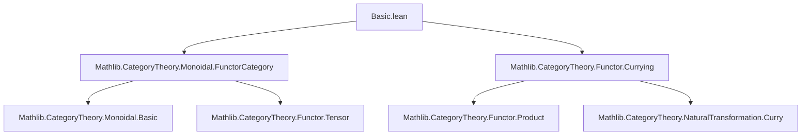
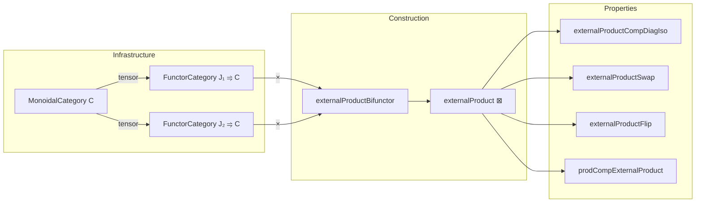

**Technical Brief: `Basic.lean` — External Product of Diagrams in a Monoidal Category**

---

### 1. **Key Definitions & Theorems**

| Name | Type | Purpose |
|------|------|---------|
| `externalProductBifunctorCurried` | `(J₁ ⥤ C) ⥤ (J₂ ⥤ C) ⥤ J₁ ⥤ J₂ ⥤ C` | Curried version of the external product bifunctor: maps `(F₁, F₂)` to `(j₁, j₂) ↦ F₁ j₁ ⊗ F₂ j₂`. Constructed via `curriedTensor`, `evaluation`, and `whiskeringLeft₂`. |
| `externalProductBifunctor` | `((J₁ ⥤ C) × (J₂ ⥤ C)) ⥤ J₁ × J₂ ⥤ C` | Uncurried external product bifunctor. Defined as `uncurry ∘ externalProductBifunctorCurried`. |
| `externalProduct` (notation `⊠`) | `(J₁ ⥤ C) → (J₂ ⥤ C) → J₁ × J₂ ⥤ C` | Abbreviation for `externalProductBifunctor.obj (F₁, F₂)`. Scoped to `CategoryTheory.MonoidalCategory.ExternalProduct`. |
| `externalProductCompDiagIso` | `externalProductBifunctor J₁ J₁ C ⋙ whiskeringLeft _ _ _ (Functor.diag J₁) ≅ tensor (J₁ ⥤ C)` | When both diagrams share domain `J₁`, composing `⊠` with the diagonal yields the pointwise tensor product `F₁ ⊗ F₂`. |
| `externalProductSwap` | `externalProductBifunctor J₁ J₂ C ⋙ whiskeringLeft _ _ _ Prod.swap ≅ Prod.swap ⋙ externalProductBifunctor J₂ J₁ C` | In a **braided** monoidal category, swapping the domain factors yields an isomorphism `F₁ ⊠ F₂ ≅ F₂ ⊠ F₁`. |
| `externalProductFlip` | `(flipFunctor ∘ externalProductBifunctorCurried J₁ J₂ C) ≅ (externalProductBifunctorCurried J₂ J₁ C).flip` | Curried version of `externalProductSwap`, expressed via `flipFunctor`. |
| `prodCompExternalProduct` | `F₁.prod F₂ ⋙ G₁ ⊠ G₂ ≅ (F₁ ⋙ G₁) ⊠ (F₂ ⋙ G₂)` | Compatibility of external product with composition: precomposing a product diagram with `F₁ × F₂` yields the external product of the composites. |

All definitions are equipped with `@[simps!]`, ensuring automatic simplification of components and hom-maps.

---

### 2. **Naming Conventions**

- **Prefixes**:
  - `externalProduct*`: Core definitions and isomorphisms related to the external product.
  - `prodComp*`: Interaction with product of functors (`prod` = `Functor.prod`).
- **Suffixes**:
  - `*Iso`: Natural isomorphisms (e.g., `externalProductCompDiagIso`).
  - `*Flip`, `*Swap`: Symmetry-related constructions.
- **Notation**:
  - Scoped infix `⊠` (right-associative, precedence 80) under `CategoryTheory.MonoidalCategory.ExternalProduct`.

---

### 3. **Tactic Stack**

Frequent tactics used in proofs and `simps!`-derived lemmas:

| Tactic | Role |
|--------|------|
| `simp` / `simp only` | Simplify hom-components using definitions (`tensorHom_def`, `whisker_exchange`, etc.). |
| `ext` | Extensionality for natural transformations/natural isomorphisms. |
| `rw` / `simp_rw` | Rewrite using known equalities (e.g., `tensorHom_def`). |
| `exact` / `refl` | Prove identity isomorphisms (`Iso.refl _`). |
| `aesop` | Not present — proofs are mostly manual or `simp`-driven. |
| `curry_uncurry` (implicit via `uncurry.obj`, `curriedTensor`) | Structural isomorphisms in functor categories. |

No heavy automation (e.g., `ring`, `linarith`) — the proofs rely on categorical identities and `simps!`.

---

### 4. **Proof Logic**

- **Structure**: All isomorphisms are constructed via `NatIso.ofComponents`, where:
  1. **Component morphisms** are defined pointwise (often `Iso.refl _` or the braiding `β_ _ _`).
  2. **Naturality squares** are verified by `ext; simp`, using lemmas like `whisker_exchange`, `tensorHom_def`.
- **Induction**: Not used — all constructions are *pointwise* and *natural*, leveraging universal properties of functor categories.
- **Key reasoning pattern**:
  ```lean
  NatIso.ofComponents
    (fun _ ↦ NatIso.ofComponents (fun _ ↦ ...) (by simp [*]))
    (fun _ ↦ by ext; simp [*])
  ```
  where `[*]` includes definitions and basic lemmas.

---

### 5. **Imports**

| Import | Purpose |
|--------|---------|
| `Mathlib.CategoryTheory.Monoidal.FunctorCategory` | Provides `FunctorCategory`, `tensor`, `braiding`, `whiskering`, `evaluation`, `currying`, `flipFunctor`, etc. |
| `Mathlib.CategoryTheory.Functor.Currying` | Supplies `curriedTensor`, `uncurry`, `flipFunctor`, and related isomorphisms for currying/uncurrying functors. |

These imports define the ambient categorical infrastructure (monoidal structure, functor categories, currying, whiskering).

---

### 6. **Mermaid Diagrams**

#### **Dependency Graph (Module-Level)**



#### **Overview of Theoretical Flow**



#### **Curried vs. Uncurried View**

```mermaid
graph LR
  A[(J₁ ⥤ C)] -->|externalProductBifunctorCurried| B[(J₂ ⥤ C) ⥤ J₁ ⥤ J₂ ⥤ C]
  C[(J₁ ⥤ C) × (J₂ ⥤ C)] -->|externalProductBifunctor| D[J₁ × J₂ ⥤ C]
  A -->|prod| C
  B -->|uncurry| D
```

---

### Summary

This module formalizes the **external product of diagrams** in a monoidal category, a fundamental construction used to lift bifunctors from the base category to diagram categories. It leverages advanced categorical machinery (currying, whiskering, braiding) to define and relate `⊠`, its symmetries, and its compatibility with composition. The formalization is clean, modular, and heavily annotated with `simps!` for usability in downstream developments (e.g., coends, Kan extensions, monoidal limits).
