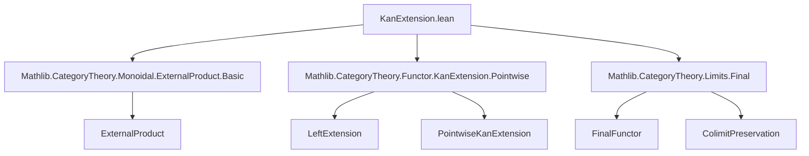

### Technical Brief: `KanExtension.lean`

---

#### **1. Key Definitions & Theorems**

| Name | Type / Signature | Purpose |
|------|------------------|---------|
| `extensionUnitLeft` | `H ⊠ K ⟶ L.prod (𝟭 E) ⋙ H' ⊠ K` | Canonical extension induced by bifunctoriality of external product from `α : H ⟶ L ⋙ H'`. |
| `extensionUnitRight` | `K ⊠ H ⟶ (𝟭 E).prod L ⋙ K ⊠ H'` | Analogous to `extensionUnitLeft`, but for the right external product. |
| `isPointwiseLeftKanExtensionAtExtensionUnitLeft` | `(d : D') → P : (H', α).IsPointwiseLeftKanExtensionAt d → (e : E) → [PreservesColimitsOfShape (CostructuredArrow L d) (tensorRight (K.obj e))] → (H' ⊠ K, extensionUnitLeft).IsPointwiseLeftKanExtensionAt (d, e)` | Shows that pointwise left Kan extension is preserved at a point `(d, e)` under external product with `K`, assuming right tensor preserves colimits over `CostructuredArrow L d`. |
| `isPointwiseLeftKanExtensionExtensionUnitLeft` | `[∀ d e, PreservesColimitsOfShape (CostructuredArrow L d) (tensorRight (K.obj e))] → (H', α).IsPointwiseLeftKanExtension → (H' ⊠ K, extensionUnitLeft).IsPointwiseLeftKanExtension` | Global version: if `H'` is a pointwise left Kan extension and right tensor preserves all relevant colimits, then `H' ⊠ K` is too. |
| `isPointwiseLeftKanExtensionAtExtensionUnitRight` | `(d : D') → P : (H', α).IsPointwiseLeftKanExtensionAt d → (e : E) → [PreservesColimitsOfShape (CostructuredArrow L d) (tensorLeft (K.obj e))] → (K ⊠ H', extensionUnitRight).IsPointwiseLeftKanExtensionAt (e, d)` | Symmetric to `extensionUnitLeft`, but for `K ⊠ H'` and left tensor preservation. |
| `isPointwiseLeftKanExtensionExtensionUnitRight` | `[∀ d e, PreservesColimitsOfShape (CostructuredArrow L d) (tensorLeft (K.obj e))] → (H', α).IsPointwiseLeftKanExtension → (K ⊠ H', extensionUnitRight).IsPointwiseLeftKanExtension` | Global version for `K ⊠ H'`. |

---

#### **2. Naming Conventions**

- **Prefixes**:
  - `extensionUnit*`: Canonical extensions induced by bifunctoriality.
  - `isPointwiseLeftKanExtensionAt*`: Pointwise preservation at an object.
  - `isPointwiseLeftKanExtension*`: Global preservation of pointwise left Kan extensions.
- **Suffixes**:
  - `ExtensionUnitLeft`: External product on the left (`H' ⊠ K`).
  - `ExtensionUnitRight`: External product on the right (`K ⊠ H'`).
- **Variables**:
  - `α`: Extension morphism `H ⟶ L ⋙ H'`.
  - `P`: Proof that `H'` is a pointwise left Kan extension at some object.
  - `I`: A final functor used to simplify colimit diagrams.

---

#### **3. Tactic Stack**

- **Core tactics**:
  - `set`, `let`, `letI`: For local definitions and typeclass inference.
  - `apply`, `exact`: Standard proof construction.
  - `infer_instance`: For typeclass resolution.
- **Category-theoretic automation**:
  - `Functor.final_fromPUnit_of_isTerminal`, `Functor.final_iff_final_comp`: To prove finality of indexing diagrams.
  - `Limits.IsColimit.ofWhiskerEquivalence`, `Limits.IsColimit.equivOfNatIsoOfIso`: To transport colimit structures along equivalences and natural isomorphisms.
  - `Limits.PreservesColimit.preserves`: To apply preservation of colimits.
  - `NatIso.ofComponents`: To construct natural isomorphisms componentwise.
  - `Limits.Cocones.ext`: To extend cocones uniquely.

---

#### **4. Proof Logic**

The proofs follow a **structured colimit-transport strategy**:

1. **Identify diagram equivalences**:
   - Use `CostructuredArrow.prodEquivalence` to relate the diagram for `(H' ⊠ K)` at `(d, e)` to a product of diagrams.
2. **Simplify via final functors**:
   - Construct a final functor `I` from `CostructuredArrow L d` to the product diagram (e.g., `I : CostructuredArrow L d ⥤ (CostructuredArrow L d) × CostructuredArrow (𝟭 E) e`).
   - Prove `I` is final using `Functor.final_fromPUnit_of_isTerminal` and `Functor.final_iff_final_comp`.
3. **Transport colimit structure**:
   - Apply `Limits.IsColimit.ofWhiskerEquivalence` to reduce to a simpler cocone.
   - Use `Functor.Final.isColimitWhiskerEquiv` to whisker along `I`.
4. **Relate to original colimit**:
   - Show the resulting cocone is isomorphic to `tensorRight (K.obj e)` (or `tensorLeft`) applied to the original colimit cocone.
   - Use `Limits.IsColimit.equivOfNatIsoOfIso` to conclude via the assumed preservation of colimits.
5. **Globalize**:
   - For the global theorems, quantify over all `(d, e)` and apply the pointwise version.

---

#### **5. Imports**

- `Mathlib.CategoryTheory.Monoidal.ExternalProduct.Basic`: Defines external product bifunctor and basic properties.
- `Mathlib.CategoryTheory.Functor.KanExtension.Pointwise`: Defines pointwise left Kan extensions and their cocones.
- `Mathlib.CategoryTheory.Limits.Final`: Provides tools for working with final functors and colimits.

---

#### **6. Mermaid Diagrams**

##### **Dependency Graph (Module-Level)**



##### **Overview of Theoretical Flow**

```mermaid
flowchart LR
  subgraph Setup
    H[H : D ⥤ V]
    L[L : D ⥤ D']
    H'[H' : D' ⥤ V]
    α[α : H ⟶ L ⋙ H']
    K[K : E ⥤ V]
  end

  subgraph Assumptions
    P[P : H' is pointwise L-Kan extension]
    ColimPres[ tensorRight(K e) preserves colimits over CostructuredArrow L d ]
  end

  subgraph Main Result
    H'K[H' ⊠ K]
    L×1[L.prod (𝟭 E)]
    extLeft[extensionUnitLeft]
    isLeft[isPointwiseLeftKanExtension]
  end

  H -- α --> H'
  L -- --> D'
  H'K -- extLeft --> L×1 ⋙ H'K
  P & ColimPres --> isLeft

  style H'K fill:#f9f,stroke:#333
  style isLeft fill:#9f9,stroke:#333
```

##### **Diagram Simplification via Finality**

```mermaid
flowchart LR
  CostructuredArrowLd[CostructuredArrow L d]
  ProductDiagram[(CostructuredArrow L d) × (CostructuredArrow (𝟭 E) e)]
  I[I : CostructuredArrow L d ⥤ ProductDiagram]

  CostructuredArrowLd -- I --> ProductDiagram
  I -- final --> |colimit preservation| CostructuredArrowLd

  style I fill:#ddf,stroke:#333
```

---

#### **7. Summary**

This file formalizes a **preservation theorem** for pointwise left Kan extensions under external products in monoidal categories. It shows that if `H'` is a pointwise left Kan extension of `H` along `L`, and tensoring with objects of `K` preserves colimits over the relevant indexing diagrams (`CostructuredArrow L d`), then the external product `H' ⊠ K` (resp. `K ⊠ H'`) is a pointwise left Kan extension along `L × 1` (resp. `1 × L`). The proofs rely heavily on **finality arguments**, **colimit transport**, and **bifunctoriality of external products**.

--- 

Let me know if you'd like a formalized summary in Lean syntax or a visualization of the cocone diagrams.
