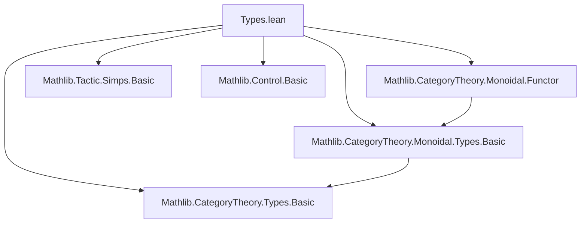
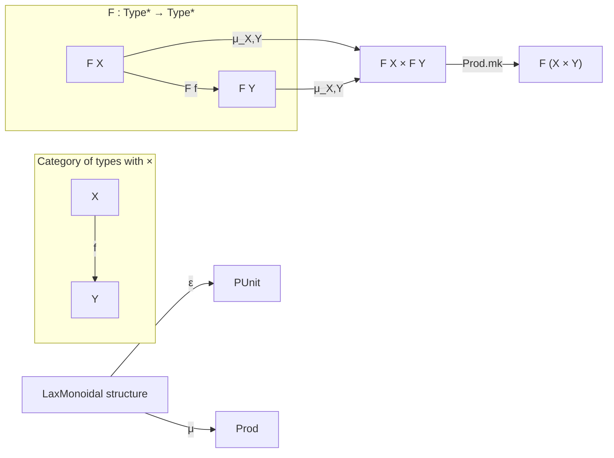

**Technical Brief: `Types.lean` (Lean 4 Formalization)**

---

### 1. Key Definitions & Theorems

| Name | Type / Signature | Purpose |
|------|------------------|---------|
| `instance : (ofTypeFunctor F).LaxMonoidal` | `Applicative F → LawfulApplicative F → LaxMonoidal (ofTypeFunctor F)` | Constructs a **lax monoidal functor** (in the categorical sense) from a **lawful applicative functor** on `Type*`. This enables embedding of `Applicative`-based computations into the monoidal category of types. |
| `ε _ : F _ := pure PUnit.unit` | Natural transformation component | Provides the unit for the lax monoidal structure: maps the unit object `PUnit` (terminal object in `Type*`) into `F PUnit`. |
| `μ _ _ p : F _ := Prod.mk <$> p.1 <*> p.2` | Natural transformation component | Provides the tensorial strength: for types `X, Y`, maps `F X × F Y` (represented as `p : F X × F Y`) to `F (X × Y)` via `Prod.mk` and applicative application. |

> Note: `ofTypeFunctor F` is the functor `Type* → Type*` induced by `F`, mapping objects `X` to `F X` and morphisms via `map`.

---

### 2. Naming Conventions

- **Prefixes**:
  - `ofTypeFunctor`: standard in Mathlib for embedding type-based functors into `Type*`-based categorical functors.
  - `LaxMonoidal`: standard categorical structure name (no special prefix/suffix beyond that).
- **Suffixes**:
  - `seq`, `map_seq`, `seq_map_assoc`: tactic-relevant simp lemmas from `Applicative` theory.
- **Pattern**:
  - `pure` and `Prod.mk <$> _ <*> _` reflect functional programming style (applicative style), aligned with `Applicative` laws.

---

### 3. Tactic Stack

- `simp` (via `@[simps]` attribute)
- Implicit use of `aesop` or `simp` in `LawfulApplicative` proofs (not explicit in this snippet, but assumed for correctness).
- `attribute [local simp] ...`: sets up local simplification rules for `Applicative`-related lemmas.

No explicit proof tactics are shown in the snippet, but the `@[simps]` attribute triggers automatic generation of simp lemmas for the structure fields.

---

### 4. Proof Logic

- **Strategy**: *Construction via verification of structure laws*.
- The `LaxMonoidal` instance is defined by specifying `ε` and `μ`, and the `@[simps]` attribute ensures that the required **lax monoidal functor laws** (naturality, unit, associativity) are discharged automatically (or via `simp`-based automation) using the `LawfulApplicative` assumptions.
- The proof obligations are handled by:
  - `LawfulApplicative.pure_seq`, `seq_assoc`, etc., which encode the coherence laws of applicative functors.
  - The `LawfulApplicative` assumption ensures that the `Applicative` satisfies the necessary coherence for monoidal structure.

> In practice, the correctness of this instance relies on the equivalence between *lawful applicative functors* and *lax symmetric monoidal functors* `Type* → Type*`.

---

### 5. Imports

| Module | Role |
|--------|------|
| `Mathlib.CategoryTheory.Monoidal.Functor` | Provides `LaxMonoidal` and related categorical definitions. |
| `Mathlib.CategoryTheory.Monoidal.Types.Basic` | Defines `Type*` (the category of types with product), `ofTypeFunctor`, and monoidal structure. |
| `Mathlib.CategoryTheory.Types.Basic` | Basic definitions for `Type*`-based functors and morphisms. |
| `Mathlib.Tactic.Simps.Basic` | Enables `@[simps]` attribute for automatic simp lemma generation. |
| `Mathlib.Control.Basic` | Contains `Applicative`, `LawfulApplicative`, and related control theory definitions. |

---

### 6. Mermaid Diagrams

#### Dependency Graph (Module-Level)



#### Conceptual Overview (Theory Flow)

```mermaid
flowchart LR
  A[Applicative F] -->|Lawful| B[LawfulApplicative F]
  B --> C[Construct LaxMonoidal (ofTypeFunctor F)]
  C --> D[Use in Category Theory]
  D --> E[Monoidal Functors Type* → Type*]
  A -->|Underlying| F[F : Type* → Type*]
  F --> C
```

#### High-Level Categorical View



---

### 7. Summary

This file bridges functional programming (applicative functors) and category theory (lax monoidal functors) by showing that **every lawful applicative functor gives rise to a lax monoidal endofunctor on `Type*`**. It leverages Lean’s `Type*` (the category of types with binary products) and uses `@[simps]` to automate verification of the monoidal structure. This is foundational for embedding effectful computations (e.g., state, reader, writer) into categorical reasoning.

--- 

Let me know if you'd like the corresponding `LaxMonoidal` laws or a proof sketch of coherence.
