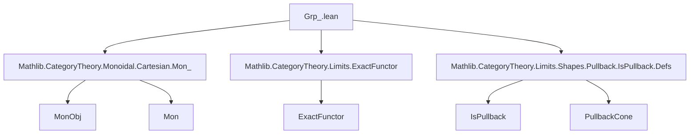

### Technical Brief: `Grp_.lean`

---

#### **1. Key Definitions & Theorems**

| Name | Type / Signature | Purpose |
|------|------------------|---------|
| `GrpObj X` | `class` extending `MonObj X` | Internal group object in a Cartesian monoidal category `C`. Adds inverse `inv : X ⟶ X` satisfying left/right inverse laws. |
| `Grp C` | `structure` | Bundled group object: underlying object `X : C` + `GrpObj X`. |
| `Grp.toMon` | `abbrev` | Forgets group structure to underlying monoid object. |
| `Grp.trivial` | `def` | Trivial group object: terminal object `𝟙_ C` with canonical group structure. |
| `Grp.homMk'`, `Grp.homMk`, `Grp.homMk''` | `def` | Constructors for morphisms of group objects, from monoid homs or raw maps with unit/multiplication compatibility. |
| `GrpObj.inv_comp_inv` | `theorem` | `ι ≫ ι = 𝟙 A`: inverse is an involution. |
| `GrpObj.inv_hom` | `theorem` | Morphisms of group objects commute with inverses: `ι ≫ f = f ≫ ι`. |
| `GrpObj.isPullback` | `theorem` | Associativity diagram of a group object is a pullback. |
| `GrpObj.tensorObj` | `instance` | Tensor product of group objects inherits group structure via `ι ⊗ₘ ι`. |
| `Grp.forget₂Mon` | `def` | Forgetful functor `Grp C ⥤ Mon C`. Fully faithful. |
| `Grp.forget` | `def` | Forgetful functor `Grp C ⥤ C`. Faithful. |
| `Grp.mkIso`, `Grp.mkIso'` | `def` | Construct isomorphisms of group objects from monoid isomorphisms. |
| `Grp.instCartesianMonoidalCategory` | `instance` | `Grp C` is Cartesian monoidal when `C` is. |
| `Grp.instBraidedCategory` | `instance` | If `C` is braided, then `Grp C` is braided. |
| `Functor.grpObjObj` | `abbrev` | Image of a group object under a monoidal functor is a group object. |
| `Functor.mapGrp` | `def` | Induced functor `Grp C ⥤ Grp D` from a monoidal functor `F : C ⥤ D`. |
| `Functor.FullyFaithful.mapGrp` | `def` | Fully faithful monoidal functors induce fully faithful functors on group objects. |
| `Functor.mapGrpNatTrans`, `mapGrpNatIso` | `def` | Lift natural transformations / isomorphisms to group objects. |
| `Functor.mapGrpFunctor` | `def` | Functoriality of `mapGrp`: `(C ⥤ₗ D) ⥤ (Grp C ⥤ Grp D)`. |
| `Functor.FullyFaithful.grpObj` | `abbrev` | Pullback group object along fully faithful monoidal functor. |
| `Adjunction.mapGrp` | `def` | Lifts an adjunction of monoidal functors to group objects. |
| `Equivalence.mapGrp` | `def` | Lifts an equivalence of categories to group objects. |

---

#### **2. Naming Conventions**

- **Prefixes**:
  - `GrpObj.`: properties of internal group objects (e.g., `GrpObj.inv`, `GrpObj.isPullback`).
  - `Grp.`: constructions and properties of the *category* of group objects (e.g., `Grp.forget`, `Grp.mkIso`).
  - `Functor.`: behavior under functors (e.g., `Functor.mapGrp`, `Functor.grpObjObj`).
  - `adjunction`, `equivalence`: lifted constructions.

- **Suffixes**:
  - `_hom_hom`, `_hom_hom_hom`: projections of morphism components in nested hom-sets (e.g., `whiskerLeft_hom_hom`).
  - `_inv`: inverse-related (e.g., `inv_comp_inv`, `inv_hom`).
  - `_def`: definitional equalities (e.g., `obj.ι_def`, `tensorUnit_one`).
  - `''` (double prime): deprecated aliases (e.g., `Grp_`, `toMon_`).

- **Notation**:
  - `ι` / `ι[G]`: inverse in a group object (`GrpObj.inv`).
  - `μ`, `η`: multiplication and unit of monoid/group object.
  - `lift f g`: universal property of product (Cartesian structure).

---

#### **3. Tactic Stack**

- **Core tactics**:
  - `cat_disch`: discharge categorical equations automatically.
  - `aesop_cat`: Aesop for category theory (used in `tensorProductIsBinaryProduct`).
  - `simp`: heavily used, especially with `reassoc`, `hom_ext`, `ext`, `simp only`.
  - `rw`, `rwa`: rewriting using lemmas like `left_inv`, `right_inv`, `lift_comp_inv_right`.
  - `apply`, `refine`: for constructing morphisms and limits.
  - `ext`: extensionality for morphisms (often nested: `hom_ext`, `Mon.Hom.ext`).
  - `convert`: for equational reasoning with definitional equality gaps.

- **Category-specific automation**:
  - `by simp [MonObj.ofIso]`, `by simp [comp_lift_assoc]`, etc.
  - `nth_rw n [eq]`: nth rewrite.
  - `rwa [assoc, lift_map_assoc, ...]`: rewriting with associators and lift properties.

---

#### **4. Proof Logic**

- **Inductive/structural reasoning**:
  - Most proofs are *diagrammatic*: using universal properties (products, pullbacks), naturality, and monoidal coherence.
  - **Key pattern**: Prove equality of morphisms by applying `hom_ext` or `Mon.Hom.ext`, reducing to component-wise equalities.

- **Common proof patterns**:
  1. **Use `isPullback`**: To prove uniqueness or factorization through pullbacks (e.g., `inv_hom`, `lift_inv_left_eq`).
  2. **Lift lemmas**: Use `lift_*` lemmas to reduce to product projections.
  3. **Monoidal coherence**: Manipulate `μ`, `α`, `β`, `λ`, `ρ` using `reassoc`, `assoc`, `lift_*`, and `SymmetricCategory.symmetry_assoc`.
  4. **Fully faithfulness**: Prove properties of `mapGrp` by pulling back via `forget₂Mon`, which is fully faithful.

- **Example flow** (e.g., `inv_hom`):
  ```lean
  apply (isPullback B).hom_ext <;> apply CartesianMonoidalCategory.hom_ext <;>
    simp [lift_inv_comp_right, lift_inv_comp_left]
  ```
  → Reduce to checking two commuting squares using pullback universal property.

---

#### **5. Imports**

| Module | Purpose |
|--------|---------|
| `Mathlib.CategoryTheory.Monoidal.Cartesian.Mon_` | Monoid objects in Cartesian monoidal categories. |
| `Mathlib.CategoryTheory.Limits.ExactFunctor` | Exact functors (used for finite-product-preserving behavior). |
| `Mathlib.CategoryTheory.Limits.Shapes.Pullback.IsPullback.Defs` | Pullback definitions and basic lemmas. |

---

#### **6. Mermaid Diagrams**

##### **Dependency Graph (Top-Level)**



##### **Theory Overview**

```mermaid
graph TD
  subgraph "Base Theory"
    C[CartesianMonoidalCategory C]
    Mon[Mon C] --> C
    GrpObj[GrpObj X] --> Mon
  end

  subgraph "Group Object Category"
    Grp[Grp C] --> GrpObj
    Grp.forget --> C
    Grp.forget₂Mon --> Mon
  end

  subgraph "Functoriality"
    F[C ⥤ D] --> mapGrp[Grp C ⥤ Grp D]
    mapGrp --> Grp
  end

  subgraph "Structural Properties"
    isPullback[Associativity diagram is pullback] --> inv_hom[Inverses preserved]
    tensorObj[GrpObj(G ⊗ H)] --> instCartesianMonoidalCategory[Grp C is Cartesian monoidal]
  end

  C -->|induces| Grp
  F -->|monoidal| mapGrp
```

##### **Key Logical Flow**

```mermaid
graph LR
  A[GrpObj X] -->|defines| B[inv : X ⟶ X]
  B -->|left/right inverse| C[μ ∘ (id ⊗ inv) = η ∘ !]
  C -->|use product universal property| D[lift lemmas]
  D -->|prove| E[inv_hom : ι ≫ f = f ≫ ι]
  A -->|associativity diagram| F[IsPullback]
  F -->|pullback universal property| E
  E -->|preserve structure| G[Grp C is monoidal]
  G -->|cartesian| H[Grp C is Cartesian monoidal]
```

---

#### **7. Summary**

This file formalizes the theory of **internal group objects** in a Cartesian monoidal category. It establishes:

- A categorical framework (`Grp C`) for groups internal to `C`.
- Key structural results: inverses are involutive, morphisms preserve inverses, associativity diagrams are pullbacks.
- Functoriality: monoidal functors, natural transformations, adjunctions, and equivalences lift to group objects.
- Monoidal structure: `Grp C` inherits Cartesian monoidal structure from `C`, and braided structure when `C` is braided.

The formalization leverages:
- **Product universal properties** (via `lift` and `IsPullback`).
- **Fully faithfulness** of `forget₂Mon` to reduce proofs to the monoid level.
- **Simp lemmas** for projections (`hom.hom`, `X`, `μ`, `η`, `ι`) to enable automation.

It serves as a foundational module for internal group theory in higher categorical and homotopical contexts (e.g., in `Mathlib`’s homotopy theory or topos theory extensions).
