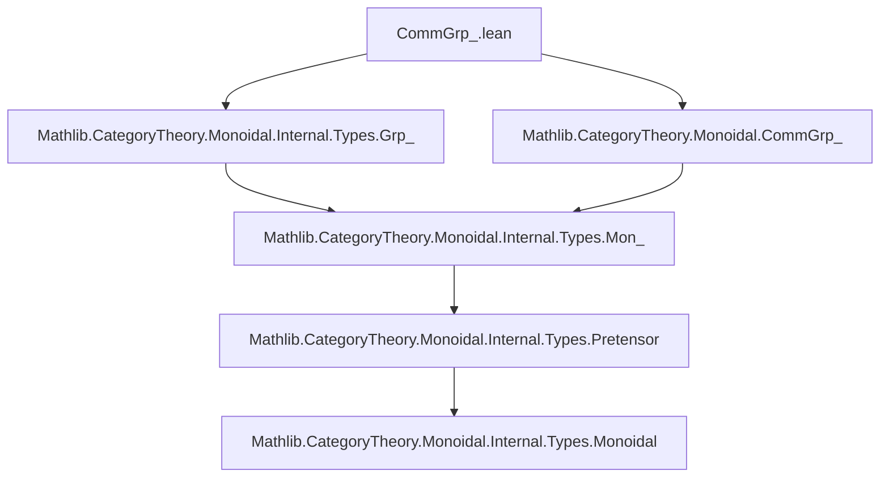

**Technical Brief: `CommGrp_.lean` — Equivalence of Internal and Bundled Commutative Groups**

---

### 1. **Key Definitions & Theorems**

| Name | Type / Signature | Purpose |
|------|------------------|---------|
| `commGrpCommGroup` | `(A : Type u) [GrpObj A] [IsCommMonObj A] → CommGroup A` | Constructs a classical commutative group structure from an internal commutative group object in `Type u`. |
| `functor` | `CommGrp (Type u) ⥤ CommGrpCat.{u}` | The forward direction of the equivalence: sends an internal commutative group object to its underlying bundled commutative group. |
| `inverse` | `CommGrpCat.{u} ⥤ CommGrp (Type u)` | The backward direction: lifts a bundled commutative group to an internal commutative group object in `Type u`. |
| `commGrpTypeEquivalenceCommGrp` | `CommGrp (Type u) ≌ CommGrpCat.{u}` | The main equivalence theorem: internal and bundled commutative groups are equivalent categories. |
| `commGrpTypeEquivalenceCommGrpForgetGrp` | `functor ⋙ forget₂ CommGrpCat GrpCat ≅ CommGrp.forget₂Grp (Type u) ⋙ GrpTypeEquivalenceGrp.functor` | Compatibility of the equivalence with the forgetful functor to groups (`GrpCat`). |
| `commGrpTypeEquivalenceCommGrpForgetCommMon` | `functor ⋙ forget₂ CommGrpCat CommMonCat ≅ CommGrp.forget₂CommMon (Type u) ⋙ CommMonTypeEquivalenceCommMon.functor` | Compatibility with the forgetful functor to commutative monoids. |

**Simp lemmas** (used for normalization of structure maps):
- `inverse_obj_X`: `(inverse.obj A).X = A`
- `inverse_obj_one`: `η[(inverse.obj A).X] x = 1`
- `inverse_obj_mul`: `μ[(inverse.obj A).X] p = p.1 * p.2`
- `inverse_obj_inv`: `ι[(inverse.obj A).X] x = x⁻¹`

---

### 2. **Naming Conventions**

- **Prefixes**:
  - `commGrp*`: for equivalences involving `CommGrp`.
  - `GrpTypeEquivalenceGrp.*`: reused from prior equivalence for non-commutative groups.
  - `forget₂ * *`: standard for forgetful functors between structured categories.
- **Suffixes**:
  - `*Obj`: for internal objects (e.g., `GrpObj`, `IsCommMonObj`).
  - `*Iso`, `*Iso.refl`: for natural isomorphisms.
  - `of`, `ofHom`: for embedding bundled structures into internal ones (via `GrpCat.of`, `ofHom`).
- **Structure fields**:
  - `X`, `η`, `μ`, `ι`: standard notation for internal group object structure (object, unit, multiplication, inverse).

---

### 3. **Tactic Stack**

- `ext`: used to extend over product types (e.g., `⟨x, y⟩`).
- `convert congr_fun (IsCommMonObj.mul_comm A) (y, x)`: to derive commutativity of multiplication from `IsCommMonObj`.
- `cat_disch`: used in `NatIso.ofComponents` to discharge category-theoretic goals.
- `rfl`: for definitional equalities (e.g., `inverse_obj_X`).
- `simp_rw` is *not* used explicitly, but `@[simp]` lemmas suggest `simp` is heavily used in downstream proofs.

---

### 4. **Proof Logic**

- **Construction of `commGrpCommGroup`**:  
  Uses `convert` + `congr_fun` to lift `IsCommMonObj.mul_comm` (a natural transformation) to pointwise commutativity.

- **Construction of `functor` / `inverse`**:  
  Leverages existing equivalences:
  - `GrpTypeEquivalenceGrp` for underlying groups.
  - `forget₂ CommGrpCat GrpCat` / `forget₂ CommGrpCat CommMonCat` to forget structure.
  - `InducedCategory.homMk` to lift morphisms.

- **Equivalence proof (`commGrpTypeEquivalenceCommGrp`)**:
  - `unitIso := Iso.refl _`: trivial unit (identity natural isomorphism).
  - `counitIso := NatIso.ofComponents ...`: uses `MulEquiv.toCommGrpIso` with `Equiv.refl`, and `rfl`-proven multiplicativity.

- **Forgetful compatibility**:  
  Both `commGrpTypeEquivalenceCommGrpForgetGrp` and `commGrpTypeEquivalenceCommGrpForgetCommMon` are proven by `Iso.refl _`, indicating definitional equality of the composite functors.

---

### 5. **Imports**

| Import | Role |
|--------|------|
| `Mathlib.CategoryTheory.Monoidal.Internal.Types.Grp_` | Defines internal group objects in `Type`. |
| `Mathlib.CategoryTheory.Monoidal.CommGrp_` | Defines internal commutative group objects in `Type`. |
| `Mathlib.CategoryTheory.Equivalence` (via `≈`, `≅`, `Iso`, `NatIso`) | For categorical equivalences and natural isomorphisms. |
| `Mathlib.CategoryTheory.Functor` | For composition (`⋙`), forgetful functors. |
| `Mathlib.Algebra.Group.Definitions` (via `CommGroup`, `CommMonoid`) | Classical algebraic structures. |

---

### 6. **Mermaid Diagrams**

#### **Dependency Graph (Module-Level)**



#### **Categorical Equivalence Overview**

```mermaid
graph LR
  subgraph "Internal"
    I[CommGrp (Type u)]
  end
  subgraph "Bundled"
    B[CommGrpCat.{u}]
  end
  I <-->|functor / inverse| B
  I -.->|CommGrp.forget₂Grp| G[Grp (Type u)]
  B -.->|forget₂| GB[GrpCat]
  G <-->|GrpTypeEquivalenceGrp| GB
  style I fill:#f9f,stroke:#333
  style B fill:#9ff,stroke:#333
```

#### **Forgetful Compatibility (Naturality Square)**

```mermaid
graph TD
  CommGrpType[CommGrp (Type u)] -->|functor| CommGrpCat[CommGrpCat]
  CommGrpType -->|forget₂Grp| GrpType[Grp (Type u)]
  CommGrpCat -->|forget₂| GrpCat[GrpCat]
  GrpType -->|GrpTypeEquivalenceGrp| GrpCat
  CommGrpType -.->|≈| GrpType
  CommGrpCat -.->|≈| GrpCat
  %% naturality:
  path1[functor ⋙ forget₂] -.->|commGrpTypeEquivalenceCommGrpForgetGrp| path2[forget₂Grp ⋙ GrpTypeEquivalenceGrp]
  style path1 fill:none,stroke:#00f
  style path2 fill:none,stroke:#00f
```

---

### 7. **Summary**

This file establishes the foundational equivalence between *internal* commutative group objects in `Type u` and *bundled* commutative groups (`CommGrpCat`). It builds on prior work for non-commutative groups (`GrpTypeEquivalenceGrp`) and commutative monoids (`CommMonTypeEquivalenceCommMon`), and verifies that the equivalence commutes with natural forgetful functors. The proofs are largely definitional or use standard categorical machinery (`Iso.refl`, `NatIso.ofComponents`), with algebraic verification handled via `ext` and `convert`.

This is a key step in the “synthetic” approach to algebra in Lean: allowing seamless translation between internal (categorical) and external (bundled) algebraic structures.
