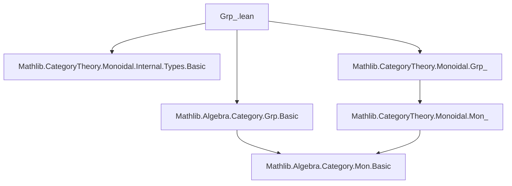

**Technical Brief: `Grp_.lean` — Equivalence between Internal Group Objects and Bundled Groups**

---

### 1. **Key Definitions & Theorems**

| Name | Type / Signature | Purpose |
|------|------------------|---------|
| `grpGroup` | `(A : Type u) [GrpObj A] → Group A` | Constructs a classical group structure from an internal group object in `Type u`, using the inverse map `ι[A]` and left inverse law. |
| `GrpTypeEquivalenceGrp.functor` | `Grp (Type u) ⥤ GrpCat.{u}` | Forwards direction of equivalence: sends an internal group object `A` to its underlying type equipped with the group structure from `grpGroup`, and a morphism to the induced group homomorphism. |
| `GrpTypeEquivalenceGrp.inverse` | `GrpCat.{u} ⥤ Grp (Type u)` | Backward direction: sends a bundled group `A` to the internal group object whose underlying monoid object comes from `MonTypeEquivalenceMon.inverse`, and group inverse is classical inversion. |
| `grpTypeEquivalenceGrp` | `Grp (Type u) ≌ GrpCat.{u}` | Main theorem: establishes the equivalence of categories between internal groups in `Type u` and bundled groups. |
| `grpTypeEquivalenceGrpForget` | `GrpTypeEquivalenceGrp.functor ⋙ forget₂ GrpCat MonCat ≅ Grp.forget₂Mon (Type u) ⋙ MonTypeEquivalenceMon.functor` | Shows compatibility of the equivalence with the forgetful functors to monoids (i.e., the square with `Grp` and `Mon` equivalences commutes up to natural isomorphism). |

---

### 2. **Naming Conventions**

- **Prefixes**:
  - `grp_`: for group-specific constructions (`grpGroup`, `grpTypeEquivalenceGrp`, `grpTypeEquivalenceGrpForget`)
  - `Mon_`: inherited from monoid equivalence (`MonTypeEquivalenceMon.*`)
  - `forget₂`: standard in Mathlib for forgetful functors between structured categories.

- **Suffixes**:
  - `_obj`, `_hom`: for components of functors/natural transformations (not used here directly, but implied via `obj`, `map`).
  - `Iso.refl`, `NatIso.ofComponents`: standard categorical naming.

- **Notable pattern**: `X` used for underlying type of an internal object (e.g., `A.X`), `ι[A]` for inverse in internal group object.

---

### 3. **Tactic Stack**

- `ext`: used in `left_inv` and `right_inv` proofs to extend over elements.
- `congr_fun`: to apply extensionality to function equalities (e.g., in `grpGroup`).
- `cat_disch`: used in `grpTypeEquivalenceGrp.counitIso` to discharge categorical diagram goals.
- `rfl`: used in `map_mul'` for multiplicative compatibility of the counit isomorphism.
- `exact`: for straightforward proof steps (e.g., `inv_mul_cancel`, `mul_inv_cancel`).

No heavy automation like `aesop` or `ring` is used—proofs are mostly direct algebraic reasoning.

---

### 4. **Proof Logic**

- **Construction of `grpGroup`**:  
  Define group structure by lifting the monoid structure (via `MonTypeEquivalenceMon.monMonoid`) and adding inverse via `ι[A]`. Verify group axioms using `GrpObj.left_inv` and `mul_inv_cancel`.

- **Functor definition**:  
  Directly induced from underlying monoidal equivalence: `obj` uses `GrpCat.of`, `map` uses `MonTypeEquivalenceMon.functor.map` and extracts underlying hom.

- **Inverse functor**:  
  Uses `MonTypeEquivalenceMon.inverse.obj` for the monoid part, then extends with group inverse. Verifies group axioms elementwise.

- **Equivalence proof (`grpTypeEquivalenceGrp`)**:  
  - `unitIso`: trivial (`Iso.refl _`) because the underlying types are definitionally equal.
  - `counitIso`: constructed via `NatIso.ofComponents`, using the identity equivalence on underlying types, and `rfl` for multiplicativity.

- **Forgetful compatibility (`grpTypeEquivalenceGrpForget`)**:  
  Again trivial (`Iso.refl _`) because the constructions are definitionally compatible with the forgetful functors.

---

### 5. **Imports**

| Import | Role |
|--------|------|
| `Mathlib.CategoryTheory.Monoidal.Internal.Types.Basic` | Basic definitions of internal monoids/groups in a monoidal category (here `Type`). |
| `Mathlib.CategoryTheory.Monoidal.Grp_` | Internal group objects in a monoidal category (used for `GrpObj`, `Grp (Type u)`). |
| `Mathlib.Algebra.Category.Grp.Basic` | Bundled groups (`GrpCat`, `Grp.hom`, `forget₂ GrpCat MonCat`). |

> **Note**: The file builds on the prior equivalence `Mon (Type u) ≌ MonCat.{u}` (`MonTypeEquivalenceMon`), reusing its components.

---

### 6. **Mermaid Diagrams**

#### **Dependency Graph (Module Level)**



#### **Categorical Equivalence Overview**

```mermaid
graph LR
  subgraph "Internal Groups"
    I[Grp (Type u)] -- functor --> F[GrpCat.{u}]
    F -- inverse --> I
  end

  subgraph "Forgetful Functors"
    I -- Grp.forget₂Mon --> M[Mon (Type u)]
    F -- forget₂ GrpCat MonCat --> N[MonCat.{u}]
    M -- MonTypeEquivalenceMon.functor --> N
  end

  I -.->|unitIso ≃| I
  F -.->|counitIso ≃| F

  M -- ≅ --> N
  I -- ≅ --> F
```

#### **Commutativity of Forgetful Square**

```mermaid
graph LR
  GrpType[Grp (Type u)] -- functor --> GrpCat[GrpCat.{u}]
  GrpType -- Grp.forget₂Mon --> MonType[Mon (Type u)]
  GrpCat -- forget₂ --> MonCat[MonCat.{u}]
  MonType -- MonTypeEquivalenceMon --> MonCat

  GrpType -- GrpTypeEquivalenceGrp.functor --> GrpCat
  MonType -- MonTypeEquivalenceMon.functor --> MonCat

  GrpType -- ≅ --> MonType
  GrpCat -- ≅ --> MonCat

  %% naturality square
  GrpType -- functor --> GrpCat
  GrpType -- Grp.forget₂Mon --> MonType
  GrpCat -- forget₂ --> MonCat
  MonType -- MonTypeEquivalenceMon --> MonCat

  %% 2-cell: natural iso between composites
  GrpType -.->|grpTypeEquivalenceGrpForget| MonType
```

---

### 7. **Summary**

This file formalizes the foundational result that *internal groups in `Type`* (i.e., group objects in the category of types) are equivalent to *bundled groups* (`GrpCat`). The equivalence is built by leveraging the already-established monoid equivalence, and it commutes with the forgetful functors to monoids. The proofs are mostly definitional or straightforward algebraic verifications, reflecting the “native” nature of the equivalence.

The file is part of a larger program to align internal categorical constructions with classical algebraic structures in Lean’s type theory.
