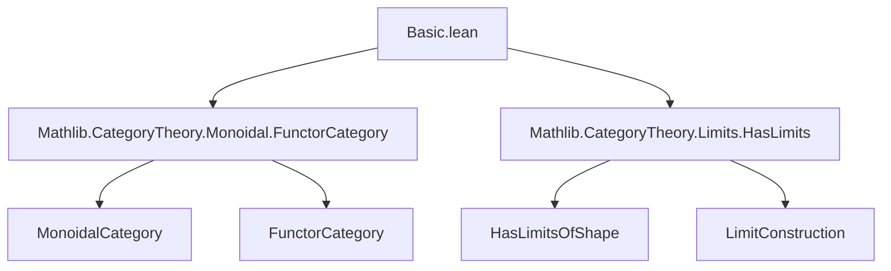
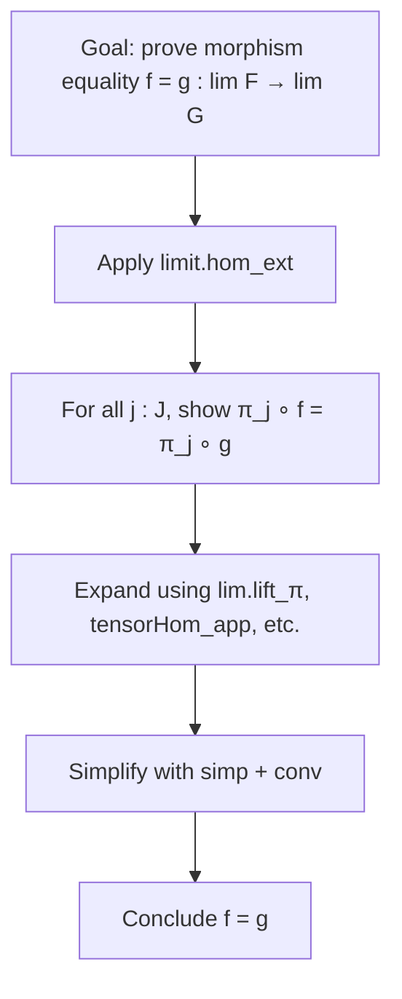

**Technical Brief: `Basic.lean` — Lax Monoidal Structure on Limit Functor**

---

### 1. **Key Definitions & Theorems**

| Name | Type / Signature | Purpose |
|------|------------------|---------|
| `lim` | `Functor (J ⥤ C) C` | Limit functor over diagram shape `J` in category `C`. |
| `LaxMonoidal` instance | `lim.LaxMonoidal` | Constructs `lim` as a lax monoidal functor when `C` is monoidal and has `J`-limits. |
| `ε` | `𝟙_ C → limit (𝟙_ (J ⥤ C))` | Unit morphism for lax monoidal structure. |
| `μ F G` | `limit F ⊗ limit G → limit (F ⊗ G)` | Tensor morphism for lax monoidal structure. |
| `lim_ε_π` | `ε ≫ π_j = 𝟙_ _` | Compatibility of unit with projections. |
| `lim_μ_π` | `μ ≫ π_j = π_j^F ⊗ₘ π_j^G` | Compatibility of tensor structure with projections. |

---

### 2. **Naming Conventions**

- **Prefixes**:
  - `lim_`: for lemmas about the limit functor.
  - `ε`, `μ`: standard notation for lax monoidal structure components.
- **Suffixes**:
  - `_π`: lemmas describing interaction with limit projections.
- **Operators**:
  - `⊗ₘ`: tensor morphism in monoidal category.
  - `limit.π F j`: projection from limit of `F` at index `j`.
  - `limit.lift _ cone`: universal morphism into limit.

---

### 3. **Tactic Stack**

Frequent tactics used in proofs:

- `limit.hom_ext`: extensionality for limit morphisms (proves equality by checking all projections).
- `simp only [...]`: heavily used to simplify using known lemmas (e.g., `limit.lift_π`, `tensorHom_comp_tensorHom`, `limit.w`).
- `dsimp`: simplifies definitional equalities.
- `conv_lhs` / `conv_rhs`: for equational reasoning on left/right sides.
- `rw [...]`: rewriting using naturality, associativity, unit laws, and tensor identities.
- `erw [...]`: rewrite with definitional equality (e.g., `erw [limit.lift_π]`).
- `simp only [Category.assoc, Category.id_comp, ...]`: for monoidal category axioms.

---

### 4. **Proof Logic**

The proof proceeds by constructing a `LaxMonoidal` structure via `Functor.LaxMonoidal.ofTensorHom`, requiring verification of:

1. **Naturality of `μ`**: `μ_natural` — shown by projecting to each `j` and using naturality of limit cones and tensor compatibility.
2. **Associativity**: `associativity` — verified by projecting to each `j`, then using:
   - Tensor associator naturality,
   - Whiskering identities,
   - Limit cone properties (`limit.lift_π`, `limit.w`).
3. **Left/Right Unitality**: `left_unitality`, `right_unitality` — verified similarly, using unitors and identity laws.

All proofs reduce to checking componentwise equations at each index `j : J`, then applying `limit.hom_ext`.

---

### 5. **Imports**

- `Mathlib.CategoryTheory.Monoidal.FunctorCategory`: defines monoidal structure on functor category `J ⥤ C`.
- `Mathlib.CategoryTheory.Limits.HasLimits`: provides existence of limits of shape `J`.

These imports define:
- The monoidal structure on `[J, C]` (pointwise tensor),
- The limit functor `lim : [J, C] → C`,
- The universal property of limits (`limit.lift`, `limit.π`, etc.).

---

### 8. **Mermaid Diagrams**

#### Dependency Graph (Module-Level)



#### Overview of Theory Flow

```mermaid
flowchart LR
  subgraph Setup
    J[SmallCategory J]
    C[Category C + HasLimitsOfShape J C + MonoidalCategory C]
  end

  subgraph Construction
    lim[lim : (J ⥤ C) ⥤ C]
    ε[ε : 𝟙 → lim 𝟙]
    μ[μ_{F,G} : lim F ⊗ lim G → lim (F ⊗ G)]
  end

  subgraph Verification
    nat[Naturality of μ]
    assoc[Associativity]
    left[L-unit]
    right[R-unit]
  end

  J & C --> lim
  lim --> ε
  lim --> μ
  ε & μ --> nat & assoc & left & right
  nat & assoc & left & right --> LaxMonoidal[LaxMonoidal lim]
```

#### Proof Strategy (Componentwise)



--- 

This file formalizes a foundational result in enriched category theory: **limits preserve monoidal structure laxly**, a key step toward understanding monoidal limits and coherence in higher category theory.
