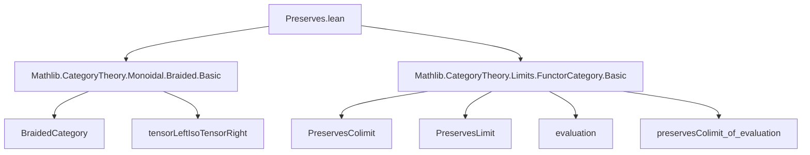
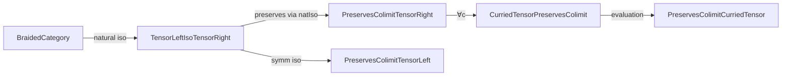

**Technical Brief: `Preserves.lean` — Preservation of (Co)limits in Monoidal Categories**

---

### 1. Key Definitions & Theorems

| Name | Type | Purpose |
|------|------|---------|
| `preservesColimit_of_braided_and_preservesColimit_tensor_left` | `instance` | Shows that in a **braided** monoidal category, if `tensorLeft c` preserves a colimit diagram `F`, then so does `tensorRight c`. Uses the natural isomorphism `tensorLeft c ≅ tensorRight c`. |
| `preservesColimit_of_braided_and_preservesColimit_tensor_right` | `lemma` | Converse direction: if `tensorRight c` preserves a colimit, then so does `tensorLeft c`. Not an instance to avoid loops. |
| `preservesCoLimit_curriedTensor` | `lemma` | If `tensorRight c` preserves colimits for all `c`, then the **curried tensor functor** `curriedTensor C : C ⥤ C ⥤ C` preserves colimits in the second argument uniformly. |
| `preservesLimit_of_braided_and_preservesLimit_tensor_left` | `instance` | Dual of the colimit version for **limits**: `tensorLeft c` preserving a limit ⇒ `tensorRight c` does too. |
| `preservesLimit_of_braided_and_preservesLimit_tensor_right` | `lemma` | Dual converse for limits; again not an instance to prevent loops. |
| `preservesLimit_curriedTensor` | `lemma` | Dual of the colimit version: uniform preservation of limits by `curriedTensor` under pointwise assumption. |

All rely on the core lemma:  
`preservesColimit_of_natIso F G` (resp. `preservesLimit_of_natIso`) — if two functors are naturally isomorphic and one preserves a (co)limit, then so does the other.

---

### 2. Naming Conventions

- **Prefixes**:
  - `preservesColimit_...` / `preservesLimit_...`: indicates preservation of colimits or limits.
  - `tensorLeft`, `tensorRight`: standard notation for left/right tensor functors $c \mapsto c \otimes x$, $c \mapsto x \otimes c$.
  - `curriedTensor`: the curried version $c \mapsto (d \mapsto c \otimes d)$.
- **Suffixes**:
  - `_of_braided_and_...`: highlights the braided hypothesis + preservation of one tensor side.
  - `_curriedTensor`: for results about the curried tensor functor.
- **Case**: All identifiers use `camelCase`, consistent with Mathlib style.

---

### 3. Tactic Stack

- `inferInstanceAs`: used to synthesize `PreservesColimit F (tensorRight c)` from the hypothesis `∀ c, ...`.
- `preservesColimit_of_natIso` / `preservesLimit_of_natIso`: core proof automation leveraging natural isomorphisms.
- `preservesColimit_of_evaluation` / `preservesLimit_of_evaluation`: used to lift pointwise preservation to preservation of a functor category (here, `curriedTensor`).
- Implicit use of `simp`/` rfl` via typeclass inference (e.g., `BraidedCategory.tensorLeftIsoTensorRight c`).

No heavy automation (e.g., `aesop`, `ring`, `linarith`) is needed — proofs are mostly *typeclass-based* and *categorical*.

---

### 4. Proof Logic

- **Structure**: All proofs follow a uniform pattern:
  1. Use the natural isomorphism `tensorLeft c ≅ tensorRight c` (from braiding).
  2. Apply `preservesColimit_of_natIso` (or its limit dual).
  3. For `curriedTensor`, apply `preservesColimit_of_evaluation`, which reduces preservation of a 2-argument functor to preservation of each evaluation `tensorRight c`.
- **Key logical flow**:
  - Braided ⇒ `tensorLeft c ≅ tensorRight c`
  - Preservation is invariant under natural isomorphism
  - Uniform preservation over all `c` ⇒ preservation of curried version via evaluation.

No induction or case analysis is used — purely categorical reasoning.

---

### 5. Imports

| Import | Role |
|--------|------|
| `Mathlib.CategoryTheory.Monoidal.Braided.Basic` | Provides `BraidedCategory`, `tensorLeftIsoTensorRight`, and basic braided monoidal category theory. |
| `Mathlib.CategoryTheory.Limits.FunctorCategory.Basic` | Provides `PreservesColimit`, `PreservesLimit`, `evaluation`, and tools like `preservesColimit_of_evaluation`. |

These imports define the ambient categorical context: limits/colimits in functor categories and braided monoidal structure.

---

### 6. Mermaid Diagrams

#### Dependency Graph (Module-Level)

#### Overview of Theoretical Flow

Same pattern holds dually for limits.

---

### 7. Summary

This file formalizes a standard but crucial fact in monoidal category theory: **in a braided monoidal category, left and right tensor functors preserve the same (co)limits**, and hence uniform preservation of one side implies preservation of the full tensor product (via currying). The proofs are elegant and rely on naturality and typeclass inference — a hallmark of modern Lean formalization.
