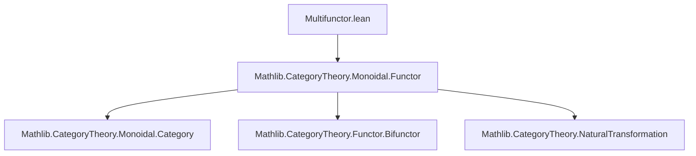
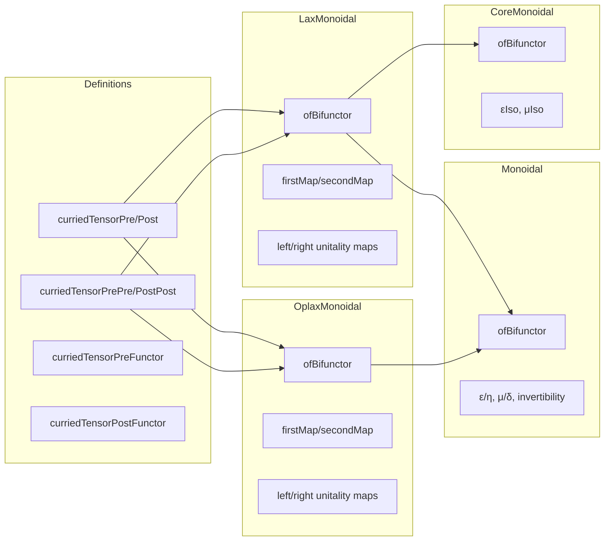

### Technical Brief: `Multifunctor.lean`

---

#### **1. Key Definitions & Theorems**

| Name | Type / Purpose |
|------|----------------|
| `curriedTensorInsertFunctor₁ F` | Bifunctor `(F -) ⊗ -` — inserts `F` into the left argument of tensor. |
| `curriedTensorInsertFunctor₂ F` | Bifunctor `- ⊗ (F -)` — inserts `F` into the right argument of tensor. |
| `curriedTensorPre F` | Bifunctor `F - ⊗ F -` — applies `F` to both arguments before tensoring. |
| `curriedTensorPost F` | Bifunctor `F (- ⊗ -)` — tensors first, then applies `F`. |
| `curriedTensorPrePre F`, `curriedTensorPrePre' F`, etc. | Trifunctors encoding various parenthesizations of `(F - ⊗ F -) ⊗ F -`, `F - ⊗ (F - ⊗ F -)`, etc. |
| `Functor.curriedTensorPreIsoPost F [F.Monoidal]` | Natural isomorphism `curriedTensorPre F ≅ curriedTensorPost F` induced by a monoidal functor. |
| `curriedTensorPreFunctor` | Functor `(C ⥤ D) ⥤ C ⥤ C ⥤ D` mapping `F ↦ F - ⊗ F -`. |
| `curriedTensorPostFunctor` | Functor `(C ⥤ D) ⥤ C ⥤ C ⥤ D` mapping `F ↦ F (- ⊗ -)`. |
| `ofBifunctor.{Lax,Oplax,Monoidal,CoreMonoidal}` | Constructors for lax/oplax/monoidal/coremonoidal functors from unit morphisms and tensorators satisfying coherence conditions. |
| `firstMap`, `secondMap` (for lax/oplax) | Composite natural transformations encoding the associativity hexagon diagrams. |
| `leftMapₗ`, `topMapₗ`, `bottomMapₗ`, etc. | Components of the left/right unitality squares for lax/oplax monoidal functors. |

**Theorems / Lemmas (implicit in definitions):**
- `ofBifunctor` for `LaxMonoidal`, `OplaxMonoidal`, `Monoidal`, `CoreMonoidal` — *constructs* the respective structure from unit/tensorator data satisfying coherence.
- Coherence conditions are expressed as equalities of natural transformations between trifunctors (associativity) and functors (unitality).

---

#### **2. Naming Conventions**

- **Prefixes:**
  - `curriedTensor*`: All bifunctor/trifunctor constructions involving tensor and `F`.
  - `firstMap*`, `secondMap*`: Left/right paths in associativity hexagon.
  - `leftMap*`, `topMap*`, `bottomMap*`, `rightMap*`: Arrows in unitality squares.
- **Suffixes:**
  - `₁`, `₂`, `₃`: Components of composite maps (e.g., `firstMap₁`, `firstMap₂`, `firstMap₃`).
  - `ₗ`, `ᵣ`: Left/right variants (e.g., `leftMapₗ`, `topMapᵣ`).
  - `Pre`, `Post`: Whether `F` is applied before (`Pre`) or after (`Post`) tensoring.
  - `Insert`, `Flip`, `Comp₁₂`, `Comp₂₃`: Indicate how bifunctors are composed or inserted.

---

#### **3. Tactic Stack**

- **`simp` / `simp_rw`**: Used heavily in `naturality` proofs and component-wise simplifications (e.g., `by simp [← id_tensorHom]`).
- **`ext`**: For extensionality arguments in naturality proofs.
- **`congr`**: Implicit via `NatTrans.congr_app` to reduce equalities of natural transformations to component-wise equalities.
- **`aesop` / `ring`**: Not explicitly used here — this file is mostly definitional and relies on `simp`-based automation.
- **`cases` / `exact`**: Used in proofs of naturality and coherence, though often deferred to `simp`-based tactics.

---

#### **4. Proof Logic**

- **Structure of proofs:**
  - Definitions are *constructive*: given unit/tensorator data satisfying coherence, construct the monoidal structure.
  - Coherence conditions are *phrased as equalities* of natural transformations (e.g., `firstMap μ = secondMap μ`).
  - Verification of monoidal functor laws reduces to:
    1. Naturality of `μ`/`δ` (handled via `naturality` lemmas).
    2. Component-wise equality of natural transformations (via `NatTrans.congr_app`).
    3. Use of monoidal category axioms (e.g., `associator`, `unitor` naturality).
- **Typical proof pattern:**
  ```lean
  associativity X Y Z :=
    NatTrans.congr_app (NatTrans.congr_app (NatTrans.congr_app associativity X) Y) Z
  ```
  This unpacks the equality of trifunctor morphisms into the hexagon diagram at objects `X, Y, Z`.

---

#### **5. Imports**

- **Primary dependency:**
  ```lean
  import Mathlib.CategoryTheory.Monoidal.Functor
  ```
  This provides:
  - `MonoidalCategory`, `LaxMonoidal`, `OplaxMonoidal`, `Monoidal`, `CoreMonoidal`.
  - Basic infrastructure for monoidal functors: `μ`, `ε`, `δ`, `η`, coherence axioms.

- **Implicit imports (via `CategoryTheory.*`):**
  - `whiskeringLeft₂`, `postcompose₂`, `bifunctorComp₁₂`, `bifunctorComp₂₃`, `curriedTensor`, `curriedAssociatorNatIso`, etc.

---

#### **6. Mermaid Diagrams**

##### **Dependency Graph (Module-Level)**



##### **Overview of File Structure**



##### **Associativity Hexagon (Lax Case)**

```mermaid
flowchart TD
  A[(F - ⊗ F -) ⊗ F -] -->|firstMap₁| B[F (- ⊗ -) ⊗ F -]
  A -->|secondMap₁| C[F - ⊗ (F - ⊗ F -)]
  B -->|firstMap₂| D[F ((- ⊗ -) ⊗ -)]
  C -->|secondMap₂| E[F - ⊗ F (- ⊗ -)]
  D -->|firstMap₃| F[F (- ⊗ (- ⊗ -))]
  E -->|secondMap₃| F
  A -.->|firstMap = secondMap| F
```

##### **Unitality Square (Lax Left)**

```mermaid
flowchart TD
  A[F ⋙ tensorUnitLeft D] -->|leftMapₗ| B[F]
  A -->|topMapₗ ε| C[(F - ⊗ F -).obj 𝟙 C]
  C -->|bottomMapₗ F| B
  A -.->|left_unitality| B
```

---

#### **7. Summary**

This file provides a *multifunctorial* approach to constructing monoidal functors: instead of defining monoidal structure via structure maps satisfying coherence diagrams, it defines them via *natural transformations between multifunctors* (bifunctors/trifunctors), making coherence conditions *equational* and more amenable to automation.

The key innovation is the use of:
- `curriedTensorPre` / `curriedTensorPost` to encode `F - ⊗ F -` and `F (- ⊗ -)` uniformly.
- `firstMap`, `secondMap` to encode associativity as equality of trifunctor morphisms.
- Component-wise naturality and coherence proofs via `NatTrans.congr_app`.

This approach is especially useful for future generalizations (e.g., pentagon axiom as quadrifunctor equality), as hinted in the docstring.

--- 

Let me know if you'd like a formalized dependency graph in `leanpkg` format or a proof automation sketch.
