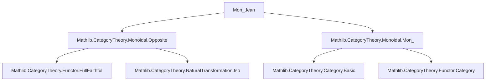

### Technical Brief: `Mon_.lean` — Monoid Objects in Monoidal Opposites

---

#### **1. Key Definitions & Theorems**

| Name | Type / Signature | Purpose |
|------|------------------|---------|
| `mopMonObj` | `MonObj M → MonObj (mop M)` | Extends a monoid object $M$ in $\mathcal{C}$ to a monoid object in the monoidal opposite $\mathcal{C}^{\mathrm{op}}$ via the `mop` functor. |
| `mop_isMonHom` | `IsMonHom f → IsMonHom f.mop` | Shows that a monoid homomorphism $f$ in $\mathcal{C}$ induces a monoid homomorphism $f^{\mathrm{op}}$ in $\mathcal{C}^{\mathrm{op}}$. |
| `unmopMonObj` | `MonObj M → MonObj (unmop M)` | Reverse direction: lifts a monoid object in $\mathcal{C}^{\mathrm{op}}$ back to $\mathcal{C}$. |
| `unmop_isMonHom` | `IsMonHom f → IsMonHom f.unmop` | Dual of `mop_isMonHom`, for morphisms in $\mathcal{C}^{\mathrm{op}}$. |
| `mopEquiv` | `Mon C ≌ Mon Cᴹᵒᵖ` | **Main theorem**: constructs an equivalence of categories between monoid objects in $\mathcal{C}$ and in $\mathcal{C}^{\mathrm{op}}$. |
| `mopEquivCompForgetIso` | `(mopEquiv C).functor ⋙ Mon.forget Cᴹᵒᵖ ≅ Mon.forget C ⋙ (MonoidalOpposite.mopEquiv C).functor` | Shows the equivalence commutes (up to iso) with the forgetful functors to $\mathcal{C}$ and $\mathcal{C}^{\mathrm{op}}$. |

All constructions rely on the fully faithful functor `mopEquiv C` between $\mathcal{C}$ and $\mathcal{C}^{\mathrm{op}}$, and use `map_injective` to reduce verification of monoid axioms to the base category.

---

#### **2. Naming Conventions**

- **Prefixes**:
  - `mop_`: for constructions using the monoidal opposite embedding `mop : C → Cᴹᵒᵖ`.
  - `unmop_`: for constructions using the inverse embedding `unmop : Cᴹᵒᵖ → C`.
- **Suffixes**:
  - `_MonObj`: for instance declarations turning objects into monoid objects.
  - `_isMonHom`: for instance declarations turning morphisms into monoid homomorphisms.
- **Function names**:
  - `mul`, `one`: inherited from `MonObj`.
  - `.hom`, `.X`: standard for morphisms/objects in `Mon C`.

---

#### **3. Tactic Stack**

- **Core tactics**:
  - `apply mopEquiv C |>.fullyFaithfulInverse.map_injective` / `fullyFaithfulFunctor.map_injective`
    - Used to reduce proofs of equality in `Mon C` or `Mon Cᴹᵒᵖ` to equalities in the underlying category.
  - `simp` / `simpa`: to simplify goals using definitions and `simps!` attributes.
  - `refl`: for constructing identity natural isomorphisms (`unitIso`, `counitIso`, `mopEquivCompForgetIso`).

No heavy automation (e.g., `aesop`, `ring`, `linarith`) is used—proofs are mostly definitional or rely on faithfulness.

---

#### **4. Proof Logic**

- **Structure**:
  1. Define `mopMonObj` and `unmopMonObj` by lifting structure via `mop`/`unmop`.
  2. Prove monoid axioms (`mul_one`, `one_mul`, `mul_assoc`) by:
     - Mapping to the base category via the fully faithful functor,
     - Using `simp` to reduce to known axioms in `M`.
  3. Extend to morphisms (`mop_isMonHom`, `unmop_isMonHom`) similarly.
  4. Assemble into an equivalence:
     - `mopEquiv` uses `mop`/`unmop` on objects and morphisms.
     - Unit and counit are identity natural isomorphisms (`refl _`), since `mop` and `unmop` are inverse equivalences on the nose.
  5. Show compatibility with forgetful functors via `mopEquivCompForgetIso := .refl _`.

- **Key idea**: The monoidal opposite functor is *strictly* involutive on objects and morphisms, and the monoid structure is preserved because multiplication and unit are defined contravariantly.

---

#### **5. Imports**

- `Mathlib.CategoryTheory.Monoidal.Opposite`: defines `mop`, `unmop`, and `MonoidalOpposite.mopEquiv`.
- `Mathlib.CategoryTheory.Monoidal.Mon_`: defines `Mon C`, `MonObj`, `IsMonHom`, and `Mon.forget`.

These imports fix the categorical context: a category $C$ with a monoidal structure, and the category of monoid objects internal to $C$.

---

#### **6. Mermaid Diagrams**

##### **Dependency Graph (Module Level)**



##### **Conceptual Overview of the Equivalence**

```mermaid
graph LR
  subgraph C
    M[Object M in C] -->|mop| Mop[mop M in Cᴹᵒᵖ]
  end

  subgraph Mon C
    [MonObj M] -->|mopMonObj| [MonObj (mop M)]
    [MonObj M] -->|mop_isMonHom| [MonObj f.mop]
  end

  subgraph Mon Cᴹᵒᵖ
    [MonObj (mop M)] -->|unmopMonObj| [MonObj (unmop (mop M)) ≅ M]
  end

  MonC[Mon C] <==|mopEquiv.functor==> MonCOp[Mon Cᴹᵒᵖ]
  MonCOp <==|mopEquiv.inverse==> MonC

  MonC -.->|Mon.forget| C
  MonCOp -.->|Mon.forget| Cᴹᵒᵖ
  C <==|MonoidalOpposite.mopEquiv.functor==> Cᴹᵒᵖ

  MonC -- mopEquivCompForgetIso --> MonCOp ⋙ forget ≅ forget ⋙ mopEquiv
```

##### **Proof Outline Flowchart**

```mermaid
flowchart TD
  Start[Start: M : C, MonObj M] --> mopMonObj_def
  mopMonObj_def -->[Define mul, one via mop] mop_axioms
  mop_axioms -->[Apply map_injective + simp] mop_axioms_ok

  mopMonObj_def --> mop_isMonHom_def
  mop_isMonHom_def -->[Define f.mop] mop_hom_axioms
  mop_hom_axioms -->[map_injective + simpa] mop_hom_ok

  mopMonObj_def & mop_isMonHom_def --> mopEquiv_def
  mopEquiv_def -->[Construct functor/inverse] unit_counit
  unit_counit -->[refl _] mopEquiv_equiv

  mopEquiv_def --> mopEquivCompForgetIso_def
  mopEquivCompForgetIso_def -->[refl _] compat_forget
```

---

#### **7. Summary**

This file establishes that the category of monoid objects is invariant under passage to the monoidal opposite:  
$$
\mathbf{Mon}(\mathcal{C}) \simeq \mathbf{Mon}(\mathcal{C}^{\mathrm{op}})
$$  
via the contravariant equivalence induced by `mop : C → Cᴹᵒᵖ`. The proof is largely definitional, leveraging the fully faithfulness of the monoidal opposite equivalence to reduce verification to the base category. The result is foundational for duality arguments in monoidal category theory (e.g., comonoids as monoids in the opposite).
