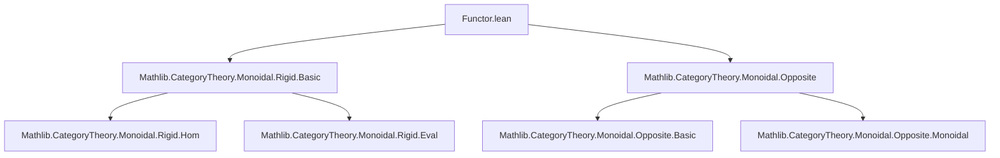

**Technical Brief: `Functor.lean` — Dual Functors for Rigid Monoidal Categories**

---

### 1. **Key Definitions & Theorems**

| Name | Type | Purpose |
|------|------|---------|
| `leftDualFunctor` | `C ⥤ (Cᵒᵖ)ᴹᵒᵖ` | Constructs a functor from a **left rigid** monoidal category `C` to the monoidal opposite of its opposite, sending objects `X` to ` mop (op (ᘁX))` and morphisms `f` to `(ᘁf).op.mop`. Encodes left duals contravariantly in a monoidal-coherent way. |
| `rightDualFunctor` | `C ⥤ (Cᵒᵖ)ᴹᵒᵖ` | Analogous for **right rigid** categories, sending `X` to ` mop (op (Xᘁ))` and `f` to `(fᘁ).op.mop`. Encodes right duals. |
| `leftAdjointMate_id` | `leftAdjointMate (id X) = id (ᘁX)` | Used to prove `map_id` for `leftDualFunctor`. |
| `comp_leftAdjointMate` | `leftAdjointMate (f ≫ g) = leftAdjointMate g ≫ leftAdjointMate f` | Used to prove `map_comp` for `leftDualFunctor`. |
| `rightAdjointMate_id` | `rightAdjointMate (id X) = id (Xᘁ)` | Analogous for right duals. |
| `comp_rightAdjointMate` | `rightAdjointMate (f ≫ g) = rightAdjointMate g ≫ rightAdjointMate f` | Analogous for right duals. |

> **Note**: `ᘁX` denotes the **left dual object** of `X`, and `Xᘁ` the **right dual object**. The notation `.op.mop` lifts maps through opposite and monoidal-opposite constructions.

---

### 2. **Naming Conventions**

- **Prefixes**:
  - `leftDual_`, `rightDual_`: For left/right dual constructions.
  - `leftAdjointMate_`, `rightAdjointMate_`: For universal properties of duals (adjoint mates).
- **Suffixes**:
  - `_id`, `_comp`: For identity and composition lemmas.
- **Notation**:
  - `ᘁX`, `Xᘁ`: Standard Lean notation for left/right duals (Unicode: `\lhd`, `\rhd`).
  - `.op`, `.mop`: For `op : Cᵒᵖ` and `mop : Dᴹᵒᵖ` (monoidal opposite).

---

### 3. **Tactic Stack**

- `simp`: Heavily used with custom lemmas (`leftAdjointMate_id`, `comp_leftAdjointMate`, etc.).
- `by simp [lemma]`: Standard pattern for verifying functor laws.
- No heavy automation (e.g., `aesop`, `linarith`) — proofs are direct applications of adjoint-mate properties.

---

### 4. **Proof Logic**

- **Structure**: Two independent sections (`LeftRigid`, `RightRigid`), each defining a functor.
- **Proof Strategy**:
  1. Define `obj` and `map` explicitly.
  2. Prove `map_id` using `simp [left/rightAdjointMate_id]`.
  3. Prove `map_comp` using `simp [comp_left/rightAdjointMate]`.
- **Key Insight**: The dual operation on morphisms (`ᘁf` or `fᘁ`) is *contravariant*, and the `op.mop` composition ensures covariance in the target category `(Cᵒᵖ)ᴹᵒᵖ`.

---

### 5. **Imports**

- `Mathlib.CategoryTheory.Monoidal.Rigid.Basic`: Provides definitions of `LeftRigidCategory`, `RightRigidCategory`, dual objects (`ᘁX`, `Xᘁ`), and adjoint mates.
- `Mathlib.CategoryTheory.Monoidal.Opposite`: Provides `MonoidalOpposite`, `mop`, and the monoidal structure on `(Cᵒᵖ)ᴹᵒᵖ`.

> **Scope**: This module lives in the *category theory* and *monoidal category theory* ecosystem of Mathlib, specifically targeting rigid (i.e., dualizable) structures.

---

### 8. **Dependency & Theory Overview**

#### Mermaid Diagram: Module Dependencies



#### Mermaid Diagram: Theoretical Flow

```mermaid
graph LR
  subgraph Source
    C[Category C] --> LR[Left Rigid?]
    C --> RR[Right Rigid?]
  end

  subgraph Construction
    LR --> LDF[leftDualFunctor]
    RR --> RDF[rightDualFunctor]
  end

  subgraph Target
    LDF --> MOP[(Cᵒᵖ)ᴹᵒᵖ]
    RDF --> MOP
  end

  subgraph Tools
    LM[Adjoint Mate Lemmas] --> LDF
    RM[Adjoint Mate Lemmas] --> RDF
  end

  MOP --> MT[Monoidal Target]
```

#### Theory Context

- **Goal**: Encode dualization as a *functor* into a monoidal category where duals behave covariantly (via `op.mop`).
- **Why `(Cᵒᵖ)ᴹᵒᵖ`?**  
  Dualization is contravariant on objects and morphisms, but `(Cᵒᵖ)ᴹᵒᵖ` restores covariance:  
  - `op` handles morphism reversal (`f : X → Y` ↦ `fᵒᵖ : Yᵒᵖ → Xᵒᵖ`),  
  - `mop` handles monoidal structure reversal (ensuring `⊗` is preserved up to structure maps).
- **Future Work**: Show these functors are *monoidal equivalences* when `C` is rigid (both left and right), i.e., when duals are two-sided and evaluation/coevaluation satisfy triangle identities.

--- 

**End of Brief**
