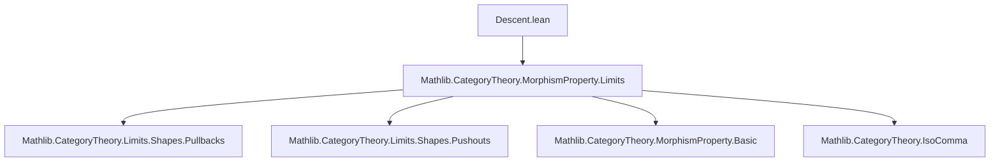
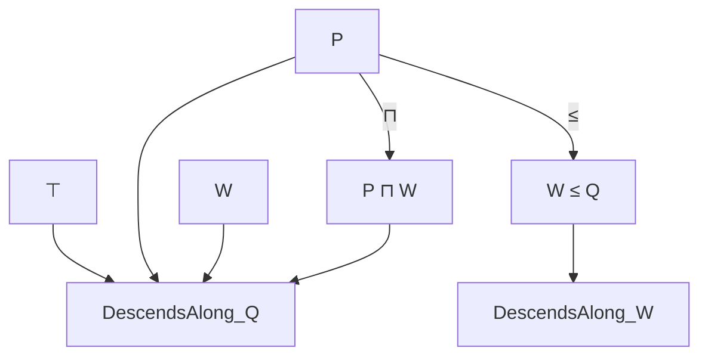

### Technical Brief: Descent of Morphism Properties in Lean 4

---

#### **1. Key Definitions & Theorems**

| Name | Type | Purpose |
|------|------|---------|
| `DescendsAlong` | `class DescendsAlong (P Q : MorphismProperty C) : Prop` | Defines that if `Q` holds for `f : X ⟶ Z`, then `P` holding on the pullback projection `fst : X ×_Z Y ⟶ X` implies `P` holds for `g : Y ⟶ Z`. |
| `CodescendsAlong` | `class CodescendsAlong (P Q : MorphismProperty C) : Prop` | Dual notion: if `Q` holds for `f : Z ⟶ X`, then `P` holding on the pushout injection `inl : X ⟶ X ∐_Z Y` implies `P` holds for `g : Z ⟶ Y`. |
| `of_isPullback_of_descendsAlong` | `lemma` | Extracts `P g` from a pullback square, `Q f`, and `P fst`, assuming `P.DescendsAlong Q`. |
| `iff_of_isPullback` | `lemma` | Under stability under base change and descent, `P fst ↔ P g` in a pullback square where `Q f`. |
| `pullback_fst_iff`, `pullback_snd_iff` | `lemmas` | Specializations of `iff_of_isPullback` to actual pullback objects via `HasPullback`. |
| `DescendsAlong.mk'` | `lemma` | Alternative constructor using `HasPullback` and `RespectsIso`. |
| `DescendsAlong.top` | `instance` | Top morphism property `⊤` descends along any `Q`. |
| `DescendsAlong.inf` | `instance` | Intersection of two descending properties still descends. |
| `DescendsAlong.of_le` | `lemma` | If `P` descends along `Q`, and `W ≤ Q`, then `P` descends along `W`. |
| `diagonal_DescendsAlong` | `instance` | If `P` descends along `Q`, then `diagonal P` also descends along `Q`, under additional assumptions (`RespectsIso`, `HasPullbacks`, `Q.IsStableUnderBaseChange`). |
| `CodescendsAlong.mk'` | `lemma` | Dual alternative constructor using `HasPushout`. |
| `CodescendsAlong.top`, `CodescendsAlong.inf`, `CodescendsAlong.of_le` | `instance/lemma` | Analogous lattice-theoretic closure properties for codescending. |

---

#### **2. Naming Conventions**

- **Class names**: `DescendsAlong`, `CodescendsAlong` — verb + prepositional phrase.
- **Lemma prefixes**:
  - `of_isPullback_`, `of_isPushout_`: from a universal property (pullback/pushout square).
  - `of_pullback_`, `of_pushout_`: from actual pullback/pushout constructions (`HasPullback`, `HasPushout`).
  - `pullback_`, `pushout_`: about projections/injections from actual pullbacks/pushouts.
  - `iff_of_`: equivalence under stability assumptions.
- **Suffixes**:
  - `_fst`, `_snd`, `_inl`, `_inr`: refer to canonical morphisms in pullback/pushout diagrams.
  - `_iff`: equivalence statements.
- **Instance names**: `top`, `inf`, `of_le` — reflect lattice operations on `MorphismProperty`.

---

#### **3. Tactic Stack**

Frequently used tactics in proofs:

| Tactic | Usage |
|--------|-------|
| `rwa` | Rewrite + assumption (e.g., to cancel isos using `cancel_left_of_respectsIso`). |
| `simp` / `simp only` | Simplify using `pullback.condition`, `diagonal_iff`, etc. |
| `rw` | Rewrite using isomorphism properties (`h.isoPullback_hom_fst`, `h.inl_isoPushout_inv`). |
| `apply` | Apply lemmas or class instances (e.g., `apply H hf`). |
| `introv` | Introduce variables and hypotheses universally. |
| `apply pullback.hom_ext` / `pushout.hom_ext` | Prove equality of morphisms into/out of pullbacks/pushouts. |
| `iterate n rw [...]` | Apply same rewrite multiple times (e.g., for chain of isomorphisms). |
| `exact`, `trivial` | For trivial instances like `DescendsAlong.top`. |
| `aesop` (not present here) — *not used* in this file. |

---

#### **4. Proof Logic**

- **Structure of descent proofs**:
  1. **Universal property → concrete construction**: Use `h.hasPullback` or `h.hasPushout` to get actual pullback/pushout.
  2. **Isomorphism manipulation**: Use `RespectsIso` to cancel or transport along canonical isomorphisms (e.g., `pullbackSymmetry`, `pullbackRightPullbackFstIso`, `diagonalObjPullbackFstIso`).
  3. **Apply hypothesis**: Use `H`, `hf`, `hfst` to get required property.
  4. **Equational reasoning**: Chain of `rw` steps to align morphisms (especially for `diagonal` case).
- **Common pattern**:
  - Prove `P g` from `P fst` (or `P inl`) using descent assumption.
  - Use stability (`IsStableUnderBaseChange`, `IsStableUnderCobaseChange`) to get reverse implication for `↔`.
- **Lattice properties**:
  - Closure under `⊤`, `⊓`, and monotonicity in `Q` (`of_le`) are standard for descent/codescending classes.

---

#### **5. Imports**

- **Primary dependency**:
  ```lean
  import Mathlib.CategoryTheory.MorphismProperty.Limits
  ```
  - Provides:
    - `MorphismProperty`
    - `IsPullback`, `IsPushout`
    - `HasPullback`, `HasPushout`, `HasPullbacks`, `HasPushouts`
    - `pullback.fst`, `pullback.snd`, `pushout.inl`, `pushout.inr`
    - `diagonal`, `diagonalObjPullbackFstIso`, `pullbackSymmetry`, etc.
    - Stability notions: `IsStableUnderBaseChange`, `IsStableUnderCobaseChange`
    - Morphism property operations: `≤`, `⊓`, `⊤`, `RespectsIso`, `RespectsLeft`, `RespectsRight`, `of_precomp`, `of_postcomp`, etc.

---

#### **6. Mermaid Diagrams**

##### **Dependency Graph (Module Level)**



##### **Conceptual Overview of Descent/Codescendence**

```mermaid
graph LR
  subgraph Pullback Square
    A["A"] -->|fst| X["X"]
    A -->|snd| Y["Y"]
    X -->|f| Z["Z"]
    Y -->|g| Z
  end

  subgraph Descent Condition
    Q[f] & P[fst] ==>[Descent] P[g]
  end

  Descent -->|if Q f holds| Descent_Cond

  subgraph Pushout Square
    Z["Z"] -->|f| X["X"]
    Z -->|g| Y["Y"]
    X -->|inl| A["A"]
    Y -->|inr| A
  end

  subgraph Codescendence Condition
    Q[f] & P[inl] ==>[Codescend] P[g]
  end

  Codescend -->|if Q f holds| Codescend_Cond
```

##### **Lattice Structure of Descending Properties**



---

#### **7. Theory Context**

- **Domain**: Category theory, specifically *morphism property descent* in categories with pullbacks/pushouts.
- **Motivation**: Formalize criteria for when a property `P` of morphisms can be “descended” along another property `Q`, i.e., checked after base change.
- **Applications**:
  - Algebraic geometry (e.g., properties of morphisms like proper, smooth, étale).
  - Homotopy theory (e.g., stable under base change, descent for fibrations).
- **Relation to other files**:
  - Builds on `MorphismProperty.Basic` and `Limits`.
  - Likely used in files about *stacks*, *fibered categories*, or *descent theory*.

--- 

Let me know if you'd like a formalized summary in `lean` docstring format or a theory roadmap for future extensions (e.g., transitivity of descent, interaction with localization).
