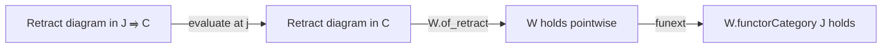

### Technical Brief: `FunctorCategory.lean`

---

#### **1. Key Definitions & Theorems**

| Name | Type / Signature | Purpose |
|------|------------------|---------|
| `W.functorCategory J` | `MorphismProperty (J ⥤ C)` | Pullback of a morphism property `W` along the evaluation functor `J ⥤ C`, yielding a morphism property on the functor category. |
| `instance of_retract` | `[W.IsStableUnderRetracts] → (W.functorCategory J).IsStableUnderRetracts` | Shows stability under retracts lifts to functor categories via pointwise evaluation. |
| `instance limitsOfShape` | `[W.IsStableUnderLimitsOfShape K] → (W.functorCategory J).IsStableUnderLimitsOfShape K` | Stability under limits of shape `K` lifts to functor categories, assuming `C` has such limits. |
| `instance colimitsOfShape` | `[W.IsStableUnderColimitsOfShape K] → (W.functorCategory J).IsStableUnderColimitsOfShape K` | Dually for colimits. |
| `instance baseChange` | `[W.IsStableUnderBaseChange] → (W.functorCategory J).IsStableUnderBaseChange` | Base change stability lifts if `C` has pullbacks. |
| `instance cobaseChange` | `[W.IsStableUnderCobaseChange] → (W.functorCategory J).IsStableUnderCobaseChange` | Cobase change stability lifts if `C` has pushouts. |
| `instance transfiniteComp` | `[W.IsStableUnderTransfiniteCompositionOfShape K] → (W.functorCategory J).IsStableUnderTransfiniteCompositionOfShape K` | Transfinite composition stability lifts under iteration assumptions. |
| `functorCategory_isomorphisms` | `(isomorphisms C).functorCategory J = isomorphisms (J ⥤ C)` | Characterizes isomorphisms in functor categories pointwise. |
| `functorCategory_monomorphisms` | `(monomorphisms C).functorCategory J = monomorphisms (J ⥤ C)` | Monomorphisms in functor categories are pointwise monos (requires pullbacks). |
| `functorCategory_epimorphisms` | `(epimorphisms C).functorcategory J = epimorphisms (J ⥤ C)` | Epimorphisms in functor categories are pointwise epis (requires pushouts). |
| `instance mono_transfiniteComp` | `(monomorphisms C).IsStableUnderTransfiniteComp K ⇒ (monomorphisms (J ⥤ C)).IsStableUnderTransfiniteComp K` | Monos stable under transfinite comp ⇒ same in functor category. |
| `instance mono_coproducts` | `(monomorphisms C).IsStableUnderCoproductsOfShape K' ⇒ (monomorphisms (J ⥤ C)).IsStableUnderCoproductsOfShape K'` | Same for coproducts. |
| `instance mono_coproducts_univ` | `[IsStableUnderCoproducts (monomorphisms C)] ⇒ IsStableUnderCoproducts (monomorphisms (J ⥤ C))` | Global stability under coproducts lifts. |

---

#### **2. Naming Conventions**

- **Prefixes**:
  - `functorCategory_`: for lemmas about how standard morphism properties behave under `functorCategory`.
  - `of_`: for constructing instances of stability properties (e.g., `of_retract`, `of_isPullback`).
- **Suffixes**:
  - `_app`: used in proofs to evaluate natural transformations at objects (e.g., `φ.app j`, `hf k j`).
  - `_le`: used in transfinite composition arguments to relate morphism properties via `≤`.
- **Pattern**: `W.functorCategory J` is the core construction; stability properties are lifted via `instance` declarations.

---

#### **3. Tactic Stack**

- `simp only [...]`: heavily used to unfold definitions like `functorCategory`, `isomorphisms.iff`, `NatTrans.mono_iff_mono_app`.
- `rw [...]`: to rewrite using lemmas like `functorCategory_monomorphisms`.
- `infer_instance`: to discharge typeclass goals after rewriting.
- `intro` / `rintro`: for destructuring hypotheses.
- `exact`, `apply`: for applying existing lemmas/instances.
- `ext _ _ f`: extensionality for natural transformations.
- `have : ... := ...`: intermediate lemmas (e.g., `W.functorCategory J ≤ W.inverseImage ...`).
- `congr_app`, `congr_fun`: for pointwise reasoning on natural transformations.

---

#### **4. Proof Logic**

- **Structure**: Most proofs follow a *pointwise reduction* pattern:
  1. Reduce a property in `J ⥤ C` to a family of properties in `C` indexed by `j : J`.
  2. Use evaluation functor `(evaluation _ _).obj j : J ⥤ C → C` to map objects/morphisms.
  3. Apply the corresponding stability property in `C` (e.g., `W.of_retract`).
  4. Reassemble using naturality or pointwise application (`φ.app j`, `hf k j`).
- **Transfinite composition**: Uses the inequality `W.functorCategory J ≤ W.inverseImage ((evaluation _ _).obj j)` to reduce to `C`.
- **Monomorphism/epimorphism cases**: Rely on characterizations like `NatTrans.mono_iff_mono_app`, which require categorical limits (pullbacks/pushouts).

---

#### **5. Imports**

| Module | Purpose |
|--------|---------|
| `Mathlib.CategoryTheory.Limits.FunctorCategory.EpiMono` | Provides basic facts about epis/monos in functor categories. |
| `Mathlib.CategoryTheory.MorphismProperty.Retract` | Defines stability under retracts. |
| `Mathlib.CategoryTheory.MorphismProperty.Limits` | Defines stability under limits/colimits of shape. |
| `Mathlib.CategoryTheory.MorphismProperty.TransfiniteComposition` | Defines stability under transfinite compositions. |

---

#### **8. Mermaid Diagrams**

##### **Dependency Graph (Module Level)**


##### **Conceptual Overview of Theory Flow**

```mermaid
graph TD
  W[MorphismProperty W on C] -->|pullback| WJ[W.functorCategory J on J ⥤ C]
  WJ -->|stability under| Retracts[Retracts]
  WJ -->|stability under| Limits[Limits of shape K]
  WJ -->|stability under| Colimits[Colimits of shape K]
  WJ -->|stability under| BaseChange[Base change]
  WJ -->|stability under| CobaseChange[Cobase change]
  WJ -->|stability under| TransComp[Transfinite composition]

  Monos[monomorphisms C] -->|functorCategory| MonosJ[monomorphisms (J ⥤ C)]
  MonosJ -->|stability| TransCompMono[Transfinite comp]
  MonosJ -->|stability| CoprodMono[Coproducts]

  subgraph C
    W
    Monos
  end

  subgraph J__C
    WJ
    MonosJ
  end
```

##### **Proof Strategy Flow (Example: Retracts)**



---

This file formalizes a foundational *transport* principle: many stability properties of morphism classes in a category `C` descend to the functor category `[J, C]` via pointwise evaluation. It is a key ingredient in homotopical algebra and model-categorical constructions in Lean.
