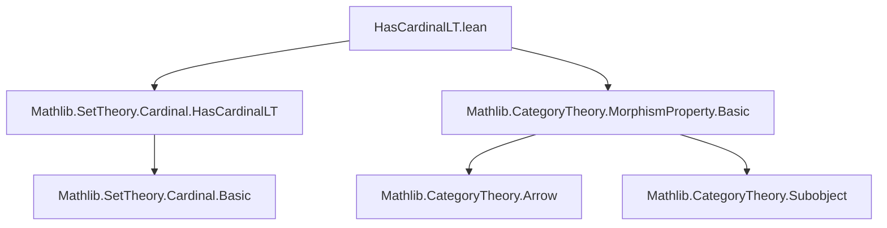
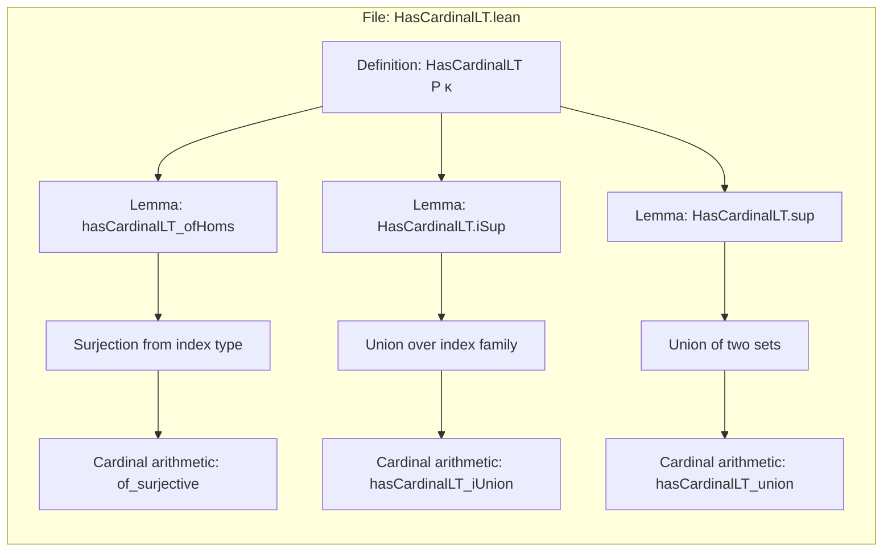
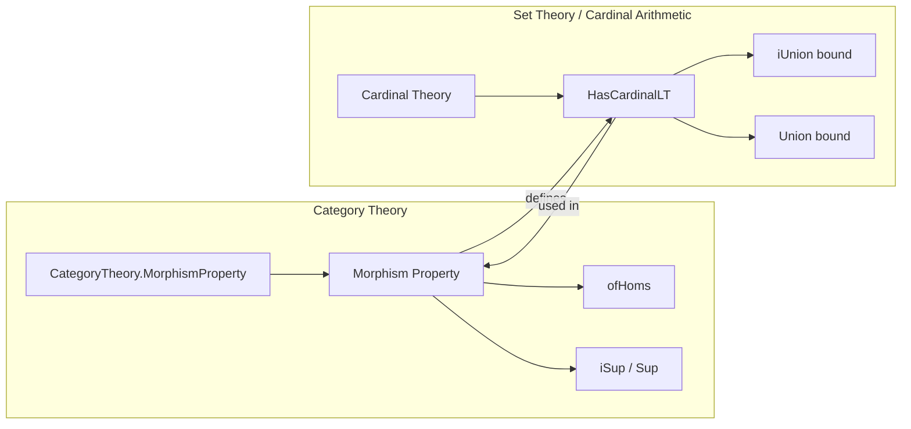

**Technical Brief: `HasCardinalLT.lean`**

---

### 1. **Key Definitions & Theorems**

| Name | Type | Purpose |
|------|------|---------|
| `MorphismProperty.HasCardinalLT P κ` | `Prop` | States that the underlying set `P.toSet` of arrows satisfying property `P` has cardinality strictly less than `κ`. Defined as `_root_.HasCardinalLT P.toSet κ`. |
| `hasCardinalLT_ofHoms` | `lemma` | Shows that if a family of morphisms `f : ∀ i, X i ⟶ Y i` is indexed by a type `ι` with `HasCardinalLT ι κ`, then the morphism property generated by this family (`MorphismProperty.ofHoms f`) also satisfies `HasCardinalLT κ`. |
| `HasCardinalLT.iSup` | `lemma` | Proves closure under arbitrary suprema (i.e., joins) of families of morphism properties: if each `P i` has cardinality `< κ` and the index type `ι` does too, and `κ` is regular, then `⨆ i, P i` also has cardinality `< κ`. |
| `HasCardinalLT.sup` | `lemma` | Proves closure under binary suprema: if `P₁`, `P₂` both have cardinality `< κ`, and `κ ≥ ℵ₀`, then `P₁ ⊔ P₂` also has cardinality `< κ`. |

---

### 2. **Naming Conventions**

- **Prefixes**:
  - `hasCardinalLT_`: for lemmas establishing `HasCardinalLT` for constructions (e.g., `hasCardinalLT_ofHoms`, `hasCardinalLT_iUnion`, `hasCardinalLT_union`).
- **Suffixes**:
  - `_ofHoms`: for properties derived from families of morphisms.
  - `_iSup`, `_sup`: for suprema (indexed and binary, respectively).
- **Abbreviations**:
  - `HasCardinalLT` is defined as a `protected abbrev`, not a `def`, indicating it's a shorthand for `_root_.HasCardinalLT P.toSet κ`.

---

### 3. **Tactic Stack**

- **Core tactics used**:
  - `dsimp only [...]`: simplifies definitions (e.g., unfolding `MorphismProperty.HasCardinalLT`, `toSet_iSup`, `toSet_max`).
  - `rw [...]`: rewrites using lemmas (e.g., `toSet_iSup`, `MorphismProperty.toSet_max`, `MorphismProperty.mem_toSet_iff`, `MorphismProperty.ofHoms_iff`).
  - `exact ...`: provides direct proof terms.
  - `rintro ⟨f, hf⟩`: destructures existential pairs.
  - `obtain ⟨i, hf⟩` / `obtain rfl : f = _`: extracts indices and equality proofs.
  - `intro`: implicit in lambda-style proofs.

- **External lemmas invoked**:
  - `hasCardinalLT_iUnion`, `hasCardinalLT_union`, `of_surjective`: from `Mathlib.SetTheory/Cardinal/Basic.lean` and related files.

---

### 4. **Proof Logic**

- **General strategy**:
  - Unfold definitions (`dsimp only`), rewrite using structural lemmas (`rw`), then apply known cardinality lemmas (`hasCardinalLT_iUnion`, `hasCardinalLT_union`, `of_surjective`).
- **`hasCardinalLT_ofHoms`**:
  - Constructs a surjection from `ι` onto `P.toSet` (where `P = MorphismProperty.ofHoms f`) and applies `of_surjective`.
- **`HasCardinalLT.iSup`**:
  - Uses `toSet_iSup = ⋃ i, (P i).toSet`, then applies `hasCardinalLT_iUnion` with regularity of `κ` and hypotheses `hP`, `hι`.
- **`HasCardinalLT.sup`**:
  - Uses `toSet_max = P₁.toSet ∪ P₂.toSet`, then applies `hasCardinalLT_union` with hypothesis `hκ : ℵ₀ ≤ κ`.

---

### 5. **Imports**

- `Mathlib.SetTheory/Cardinal/HasCardinalLT.lean`: provides `HasCardinalLT` and related lemmas (`hasCardinalLT_iUnion`, `hasCardinalLT_union`, `of_surjective`).
- `Mathlib.CategoryTheory/MorphismProperty/Basic.lean`: defines `MorphismProperty`, `ofHoms`, `iSup`, `sup`, and their set-theoretic interpretations (`toSet_iSup`, `toSet_max`, `mem_toSet_iff`, etc.).

---

### 6. **Mermaid Diagrams**

#### **Dependency Graph (Module-Level)**

#### **Overview of File Structure**

#### **Theoretical Context**

--- 

This file formalizes *cardinality bounds* on collections of morphisms defined by a morphism property, enabling control over size in categorical constructions (e.g., accessibility, presentability). It leverages standard cardinal arithmetic lemmas and categorical definitions of morphism properties.
