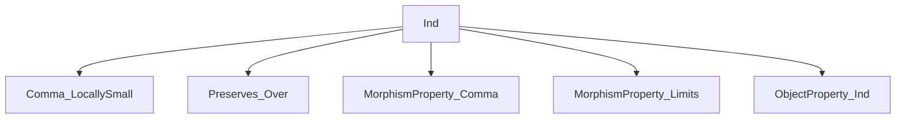
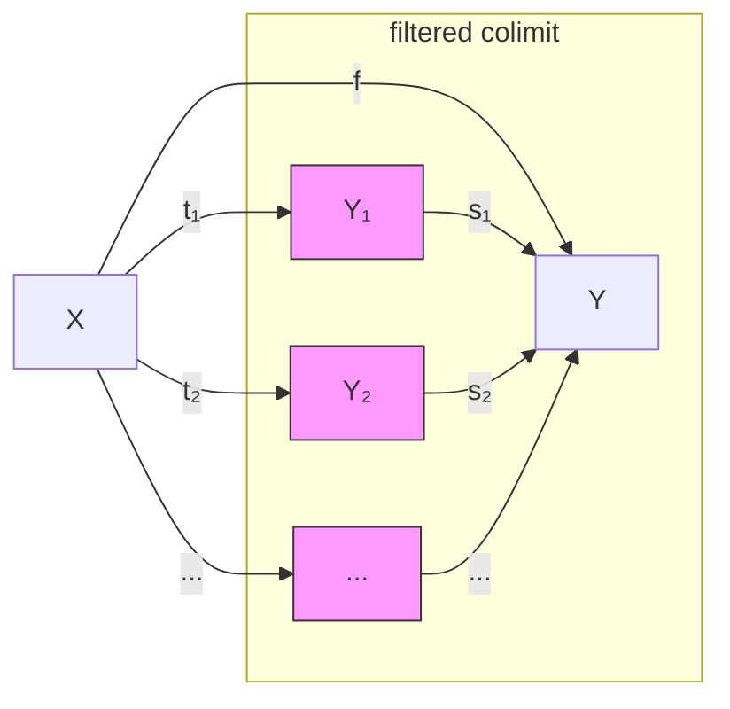

Here is the structured technical brief extracted from `Ind.lean`:

---

### **1. Key Definitions & Theorems**

| Name | Type / Signature | Purpose |
|------|------------------|---------|
| `ind` | `MorphismProperty C → MorphismProperty C` | Lifts a morphism property `P` to `ind P`, where `f : X → Y` satisfies `ind P` iff `f` factors through a filtered colimit of `P`-morphisms. |
| `le_ind` | `P ≤ ind P` | Shows `P` is contained in `ind P`. |
| `ind_iff_ind_underMk` | `ind P f ↔ ObjectProperty.ind P.underObj (Under.mk f)` | Equates `ind P` on morphisms with `ObjectProperty.ind` on under-objects. |
| `underObj_ind_eq_ind_underObj` | `underObj (ind P) = ObjectProperty.ind P.underObj` | Equality of two ways to define the under-object property induced by `ind P`. |
| `ind_ind` | `P ≤ isFinitelyPresentable → ind (ind P) = ind P` | Idempotence of `ind` under finite presentability of `P`. |
| `ind_iff_exists` | Characterization of `ind P f` via factorization through finitely presentable maps (under accessibility assumptions). | Enables concrete reasoning about `ind P` in accessible categories. |
| `PreIndSpreads` | `Prop` | A property ensuring `P`-morphisms out of filtered colimits descend to finite level via pushouts. |
| `IsStableUnderComposition.ind_of_preIndSpreads` | Stability of `ind P` under composition under pre-ind-spreading + accessibility + pushouts. | Generalizes stability results (e.g., Stacks Project 0BSI). |
| `IsMultiplicative.ind_of_preIndSpreads` | Multiplicativity of `ind P` under same hypotheses. | Follows from composition stability. |

---

### **2. Naming Conventions**

- **Prefixes**:
  - `ind_`: for definitions/lemmas about `ind P`.
  - `underObj_`: for relations between morphism and object properties via under-categories.
  - `isFinitelyPresentable`, `isFinitelyAccessible`: standard terminology for finiteness conditions.
  - `preIndSpreads`, `PreIndSpreads`: class naming for descent properties.

- **Suffixes**:
  - `_of_isFiltered`: for lemmas using filtered colimit structure.
  - `_mem`: for membership in a property (e.g., `id_mem`, `comp_mem`).
  - `_inst`: for instance proofs (e.g., `RespectsLeft`, `ContainsIdentities`).

- **Aliases**:
  - `exists_isPushout_of_isFiltered` is an alias for `PreIndSpreads.exists_isPushout`.

---

### **3. Tactic Stack**

Frequently used tactics:
- `simp`, `simp only`, `simp [hst]`, `rwa`
- `refine`, `exact`, `intro`, `cases`
- `rw`, `ext`, `congr`
- `have`, `obtain`, `let`, `set`
- `apply`, `apply_fun`, `convert`
- `isColimit`, `isColimitOfPreserves`, `isFiltered`, `isPushout`, `isIso`
- `Functor.whiskerRight`, `Functor.const`, `Under.lift`, `Under.pushout`
- `aesop` (not explicitly used here, but `simp`-based automation dominates)

---

### **4. Proof Logic**

- **Structure**: Most proofs follow a pattern:
  1. **Unfold definitions** (`ind`, `underObj`, `ObjectProperty.ind`).
  2. **Construct witnesses** (e.g., filtered diagrams, cocones).
  3. **Use universal properties** (colimits, pushouts, under-category universal properties).
  4. **Apply finite presentability** to descend from colimits to finite level.
  5. **Leverage stability assumptions** on `P` (e.g., cobase change, composition).

- **Induction/Descent**: Key technique is *finite descent* via `isFinitelyPresentable.exists_hom_of_isColimit_under`, which allows lifting morphisms through filtered colimits.

- **Equivalence proofs**: Often use `ind_iff_ind_underMk` to translate between morphism-level and object-level properties.

- **Idempotence proof (`ind_ind`)**:
  - Uses `le_antisymm`.
  - Reduces to `ObjectProperty.ind_ind` via `ind_iff_ind_underMk`.

- **Stability under composition (`ind_of_preIndSpreads`)**:
  - Uses two filtered colimit presentations for `f` and `g`.
  - Uses finite presentability to factor through finite levels.
  - Uses `PreIndSpreads` to construct a pushout square descending `f`.
  - Combines with stability of `P` under pushouts and composition.

---

### **5. Imports**

| Module | Purpose |
|--------|---------|
| `Mathlib.CategoryTheory.Comma.LocallySmall` | Locally small comma categories (needed for `ind` universe management). |
| `Mathlib.CategoryTheory.Limits.Preserves.Over` | Preservation of limits/colimits in over-categories (used for `Under.forget`). |
| `Mathlib.CategoryTheory.MorphismProperty.Comma` | Morphism properties in comma categories (e.g., cobase change). |
| `Mathlib.CategoryTheory.MorphismProperty.Limits` | Stability properties (composition, cobase change, etc.). |
| `Mathlib.CategoryTheory.ObjectProperty.Ind` | Object-level `ind` construction (used in `ind_iff_ind_underMk`). |

---

### **6. Mermaid Diagrams**

#### **Dependency Graph (Module Level)**



#### **Conceptual Overview of `ind` Construction**



- `f = tᵢ ≫ sᵢ` for all `i`, and `P(tᵢ)` holds.
- `Y ≅ colim Yᵢ` via `{sᵢ}`.

#### **Proof Strategy for `ind_ind` (Idempotence)**

```mermaid
graph LR
  ind (ind P) f
    -->[ind_iff_ind_underMk]
    ObjectProperty.ind (P.underObj) (Under.mk f)
    -->[hp : P ≤ fp]
    ObjectProperty.isFinitelyPresentable (Under.mk f)
    -->[ObjectProperty.ind_ind]
    ObjectProperty.ind (P.underObj) (Under.mk f)
    -->[ind_iff_ind_underMk]
    ind P f
```

#### **Stability under Composition (High-Level)**

```mermaid
graph TD
  hf: ind P f
    -->[filtered colim D₁]
    hf': P(t₁)
  hg: ind P g
    -->[filtered colim D₂]
    hg': P(t₂)
  hp: fp p
    -->[finite descent]
    j₂: t₂.app j₂ factors through p
  PreIndSpreads
    -->[pushout square]
    j₁: f' : D₁.j₁ → T' with P(f')
  finite descent again
    -->[j₃: factor through D'.obj j₃]
  P.comp_mem
    -->[P(f') & P(t₂.app j₂)]
    P(f ≫ g)
```

---

### **7. Theory Context**

- **Category-theoretic setting**: Locally small, locally presentable (via finite accessibility), with pushouts.
- **Goal**: Extend morphism properties `P` to `ind P`, preserving stability properties (composition, cobase change, etc.) under finiteness assumptions.
- **Motivation**: Generalizes constructions like *ind-étale* ring maps, where properties descend along filtered colimits.

---

Let me know if you'd like a formalized dependency graph (e.g., for `leanpkg`), or a visualization of the `PreIndSpreads` condition.
