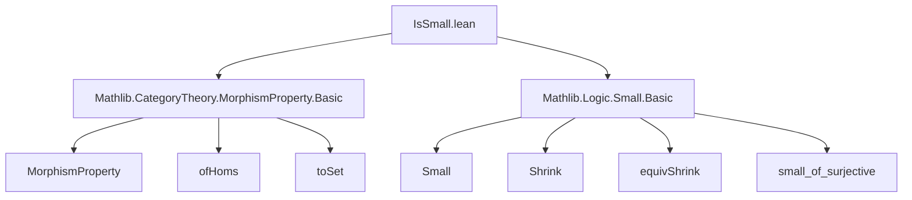

Here is the structured technical brief for `IsSmall.lean`:

---

### **1. Key Definitions & Theorems**

| Name | Type | Purpose |
|------|------|---------|
| `IsSmall.{w} W` | `Prop` | States that the class of morphisms `W : MorphismProperty C` corresponds to a `w`-small set in `Set (Arrow C)`. Formally: `Small.{w} W.toSet`. |
| `isSmall_ofHoms` | `IsSmall.{w} (ofHoms f)` | Shows that any class of morphisms defined as the image of a family indexed by a `w`-small type is `w`-small. |
| `isSmall_iff_eq_ofHoms` | `IsSmall.{w} W ↔ ∃ ι A B f, W = ofHoms f` | Characterizes `w`-small morphism classes as exactly those representable as `ofHoms f` for some `w`-small indexing type `ι`. |

---

### **2. Naming Conventions**

- **Prefixes**:
  - `isSmall_`: for properties/instances asserting smallness (e.g., `isSmall_ofHoms`, `isSmall_iff_eq_ofHoms`).
- **Suffixes**:
  - `_iff_`: for biconditional characterizations (`isSmall_iff_eq_ofHoms`).
- **Other**:
  - `ofHoms`: constructs a morphism property from a family of morphisms.
  - `toSet`: coercion from a `MorphismProperty` to its underlying set of arrows.

---

### **3. Tactic Stack**

Frequently used tactics in proofs:
- `intro`, `rintro`, `exact`, `rw`, `ext`, `simp`, `simp only`, `constructor`, `infer_instance`, `let`, `have`, `refine`, `symm`, `apply`, `cases`.

Notably:
- `simp` and `simp only` are used to simplify subtype and arrow constructions.
- `ext` is used to prove extensionality of morphism properties via `ofHoms_iff`.
- `infer_instance` appears in the `isSmall_iff_eq_ofHoms` backward direction.

No heavy automation (e.g., `aesop`, `ring`, `linarith`) is used—proofs are mostly structural and rely on `Small`-specific lemmas.

---

### **4. Proof Logic**

- **Forward direction** (`isSmall_iff_eq_ofHoms →`):
  - Uses `Shrink.{w} W.toSet` to get a small indexing type.
  - Constructs `A`, `B`, and `f` via `equivShrink` to recover the original morphism family.
  - Proves equality of morphism properties using `ofHoms_iff`.

- **Backward direction** (`←`):
  - Reduces to showing `ofHoms f` is small, using `isSmall_ofHoms`.
  - Applies `infer_instance` to discharge the `Small.{w} ι` assumption.

- **`isSmall_ofHoms` proof**:
  - Constructs a surjection `φ : ι → W.toSet`.
  - Uses `small_of_surjective` to deduce smallness of `W.toSet`.

Induction is not used; the logic is constructive and relies on properties of `Small` and `Shrink`.

---

### **5. Imports**

| Import | Purpose |
|--------|---------|
| `Mathlib.CategoryTheory.MorphismProperty.Basic` | Defines `MorphismProperty`, `ofHoms`, `toSet`, and basic operations. |
| `Mathlib.Logic.Small.Basic` | Provides `Small`, `Shrink`, `equivShrink`, `small_of_surjective`, and related lemmas. |

These imports define the foundational objects and tools used in the module.

---

### **6. Mermaid Diagrams**

#### **Dependency Graph**



#### **Overview of File Structure**

```mermaid
flowchart LR
  A[Universe declarations] --> B[CategoryTheory.MorphismProperty.IsSmall]
  B --> C[Class IsSmall]
  B --> D[Instance isSmall_ofHoms]
  B --> E[Lemma isSmall_iff_eq_ofHoms]

  C --> F[small_toSet : Small W.toSet]
  D --> G[Small ι ⇒ IsSmall (ofHoms f)]
  E --> H[Characterization via ofHoms]
```

---

### **7. Theory Context**

This module formalizes a foundational notion of *smallness* for classes of morphisms in category theory, building on:
- The correspondence between `MorphismProperty C` and subsets of `Arrow C`.
- The `Small` typeclass from logic, which captures sets embeddable in a universe level.

It enables reasoning about “smallly generated” classes of morphisms (e.g., in model category theory or localization), where one often needs to ensure that generating classes are set-sized.

The equivalence `isSmall_iff_eq_ofHoms` shows that such classes are precisely those generated by a *set* (not a proper class) of morphisms.

--- 

Let me know if you'd like a formalization-level summary or a comparison with related files (e.g., `IsLocallySmall.lean`).
