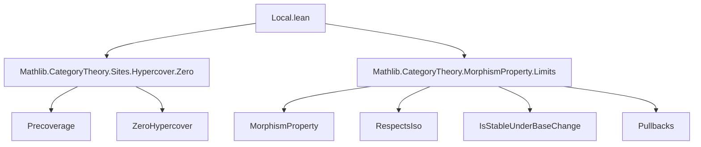

**Technical Brief: Locality Conditions on Morphism Properties in `Local.lean`**

---

### 1. KEY DEFINITIONS & THEOREMS

| Name | Type / Signature | Purpose |
|------|------------------|---------|
| `IsLocalAtTarget` | `class IsLocalAtTarget (P : MorphismProperty C) (K : Precoverage C) [K.HasPullbacks] extends RespectsIso P` | Defines when a morphism property `P` is *local at the target* w.r.t. a precoverage `K`: `P(f)` iff `P` holds on all pullbacks of `f` along a `0`-hypercover of the target. |
| `IsLocalAtTarget.pullbackSnd` | `{f : X ⟶ Y} → P f → P (pullback.snd f (𝒰.f i))` | “Only if” direction: `P` descends along pullbacks along covers. |
| `IsLocalAtTarget.of_zeroHypercover` | `(∀ i, P (pullback.snd f (𝒰.f i))) → P f` | “If” direction: `P` ascends from its behavior on a `0`-hypercover. |
| `IsLocalAtSource` | `class IsLocalAtSource (P : MorphismProperty C) (K : Precoverage C) extends RespectsIso P` | Defines when `P` is *local at the source* w.r.t. `K`: `P(f)` iff `P` holds on all composites `𝒰.f i ≫ f` for a `0`-hypercover of the source. |
| `IsLocalAtSource.comp` | `P f → P (𝒰.f i ≫ f)` | “Only if” direction: `P` descends along precomposition with covers. |
| `IsLocalAtSource.of_zeroHypercover` | `(∀ i, P (𝒰.f i ≫ f)) → P f` | “If” direction: `P` ascends from its behavior on a `0`-hypercover of the source. |
| `mk_of_iff` | Lemma constructing `IsLocalAtTarget` / `IsLocalAtSource` from a bi-implication | Enables proving locality by establishing an equivalence. |
| `mk_of_isStableUnderBaseChange` | Lemma for `IsLocalAtTarget` using stability under base change | Simplifies proofs when `P` is stable under pullbacks. |
| `of_le` | Monotonicity in the precoverage: `K ≤ L ⇒ IsLocalAtTarget P L → IsLocalAtTarget P K` | Shows locality is preserved under refinement of precoverage. |
| `top` | Instance: `⊤` (top property) is local at source/target | Trivial instance: universal property is always local. |
| `inf` | Instance: `P ⊓ Q` is local if `P`, `Q` are | Closure under finite infima (conjunctions). |
| `of_isPullback` | Uses pullback square to transfer `P(f)` to `P(snd)` | Leverages universal property of pullbacks. |
| `iff_of_zeroHypercover` | `P f ↔ ∀ i, P (pullback.snd f (𝒰.f i))` (target) or `P f ↔ ∀ i, P (𝒰.f i ≫ f)` (source) | Core equivalence characterizing locality. |
| `of_zeroHypercover_target` / `of_zeroHypercover_source` | Versions for *small* hypercovers | Enables use of universe-polymorphic hypercovers. |

---

### 2. NAMING CONVENTIONS

- **Prefixes**:
  - `isLocalAtTarget`, `isLocalAtSource`: class names.
  - `pullbackSnd`, `comp`: core operations for “only if” direction.
  - `of_zeroHypercover`: core operation for “if” direction.
  - `mk_of_…`: constructors via logical equivalence or additional assumptions.
  - `of_le`: monotonicity in precoverage.
- **Suffixes**:
  - `_target`, `_source`: distinguish between target/source locality.
  - `_iff`, `_target`, `_source`: variants for equivalence or small hypercovers.
- **Notation**:
  - `𝒰.f i`: the `i`-th cover morphism in a hypercover `𝒰`.
  - `𝒰.I₀`: index type of the 0-simplices of the hypercover.
  - `𝒰.weaken hle`: refinement of hypercover along `K ≤ L`.

---

### 3. TACTIC STACK

- `simp`: used heavily for trivial instances (`top`, `inf`, etc.).
- `rw`: for rewriting using equivalences (`iff_of_zeroHypercover`, `of_zeroHypercover_target`).
- `by simp` / `by aesop`: for trivial proofs (e.g., `top` instances).
- `intro`, `apply`, `exact`: standard intro/elimination in lemma proofs.
- `rw [← P.cancel_left_of_respectsIso h.isoPullback.inv, h.isoPullback_inv_snd]`: specialized rewriting using isomorphism properties.

No heavy automation (e.g., `linarith`, `ring`, `field_simp`) is used — proofs are mostly structural and categorical.

---

### 4. PROOF LOGIC

- **Structure**: Proofs follow categorical reasoning patterns:
  1. **Induction/Construction**: Often constructing a proof by unfolding definitions and applying `pullbackSnd`/`comp` or `of_zeroHypercover`.
  2. **Equivalence-based reasoning**: Many lemmas (`mk_of_iff`, `mk_of_isStableUnderBaseChange`) reduce locality to verifying an equivalence.
  3. **Monotonicity**: `of_le` uses hypercover weakening (`𝒰.weaken`) to transfer locality across precoverages.
  4. **Pullback logic**: `of_isPullback` uses the universal property of pullbacks and `RespectsIso` to transfer properties.
  5. **Closure under conjunction**: `inf` instance uses pair-wise application of the two directions.

- **Common pattern**:
  ```lean
  apply of_zeroHypercover 𝒰
  intro i
  apply pullbackSnd _ _ hf
  ```

---

### 5. IMPORTS

| Import | Purpose |
|--------|---------|
| `Mathlib.CategoryTheory.Sites.Hypercover.Zero` | Provides `Precoverage.ZeroHypercover`, the 0-truncated hypercover machinery. |
| `Mathlib.CategoryTheory.MorphismProperty.Limits` | Provides `MorphismProperty`, `RespectsIso`, `IsStableUnderBaseChange`, and pullback-related limits infrastructure. |

These imports define the foundational categorical and sheaf-theoretic context.

---

### 6. DEPENDENCY & THEORY OVERVIEW (Mermaid Diagrams)

#### Dependency Graph (Module-Level)



#### Theoretical Flow (Conceptual)

```mermaid
graph LR
  P[Morphism Property P] -->|Respects Iso| R[RespectsIso]
  K[Precoverage K] -->|Has Pullbacks| H[ZeroHypercover 𝒰 of Y]
  P -->|Local at Target| L1[IsLocalAtTarget]
  P -->|Local at Source| L2[IsLocalAtSource]
  L1 -->|iff_of_zeroHypercover| E1[P f ↔ ∀ i, P pullback.snd]
  L2 -->|iff_of_zeroHypercover| E2[P f ↔ ∀ i, P (𝒰.f i ≫ f)]
  L1 & L2 -->|inf| I[Closed under ∧]
  L1 & L2 -->|of_le| M[Monotone in K]
```

#### File Overview

- **Goal**: Formalize *locality* of morphism properties w.r.t. 0-hypercovers (i.e., covers in a precoverage).
- **Core idea**: A property `P` is local if checking it on a cover (pullbacks or precomposites) suffices to infer it globally — a categorical generalization of sheaf-like descent.
- **Structure**:
  - Two symmetric notions: `IsLocalAtTarget` (pullback along covers of target) and `IsLocalAtSource` (precomposition with covers of source).
  - Each has two axioms: descent (`pullbackSnd` / `comp`) and ascent (`of_zeroHypercover`).
  - Lemmas for constructing instances (`mk_of_…`), monotonicity (`of_le`), closure under conjunction (`inf`), and small hypercover variants.

---

### 7. SUMMARY

This file formalizes a foundational categorical notion of *locality* for morphism properties, using 0-hypercovers (i.e., covers) as the test objects. It is designed to support sheaf-theoretic and descent arguments in categorical contexts (e.g., algebraic geometry, topos theory). The structure is modular, with clear separation between source/target locality, and supports both abstract reasoning and concrete verification via equivalences or stability assumptions.

--- 

Let me know if you'd like a formalized summary in Lean syntax or a theory roadmap for extending this module (e.g., with local closures or higher hypercovers).
