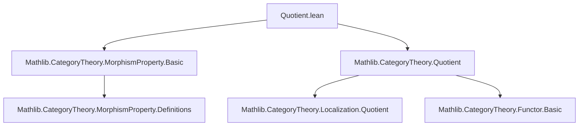
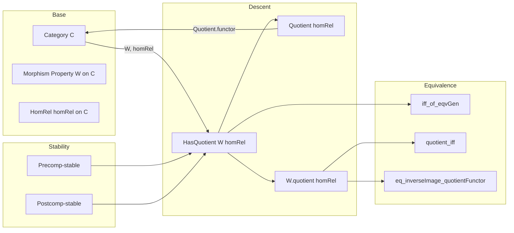

### Technical Brief: `Quotient.lean`

---

#### **1. Key Definitions & Theorems**

| Name | Type / Signature | Purpose |
|------|------------------|---------|
| `HasQuotient` | `class HasQuotient (W : MorphismProperty C) (homRel : HomRel C) [...] : Prop` | Expresses that a morphism property `W` descends to the quotient category: `W f ↔ W g` whenever `homRel f g`. Requires stability of `homRel` under pre- and postcomposition. |
| `quotient` | `def quotient [W.HasQuotient homRel] : MorphismProperty (Quotient homRel)` | Defines the induced morphism property on the quotient category: a morphism `f̄ : X̄ → Ȳ` satisfies `W.quotient` iff it lifts to some `f' : X → Y` with `W f'` and `f̄ = Quotient.functor.map f'`. |
| `HasQuotient.iff_of_eqvGen` | `lemma HasQuotient.iff_of_eqvGen [...] (h : Relation.EqvGen homRel f g) : W f ↔ W g` | Extends the defining equivalence from `homRel` to its equivalence closure (i.e., the actual quotient relation). |
| `quotient_iff` | `lemma quotient_iff [...] : W.quotient ((Quotient.functor).map f) ↔ W f` | Core equivalence: the induced property on the image of `f` under the quotient functor matches the original property `W f`. |
| `eq_inverseImage_quotientFunctor` | `lemma eq_inverseImage_quotientFunctor [...] : W = (W.quotient homRel).inverseImage (Quotient.functor _)` | Shows that `W` is precisely the pullback (inverse image) of its quotient along the quotient functor. |

---

#### **2. Naming Conventions**

- **Prefixes**:
  - `HasQuotient`: class name indicating *existence* of descent.
  - `quotient`: noun for the *induced* object (property).
  - `inverseImage`: standard categorical pullback of a property along a functor.

- **Suffixes**:
  - `_iff`: equivalence lemmas (`quotient_iff`).
  - `_eq_...`: equality lemmas (`eq_inverseImage_quotientFunctor`).

- **Variable naming**:
  - `W`: morphism property on base category `C`.
  - `homRel`: binary relation on morphisms (used to define quotient).
  - `f`, `g`: morphisms in `C`.
  - `f'`: lift of a morphism in the quotient.
  - `⟨X⟩`, `⟨Y⟩`: objects in the quotient (quotient types).
  - `f̄` (implicit as `f` in `Quotient homRel`): morphism in the quotient.

---

#### **3. Tactic Stack**

- `induction h with [...]`: used for structural induction on an equivalence closure (`Relation.EqvGen`).
- `rwa [...]`: rewrite + assumption, especially to simplify using `Quotient.functor_homRel_eq_compClosure_eqvGen` and `HomRel.compClosure_eq_self`.
- `refine ⟨fun ⟨...⟩ ↦ ?_, fun ... ↦ ...⟩`: constructive proof of biconditional via two-directional refinement.
- `rw [...] at h`: rewrite hypothesis `h` using categorical identities.
- `rfl`: reflexivity for trivial equalities (e.g., `f = f`).

No heavy automation (e.g., `aesop`, `tauto`), but relies on `simp`-friendly lemmas and rewriting.

---

#### **4. Proof Logic**

- **Inductive descent**: Prove `W f ↔ W g` for `homRel f g`, then extend to the equivalence closure via induction.
- **Lifting vs. descent**: The definition of `quotient` uses *existence of a lift* satisfying `W`. The key lemmas show:
  - Any morphism in the image of the quotient functor reflects `W` back to its lift (`quotient_iff`).
  - `W` is exactly the pullback of its quotient along the quotient functor (`eq_inverseImage_quotientFunctor`).
- **Categorical reasoning**: Heavy use of:
  - `Functor.homRel_iff`: characterizes when two morphisms become equal in the quotient.
  - `Quotient.functor_homRel_eq_compClosure_eqvGen`: identifies the hom-relation of the quotient functor with the equivalence closure of `homRel`.
  - `HomRel.compClosure_eq_self`: uses stability under pre/postcomposition to identify the closure with `homRel` itself.

---

#### **5. Imports**

- `Mathlib.CategoryTheory.MorphismProperty.Basic`: foundational definitions of `MorphismProperty`, `inverseImage`, etc.
- `Mathlib.CategoryTheory.Quotient`: defines `Quotient homRel`, `Quotient.functor`, and basic properties of quotient categories.

---

#### **8. Mermaid Diagrams**

##### **Dependency Graph (Module Level)**



##### **Conceptual Overview (Theory Flow)**



##### **Morphism-Level Commutative Diagram (Key Idea)**

For `f : X ⟶ Y` in `C`, let `Q : C → Quotient homRel` be the quotient functor:

```mermaid
flowchart LR
  X -- f --> Y
  |           |
  v           v
  QX -- Qf --> QY

  style QX fill:#f9f,stroke:#333
  style QY fill:#f9f,stroke:#333
```

- **Descent condition**: `W f ↔ W g` whenever `Qf = Qg` (i.e., `homRel* f g`).
- **Induced property**: `W.quotient (Qf) ↔ W f`.

---

### Summary

This module formalizes the *descent of morphism properties* along quotient categories. It isolates the necessary and sufficient condition (`HasQuotient`) for a property `W` to descend, constructs the induced property `W.quotient`, and proves foundational equivalences showing that `W` is recovered as the inverse image of its quotient along the quotient functor. The development is clean, categorical, and leverages `Relation.EqvGen` to handle the quotient’s equivalence closure.
