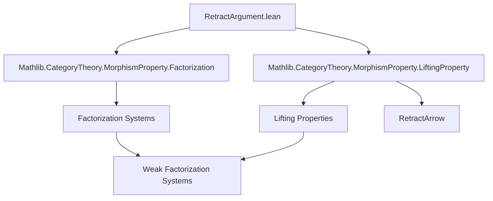
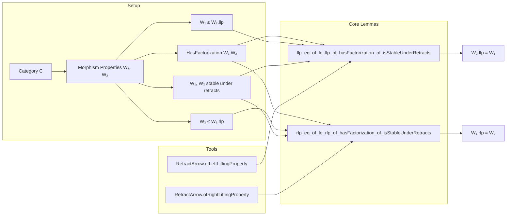

**Technical Brief: `RetractArgument.lean`**

---

### 1. KEY DEFINITIONS & THEOREMS

| Name | Type / Signature | Purpose |
|------|------------------|---------|
| `RetractArrow.ofLeftLiftingProperty` | `{i : X ⟶ Y} {p : Y ⟶ Z} {f : X ⟶ Z} → (i ≫ p = f) → HasLiftingProperty f p → RetractArrow f i` | Constructs a retraction of arrows when `f` has a left lift against `p` and factors as `i ≫ p`. |
| `RetractArrow.ofRightLiftingProperty` | `{i : X ⟶ Y} {p : Y ⟶ Z} {f : X ⟶ Z} → (i ≫ p = f) → HasLiftingProperty i f → RetractArrow f p` | Constructs a retraction of arrows when `f` has a right lift against `i` and factors as `i ≫ p`. |
| `llp_eq_of_le_llp_of_hasFactorization_of_isStableUnderRetracts` | `[HasFactorization W₁ W₂] → [W₁.IsStableUnderRetracts] → W₁ ≤ W₂.llp → W₂.llp = W₁` | Shows equality of `W₁` and the left lifting property of `W₂`, under factorization and retract stability of `W₁`. |
| `rlp_eq_of_le_rlp_of_hasFactorization_of_isStableUnderRetracts` | `[HasFactorization W₁ W₂] → [W₂.IsStableUnderRetracts] → W₂ ≤ W₁.rlp → W₁.rlp = W₂` | Symmetric dual: equality of `W₂` and the right lifting property of `W₁`, under factorization and retract stability of `W₂`. |

---

### 2. NAMING CONVENTIONS

- **Prefixes**:
  - `of_`: Indicates construction from a universal property or lifting condition (e.g., `ofLeftLiftingProperty`, `ofRightLiftingProperty`).
  - `llp_`, `rlp_`: Used for lemmas involving left/right lifting properties.
- **Suffixes**:
  - `_eq_of_…`: Indicates an equality proof derived from inclusion and stability assumptions.
  - `_of_`: Standard Lean pattern for “constructor from X” (e.g., `ofLeftLiftingProperty`).
- **Variable naming**:
  - `W₁`, `W₂`: Morphism properties (classes of morphisms).
  - `i`, `p`, `f`: Typical notation for “injective-like”, “projective-like”, and “factor” morphisms in factorization systems.

---

### 3. TACTIC STACK

- `simp [h]`: Used to simplify using the factorization equation `i ≫ p = f`.
- `have h := …`: Extracts data from assumptions (e.g., `factorizationData`).
- `have := hp _ h.hi`: Applies stability under retracts (via `hp` on a retract).
- `simpa using …`: Simplifies and discharges goal using a given term.
- `le_antisymm … …`: Proves equality of sets/morphism properties by double inclusion.
- `fun A B i hi ↦ …`: Standard lambda for element-wise reasoning on morphism properties.

No heavy automation (e.g., `aesop`, `ring`, `conv`) is used—proofs are mostly structural and rely on definitional simplification.

---

### 4. PROOF LOGIC

- **Structure**:
  1. Assume inclusion `W₁ ≤ W₂.llp` (or `W₂ ≤ W₁.rlp`).
  2. Use `HasFactorization` to factor any `i : A ⟶ B` as `i = i₁ ≫ i₂` with `i₁ ∈ W₁`, `i₂ ∈ W₂`.
  3. Use the inclusion hypothesis to deduce `i₂ ∈ W₂.llp` (or `i₁ ∈ W₁.rlp`).
  4. Apply `RetractArrow.ofLeftLiftingProperty` (or dual) to get a retraction `f ⇒ i₁`.
  5. Use `W₁.IsStableUnderRetracts` to conclude `i ∈ W₁`.
  6. Conclude equality via `le_antisymm`.

- **Logical flow**:
  > *Factor → Lift → Retract → Stability → Inclusion reverse to hypothesis → Equality.*

---

### 5. IMPORTS

- `Mathlib.CategoryTheory.MorphismProperty.Factorization`: Provides `HasFactorization`, `factorizationData`, and related infrastructure.
- `Mathlib.CategoryTheory.MorphismProperty.LiftingProperty`: Provides `HasLiftingProperty`, `llp`, `rlp`, and retract-related notions.

These imports define the core categorical context: morphism properties, lifting, factorization systems, and retract stability.

---

### 6. MERMAID DIAGRAMS

#### Dependency Graph (Module-Level)

#### Overview of Theoretical Flow

---

### 7. CONTEXTUAL ROLE

This file formalizes the **retract argument**, a foundational step in the theory of **weak factorization systems (WFS)**. It shows that under factorization and retract stability, the left (resp. right) class of a WFS is uniquely determined by the lifting condition. This is used extensively in homotopy theory (e.g., model categories), where one builds WFS from generating (co)fibrations.

The lemmas are dual and symmetric, and the proofs are minimal and structural—typical of Lean’s style in `Mathlib`.

--- 

Let me know if you'd like a formalized summary in `lean` comment format or a diagram of `RetractArrow` structure.
