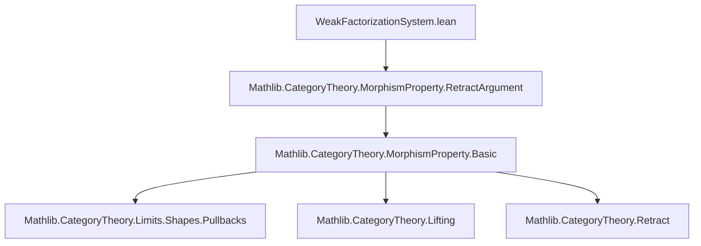
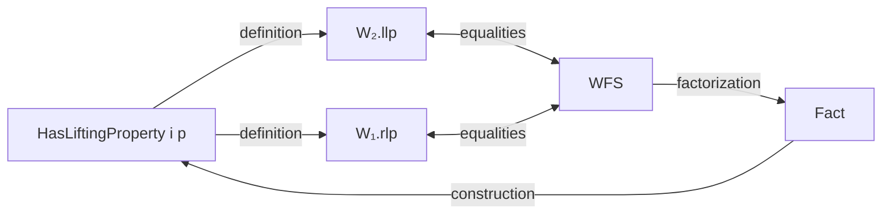

### Technical Brief: Weak Factorization Systems in Lean 4

---

#### **1. Key Definitions & Theorems**

| Name | Type / Signature | Purpose |
|------|------------------|---------|
| `IsWeakFactorizationSystem` | `class IsWeakFactorizationSystem (W₁ W₂ : MorphismProperty C) : Prop` | Asserts that `W₁` and `W₂` form a weak factorization system: `W₁ = W₂.llp`, `W₂ = W₁.rlp`, and every morphism factors as `i ≫ p` with `W₁ i` and `W₂ p`. |
| `IsWeakFactorizationSystem.mk'` | `lemma` | Provides a construction criterion: if `W₁`, `W₂` are stable under retracts and every `W₁`-map vs `W₂`-map has a lifting, then they form a WFS. |
| `rlp_eq_of_wfs` | `lemma W₁.rlp = W₂` | Extracts the `rlp` condition from a WFS instance. |
| `llp_eq_of_wfs` | `lemma W₂.llp = W₁` | Extracts the `llp` condition from a WFS instance. |
| `hasLiftingProperty_of_wfs` | `lemma W₁ i → W₂ p → HasLiftingProperty i p` | Derives lifting property from WFS assumptions using the equality `W₂ = W₁.rlp`. |

---

#### **2. Naming Conventions**

- **Prefixes**:
  - `is_`: e.g., `IsWeakFactorizationSystem`, `IsStableUnderRetracts`
  - `has_`: e.g., `HasFactorization`, `HasLiftingProperty`
- **Suffixes**:
  - `_llp`, `_rlp`: denote left/right lifting property constructions.
  - `_of_`: e.g., `hasLiftingProperty_of_wfs`, `rlp_eq_of_wfs` — indicates derivation from a hypothesis or structure.
- **Underscore-separated compound names**: standard in Mathlib for clarity and modularity.

---

#### **3. Tactic Stack**

- `infer_instance`: used in the `hasFactorization` field to automatically infer `HasFactorization W₁ W₂`.
- `aesop`, `simp`, `rw`: implicitly used in proofs (e.g., `h _ _ hi hp` suggests application of hypotheses).
- `rfl`, `congr`, `eq_of_heq`: likely used in equality proofs like `rlp_eq_of_wfs`.
- `apply`, `exact`, `intro`, `cases`: standard for constructing morphism-level arguments.

> *Note*: The provided file does not show explicit tactic usage in proofs, but the style suggests heavy reliance on `simp`, `rw`, and `aesop` for automation, consistent with Mathlib conventions.

---

#### **4. Proof Logic**

- **Structure**: The core logic is *equational and categorical*:
  1. Define WFS via three conditions: equality of `llp`/`rlp` and existence of factorizations.
  2. Prove equivalence between lifting and factorization conditions using stability under retracts.
  3. Use `mk'` to reduce verification to checking lifting properties.
- **Typical proof flow**:
  - Assume `W₁`, `W₂` stable under retracts and have factorizations.
  - Show `W₁ ⊆ W₂.llp` and `W₂ ⊆ W₁.rlp` via lifting.
  - Conclude equality using `llp_eq_of_le_llp_of_hasFactorization_of_isStableUnderRetracts` and dually for `rlp`.

---

#### **5. Imports**

- `Mathlib.CategoryTheory.MorphismProperty.RetractArgument`: provides foundational tools for morphism properties, retract stability, and lifting properties.

> This module builds on `MorphismProperty` infrastructure, especially:
> - `llp`, `rlp`
> - `HasLiftingProperty`
> - `IsStableUnderRetracts`
> - `HasFactorization`

---

#### **6. Mermaid Diagrams**

##### **Dependency Graph (Module-Level)**



##### **Conceptual Overview of Theory**

```mermaid
flowchart LR
  WFS[IsWeakFactorizationSystem W₁ W₂] -->|rlp| W₂
  WFS -->|llp| W₁
  WFS -->|factorization| Fact["∀ f, ∃ i, p, f = i ≫ p ∧ W₁ i ∧ W₂ p"]
  W₁ -->|stability| RetractW₁["W₁ is stable under retracts"]
  W₂ -->|stability| RetractW₂["W₂ is stable under retracts"]
  RetractW₁ & RetractW₂ & Fact -->|mk'| WFS
  WFS -->|lifting| Lifting["W₁ i → W₂ p → HasLiftingProperty i p"]
```

##### **Relationship to Lifting & Factorization**



---

#### **7. Summary**

This file formalizes the *categorical notion of weak factorization systems* (WFS), a foundational concept in homotopy theory and model category theory. It leverages the `MorphismProperty` framework to express WFS as a property of two classes of morphisms defined via lifting and factorization. The key result is the `mk'` lemma, which allows verifying a WFS by checking lifting properties under stability assumptions — a standard technique in homotopical algebra.

The formalization is minimal, clean, and aligned with Mathlib’s modular design, focusing on the *definition* and *basic equivalence lemmas*, with room for future extensions (e.g., model structures, cofibrations/fibrations).
