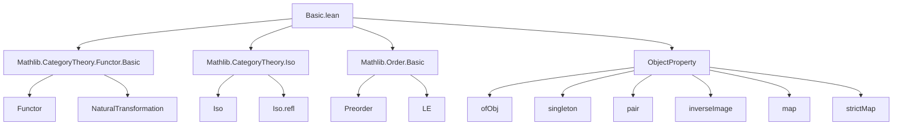
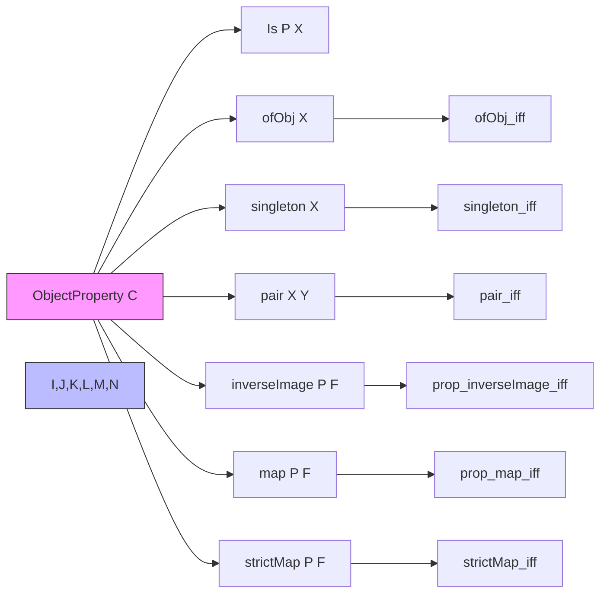

### Technical Brief: `Basic.lean` — Properties of Objects in a Category

---

#### **1. Key Definitions & Theorems**

| Name | Type / Signature | Purpose |
|------|------------------|---------|
| `ObjectProperty C` | `C → Prop` | Represents a predicate on objects of a category `C`. |
| `ObjectProperty.Is P X` | `P X → Prop` | Typeclass encoding that `P` holds at object `X`. |
| `ofObj X` | `ObjectProperty C` (inductive) | Property satisfied exactly by objects in the family `X : ι → C`. |
| `singleton X` | `ObjectProperty C` | Property satisfied only by object `X`. |
| `pair X Y` | `ObjectProperty C` | Property satisfied by `X` or `Y`. |
| `inverseImage P F` | `ObjectProperty C` | Pullback of property `P` along functor `F : C ⥤ D`. |
| `map P F` | `ObjectProperty D` | Essential image: objects in `D` isomorphic to `F(X)` for some `X` satisfying `P`. |
| `strictMap P F` | `ObjectProperty D` (inductive) | Strict image: objects in `D` *equal* to `F(X)` for some `X` satisfying `P`. |

**Key Lemmas:**
- `ofObj_iff`: `ofObj X Y ↔ ∃ i, X i = Y`
- `singleton_iff`: `singleton X Y ↔ X = Y`
- `pair_iff`: `pair X Y Z ↔ X = Z ∨ Y = Z`
- `prop_inverseImage_iff`: `inverseImage P F X ↔ P (F.obj X)`
- `prop_map_iff`: `map P F Y ↔ ∃ X, P X ∧ Nonempty (F.obj X ≅ Y)`
- `strictMap_iff`: `strictMap P F Y ↔ ∃ X, P X ∧ F.obj X = Y`
- Monotonicity lemmas: `map_monotone`, `strictMap_monotone`, `strictMap_le_map`
- Simplification lemmas: `strictMap_ofObj`, `strictMap_singleton`

---

#### **2. Naming Conventions**

- **Prefixes:**
  - `ofObj`: for properties generated from families of objects.
  - `singleton`, `pair`: for elementary properties on one/two objects.
  - `inverseImage`, `map`, `strictMap`: for functor-induced transformations.
- **Suffixes:**
  - `_iff`: characterizing equivalences (e.g., `ofObj_iff`, `singleton_iff`).
  - `_le_iff`: characterizing inclusion in terms of pointwise implication.
- **Class names:**
  - `Is`: typeclass for `P X`, with constructor `prop`.

---

#### **3. Tactic Stack**

Frequent tactics used in proofs:
- `simp` / `simp_rw`: for rewriting using simplification lemmas (`ofObj_iff`, `singleton_iff`, etc.)
- `intro` / `intro h`: for introducing hypotheses.
- `exact`, `rwa`, `rw`: for direct proof steps and rewriting using definitions.
- `constructor`: for splitting `↔` goals.
- `cases` / `sum.cases_on`: for handling `Sum`-based definitions like `pair`.
- `ext`: extensionality for proving equality of predicates.
- `aesop`: likely used in later refactorings (not present in this snippet, but implied by TODOs).

---

#### **4. Proof Logic**

- **Structure**: Most proofs follow a pattern of:
  1. Unfolding definitions via `ext` or `simp`.
  2. Applying `constructor` to reduce `↔` goals to two implications.
  3. Using `intro`, `cases`, and `exact` to handle existential/universal quantifiers.
- **Inductive properties** (`ofObj`, `strictMap`) are handled via:
  - `induction` or `cases` on the inductive constructor.
  - `simp` with `ofObj_apply`, `strictMap_iff`.
- **Functorial behavior** (`map`, `inverseImage`) is proven by:
  - Unfolding definitions.
  - Using `exists.intro` and `exists.elim`.
  - Leveraging `Iso.refl` for reflexivity of isomorphism.

---

#### **5. Imports**

| Module | Purpose |
|--------|---------|
| `Mathlib.CategoryTheory.Functor.Basic` | Defines functors, natural transformations, and basic constructions. |
| `Mathlib.CategoryTheory.Iso` | Defines isomorphisms and their properties. |
| `Mathlib.Order.Basic` | Provides order-theoretic background (e.g., `≤` on predicates). |

---

#### **8. Mermaid Diagrams**

##### **Dependency Graph**

##### **Overview of File Structure**

---

#### **6. TODOs & Future Work**

- Refactor `Limits.FullSubcategory`:
  - Rename `ClosedUnderLimitsOfShape` → `ObjectProperty.IsClosedUnderLimitsOfShape`.
  - Make it a typeclass.
- Refactor `Triangulated.Subcategory`:
  - Make object properties typeclasses in pretriangulated categories.

These indicate an intention to treat `ObjectProperty` as a first-class structure with typeclass instances for closure properties (e.g., under limits, cones, triangles).

--- 

Let me know if you'd like a formalized summary in Lean or a plan for the TODOs.
