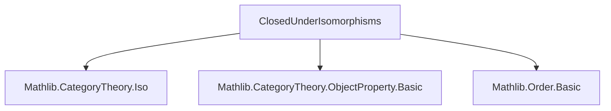
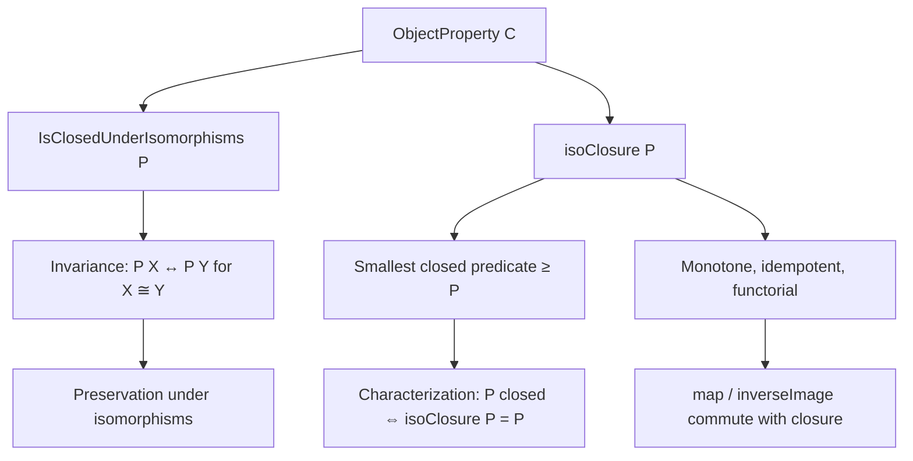
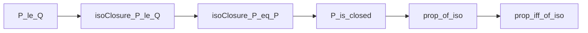

### Technical Brief: `ClosedUnderIsomorphisms.lean`

---

#### **1. Key Definitions & Theorems**

| Name | Type / Signature | Purpose |
|------|------------------|---------|
| `IsClosedUnderIsomorphisms` | `class IsClosedUnderIsomorphisms (P : ObjectProperty C) : Prop` | Typeclass asserting that if `P X` holds and `X ≅ Y`, then `P Y`. |
| `prop_of_iso` | `{X Y : C} → X ≅ Y → P X → P Y` | Immediate consequence of the class: `P` is preserved under isomorphism. |
| `prop_iff_of_iso` | `{X Y : C} → X ≅ Y → P X ↔ P Y` | Under `IsClosedUnderIsomorphisms`, `P` is *invariant* under isomorphism. |
| `prop_of_isIso` | `{f : X ⟶ Y} [IsIso f] → P X → P Y` | Special case: `P` preserved under isomorphisms viewed as invertible morphisms. |
| `prop_iff_of_isIso` | `{f : X ⟶ Y} [IsIso f] → P X ↔ P Y` | Invariance under isomorphisms via invertible morphisms. |
| `isoClosure` | `P : ObjectProperty C ↦ (X ↦ ∃ Y, P Y × Nonempty (X ≅ Y))` | Smallest predicate containing `P` and closed under isomorphisms. |
| `prop_isoClosure_iff` | `isoClosure P X ↔ ∃ Y, P Y × Nonempty (X ≅ Y)` | Definition unfolding. |
| `prop_isoClosure` | `P X → IsIso (e : X ⟶ Y) → isoClosure P Y` | Shows `isoClosure` is upward-closed w.r.t. isomorphisms. |
| `le_isoClosure` | `P ≤ isoClosure P` | `P` is contained in its closure. |
| `monotone_isoClosure` | `P ≤ Q ⇒ isoClosure P ≤ isoClosure Q` | `isoClosure` is monotone. |
| `isoClosure_eq_self` | `[IsClosedUnderIsomorphisms P] ⇒ isoClosure P = P` | `P` is closed iff it equals its closure. |
| `isoClosure_le_iff` | `[IsClosedUnderIsomorphisms Q] ⇒ isoClosure P ≤ Q ↔ P ≤ Q` | Universal property of `isoClosure`. |
| `instance isoClosure_isClosed` | `IsClosedUnderIsomorphisms (isoClosure P)` | `isoClosure` is always closed under isomorphisms. |
| `isClosedUnderIsomorphisms_iff_isoClosure_eq_self` | `IsClosedUnderIsomorphisms P ↔ isoClosure P = P` | Characterization of closed predicates. |
| `instance map_isClosed` | `IsClosedUnderIsomorphisms (P.map F)` | `P` closed ⇒ its image under functor `F` is closed. |
| `instance inverseImage_isClosed` | `[IsClosedUnderIsomorphisms P] ⇒ IsClosedUnderIsomorphisms (P.inverseImage F)` | Pullback of a closed predicate along a functor is closed. |
| `isoClosure_strictMap` | `(P.strictMap F).isoClosure = P.map F` | Closure of strict map equals direct image. |
| `map_isoClosure` | `P.isoClosure.map F = P.map F` | Direct image commutes with closure. |

---

#### **2. Naming Conventions**

- **Prefixes**:
  - `prop_`: Lemmas about preservation/invariance of `P` under isomorphisms.
  - `isoClosure_`: Properties of the closure operator.
  - `le_`, `monotone_`: Order-theoretic properties (since `ObjectProperty C` is a poset).
- **Suffixes**:
  - `_iff`: Equivalence statements.
  - `_isClosed`: Instance declarations or characterizations of closure.
- **Operator names**:
  - `map`, `inverseImage`, `strictMap`: Standard categorical operations on predicates.
  - `isoClosure`: The closure operator.

---

#### **3. Tactic Stack**

- `rfl`: For unfolding definitions (`prop_isoClosure_iff`).
- `intro` + `exact`: Basic intro/apply style.
- `apply le_antisymm`: To prove equality of predicates (via pointwise ≤).
- `rw [isoClosure_eq_self]`, `rw [← h]`: Rewriting using key lemmas.
- `infer_instance`: To discharge typeclass goals (e.g., `instance isoClosure_isClosed`).
- `simp_rw`: Not explicitly used, but `rw` + `simp`-friendly lemmas suggest `simp` could be used in extensions.
- `cases` / `rintro`: Pattern matching on existential/dependent pairs.

---

#### **4. Proof Logic**

- **Structure**: Most proofs follow a *two-step ≤-antisymmetry* pattern for equality of predicates:
  1. Show `isoClosure P ≤ P` using closure assumption (`prop_of_iso`).
  2. Show `P ≤ isoClosure P` via `le_isoClosure`.
- **Inductive/constructive reasoning**: Existential witnesses are built explicitly (e.g., `⟨X, hX, ⟨Iso.refl X⟩⟩`).
- **Functorial behavior**: Proofs for `map`/`inverseImage` use functoriality of `≅` and `IsIso`.
- **Order-theoretic reasoning**: Leverages the lattice structure of `ObjectProperty C` (pointwise order).

---

#### **5. Imports**

| Module | Purpose |
|--------|---------|
| `Mathlib.CategoryTheory.Iso` | Isomorphisms, `asIso`, `Iso.refl`, `Iso.symm`, `Iso.trans`. |
| `Mathlib.CategoryTheory.ObjectProperty.Basic` | `ObjectProperty`, `map`, `inverseImage`, `strictMap`, order structure. |
| `Mathlib.Order.Basic` | Poset structure, `≤`, `le_antisymm`, monotonicity. |

---

#### **6. Mermaid Diagrams**

##### **Dependency Graph (Module-Level)**

##### **Conceptual Overview (Theory Flow)**

##### **Proof Strategy Skeleton**

---

#### **7. Summary**

This module formalizes the categorical notion of *properties of objects closed under isomorphism*, introducing a typeclass `IsClosedUnderIsomorphisms` and a closure operator `isoClosure`. It establishes:
- Equivalence between closure and invariance under isomorphism.
- `isoClosure` as a *closure operator* (extensive, monotone, idempotent).
- Functorial compatibility: direct images and inverse images preserve closure.

The development is clean, order-theoretic, and highly reusable—especially in contexts like localization, sheaf theory, or model structures where isomorphism-invariant properties dominate.

--- 

Let me know if you'd like a formalization checklist or a plan for extending this theory (e.g., to subobject classifiers, Grothendieck topologies, or homotopy categories).
