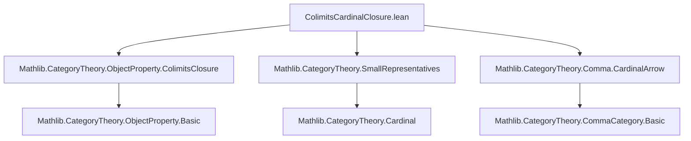

### Technical Brief: `ColimitsCardinalClosure.lean`

---

#### **1. Key Definitions & Theorems**

| Name | Type / Signature | Purpose |
|------|------------------|---------|
| `colimitsCardinalClosure` | `def colimitsCardinalClosure : ObjectProperty C` | Closure of `P` under colimits indexed by categories `J` with `|Arrow J| < κ`. Defined as `P.colimitsClosure (SmallCategoryCardinalLT.categoryFamily κ)`. |
| `le_colimitsCardinalClosure` | `lemma P ≤ P.colimitsCardinalClosure κ` | Inclusion of `P` into its closure (reflexivity of closure). |
| `instance IsClosedUnderIsomorphisms` | `instance (P.colimitsCardinalClosure κ).IsClosedUnderIsomorphisms` | Closure is closed under isomorphisms (inherited from `colimitsClosure`). |
| `instance EssentiallySmall` | `instance [EssentiallySmall P] [LocallySmall C] ⇒ EssentiallySmall (P.colimitsCardinalClosure κ)` | Closure preserves essential smallness under local smallness. |
| `instance IsClosedUnderColimitsOfShape` | `instance (S : SmallCategoryCardinalLT κ) ⇒ IsClosedUnderColimitsOfShape (SmallCategoryCardinalLT.categoryFamily κ S)` | Closure is closed under colimits of shapes in the family `SmallCategoryCardinalLT.categoryFamily κ`. |
| `isClosedUnderColimitsOfShape_colimitsCardinalClosure` | `lemma (J : Type u') [Category J] (hJ : HasCardinalLT (Arrow J) κ) ⇒ IsClosedUnderColimitsOfShape J` | Closure is closed under *any* shape `J` with `|Arrow J| < κ`, via equivalence to a small representative. |
| `colimitsCardinalClosure_le` | `lemma {Q : ObjectProperty C} [...] (hQ : ∀ J, HasCardinalLT (Arrow J) κ ⇒ Q.IsClosedUnderColimitsOfShape J) (h : P ≤ Q) ⇒ P.colimitsCardinalClosure κ ≤ Q` | Universal property: minimal closure satisfying closure under such colimits. |
| `instance IsStableUnderRetracts` | `instance [Fact κ.IsRegular] ⇒ IsStableUnderRetracts (P.colimitsCardinalClosure κ)` | Closure is stable under retracts, assuming `κ` is regular (uses `WalkingParallelPair` and `aleph0_le`). |

---

#### **2. Naming Conventions**

- **Prefixes**:
  - `colimitsCardinalClosure`: main definition name.
  - `isClosedUnder...`: standard property names (e.g., `IsClosedUnderColimitsOfShape`, `IsStableUnderRetracts`).
  - `SmallCategoryCardinalLT`: family of small categories indexed by cardinal bound.
- **Suffixes**:
  - `_closure`: indicates a closure operation.
  - `_le`: indicates inclusion or minimality lemmas.
  - `_iff_of_equivalence`: used in equivalence-based transfer lemmas.

---

#### **3. Tactic Stack**

Frequent tactics used in proofs:

- `dsimp [colimitsCardinalClosure]`: simplifies definitions.
- `infer_instance`: fills in typeclass goals (e.g., closure properties).
- `rw [...]`: rewrites using equivalences or lemmas (e.g., `isClosedUnderColimitsOfShape_iff_of_equivalence`).
- `simp only [...]`: simplifies cardinal inequalities (e.g., `hasCardinalLT_aleph0_iff`).
- `obtain ⟨S, ⟨e⟩⟩ := ...`: destructs existential quantifiers involving equivalences.
- `exact colimitsClosure_le h`: applies universal property of colimits closure.

No heavy automation (`aesop`, `ring`, `linarith`) appears—proofs rely on structural properties and typeclass inference.

---

#### **4. Proof Logic**

- **Structure**: Most proofs follow a pattern:
  1. **Unfold definition** (`dsimp [colimitsCardinalClosure]`).
  2. **Apply instance inference** for closure properties (e.g., `infer_instance`).
  3. **Use equivalence** to reduce to a representative in `SmallCategoryCardinalLT κ`.
  4. **Leverage minimality** (`colimitsClosure_le`) for universal properties.
- **Key logical steps**:
  - **Equivalence-based transfer**: If `J ≃ J'`, then closure under `J'` implies closure under `J`.
  - **Cardinal bounding**: `HasCardinalLT (Arrow J) κ` ensures `J` is “small enough” to be equivalent to some `S : SmallCategoryCardinalLT κ`.
  - **Regular cardinal assumption**: For retracts stability, uses `κ.IsRegular` to bound the size of parallel pairs.

---

#### **5. Imports & Dependencies**

| Import | Role |
|--------|------|
| `Mathlib.CategoryTheory.ObjectProperty.ColimitsClosure` | Core theory of colimits closure (`colimitsClosure`, `IsClosedUnderColimitsOfShape`, etc.). |
| `Mathlib.CategoryTheory.SmallRepresentatives` | Provides `SmallCategoryCardinalLT` and representation of small categories up to cardinal bounds. |
| `Mathlib.CategoryTheory.Comma.CardinalArrow` | Defines `HasCardinalLT (Arrow J) κ` and related cardinality tools. |

---

#### **6. Mermaid Diagrams**

##### **Dependency Graph (Module Level)**



##### **Overview of Theory Flow**

```mermaid
flowchart LR
  P[ObjectProperty P] -->|closure| C[P.colimitsCardinalClosure κ]
  C -->|closed under| I[Isomorphisms]
  C -->|closed under| CL[Colimits of shape J, |Arrow J| < κ]
  C -->|preserves| ES[Essentially Small]
  C -->|stable under| R[Retracts] 
  style R fill:#ffe6e6,stroke:#333
  classDef key fill:#e6ffe6,stroke:#333;
  class P,C,ES,CL key;
```

- **Key insight**: The closure is *minimal* among properties closed under colimits of shape `J` with `|Arrow J| < κ`, and inherits structural properties (isomorphism closure, essential smallness, retracts stability under regularity).

--- 

Let me know if you'd like a formalized summary in Lean or a diagram of the `SmallCategoryCardinalLT` family structure.
