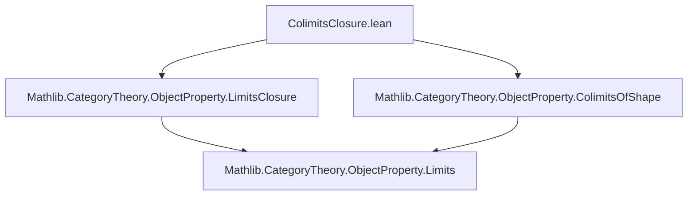
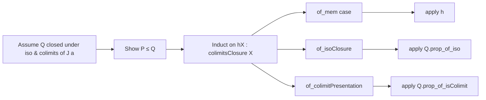

Here's a structured technical brief based on the provided `ColimitsClosure.lean` file:

---

### **1. Key Definitions & Theorems**

| Name | Type / Signature | Purpose |
|------|------------------|---------|
| `colimitsClosure` | `inductive colimitsClosure : ObjectProperty C` | Defines the smallest property containing `P`, closed under isomorphisms and colimits of shapes `J a`. |
| `le_colimitsClosure` | `P ≤ P.colimitsClosure J` | Shows `P` is contained in its colimits closure. |
| `colimitsClosure_le` | `P.colimitsClosure J ≤ Q` under closure assumptions on `Q` and `P ≤ Q` | Universal property: colimits closure is the *least* such closed extension. |
| `colimitsClosure_monotone` | `P ≤ Q ⇒ P.colimitsClosure J ≤ Q.colimitsClosure J` | Monotonicity of the closure operator. |
| `colimitsClosure_isoClosure` | `P.isoClosure.colimitsClosure J = P.colimitsClosure J` | Closure commutes with iso-closure: iso-closure first or last gives same result. |
| `colimitsClosure_eq_unop_limitsClosure` | `P.colimitsClosure J = (P.op.limitsClosure (fun a ↦ (J a)ᵒᵖ)).unop` | Duality: colimits closure = opposite of limits closure of opposite property. |
| `EssentiallySmall` instance | Under smallness assumptions on `P`, `J`, and `α` | Shows `P.colimitsClosure J` is essentially small. |

---

### **2. Naming Conventions**

- **Prefixes / Suffixes**:
  - `colimitsClosure`: main operator name.
  - `of_*`: constructors of inductive type (`of_mem`, `of_isoClosure`, `of_colimitPresentation`).
  - `le_*`: inclusion lemmas (`le_colimitsClosure`, `colimitsClosure_le`, `colimitsClosure_monotone`).
  - `_*_eq_*`: structural equalities (`colimitsClosure_isoClosure`, `colimitsClosure_eq_unop_limitsClosure`).
  - `_*_instance`: typeclass instances (`IsClosedUnderIsomorphisms`, `IsClosedUnderColimitsOfShape`).

- **Suffixes**:
  - `Closure`: indicates closure operator.
  - `op`/`unop`: used for duality (e.g., `P.op`, `.unop`).
  - `Presentation`: used for colimit presentations (`ColimitPresentation`).

---

### **3. Tactic Stack**

Frequently used tactics in proofs:
- `intro`, `rw`, `exact`, `apply`, `induction` (for inductive types).
- `refine` + `?_` for hole-driven construction.
- `infer_instance` (to discharge typeclass goals).
- `simp_rw` (implied via `rw` + `simp`-friendly lemmas).
- `apply colimitsClosure_le`, `apply colimitsClosure_monotone`, etc., as proof combinators.

No heavy automation like `aesop`, `ring`, or `linarith` — proofs are mostly structural and rely on induction and universal properties.

---

### **4. Proof Logic**

- **Inductive structure**: Proofs about `colimitsClosure` use induction on its constructors.
- **Universal property**: To show `P.colimitsClosure J ≤ Q`, it suffices to verify `Q` contains `P`, is closed under isos, and under colimits of shapes `J a`.
- **Duality**: Key insight: colimits closure is defined *dual* to limits closure via `op`/`unop`.
- **Essential smallness**: Proved by reducing to the known result for `limitsClosure` via the duality lemma.

Typical proof pattern:
```lean
apply colimitsClosure_le
· exact h
· exact closure_iso
· exact closure_colimits
```

Or for equalities:
```lean
refine le_antisymm ?_ ?_
· apply colimitsClosure_le ...
· apply colimitsClosure_monotone ...
```

---

### **5. Imports**

- `Mathlib.CategoryTheory.ObjectProperty.LimitsClosure`: source of dualized results.
- `Mathlib.CategoryTheory.ObjectProperty.ColimitsOfShape`: for `ColimitPresentation`, `IsClosedUnderColimitsOfShape`.

These imports define the dual framework (limits closure) and colimit closure notions.

---

### **6. Mermaid Diagrams**

#### **Dependency Graph (File-Level)**



#### **Conceptual Overview (Module Structure)**

```mermaid
graph TD
  subgraph "ObjectProperty"
    P[P : ObjectProperty C]
    J[J : α → Type u']
    CL[P.colimitsClosure J]
  end

  CL -->|constructor| O[of_mem]
  CL -->|constructor| I[of_isoClosure]
  CL -->|constructor| C[of_colimitPresentation]

  O --> P
  I --> CL
  C -->|uses| Colim[ColimitPresentation (J a) X]
  C -->|assumes| H[∀ j, colimitsClosure (pres.diag.obj j)]

  CL -->|universal| UL[Universal property: colimitsClosure_le]
  CL -->|duality| D[= (P.op.limitsClosure (J a)ᵒᵖ).unop]
```

#### **Proof Strategy Flow (for `colimitsClosure_le`)**



---

Let me know if you'd like a formalized dependency graph (e.g., for `leanpkg` or `lake`) or a visualization of the inductive type’s structure.
