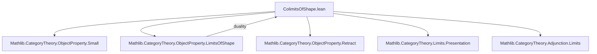
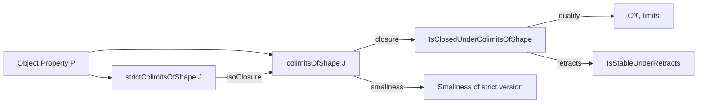

Here is the **technical metadata extraction** for `ColimitsOfShape.lean`, formatted as requested:

---

### 1. KEY DEFINITIONS & THEOREMS

| Name | Type / Signature | Purpose |
|------|------------------|---------|
| `strictColimitsOfShape` | `inductive ObjectProperty C` | Objects *equal* to `colimit F` where all `F.obj j` satisfy `P`. |
| `ColimitOfShape (X : C)` | `structure` extending `ColimitPresentation J X` | A witness that `X` is a colimit of a diagram satisfying `P`. |
| `colimitsOfShape` | `def ObjectProperty C := fun X ↦ Nonempty (P.ColimitOfShape J X)` | Objects *isomorphic* to some `colimit F` with `F.obj j ⊨ P`. |
| `colimit (F : J ⥤ C) [HasColimit F] (hF : ∀ j, P (F.obj j))` | `P.ColimitOfShape J (colimit F)` | Constructs a `ColimitOfShape` from a functor with colimit. |
| `ofIso`, `ofLE`, `reindex`, `toCostructuredArrow` | Various `ColimitOfShape` morphisms | Structural lemmas for manipulating `ColimitOfShape` witnesses. |
| `isoClosure_strictColimitsOfShape` | `lemma` | Shows `colimitsOfShape` is the iso-closure of `strictColimitsOfShape`. |
| `IsClosedUnderColimitsOfShape` | `class` | `P` is closed under colimits of shape `J` iff `P.colimitsOfShape J ≤ P`. |
| `colimitsOfShape_le_of_final`, `colimitsOfShape_congr`, `isClosedUnderColimitsOfShape_iff_of_equivalence` | `lemma`s | Invariance under final functors and categorical equivalences. |
| `colimitsOfShape_eq_unop_limitsOfShape`, `limitsOfShape_eq_unop_colimitsOfShape` | `lemma`s | Relates colimits in `C` to limits in `Cᵒᵖ`, and vice versa. |
| `isClosedUnderColimitsOfShape_iff_op`, `isClosedUnderLimitsOfShape_iff_op`, etc. | `lemma`s | Equivalences between closure under colimits in `C` and limits in `Cᵒᵖ`. |
| `IsStableUnderRetracts` instance | `instance` | Shows closure under retracts follows from closure under colimits over `WalkingParallelPair`. |

---

### 2. NAMING CONVENTIONS

- **Prefixes**:
  - `strictColimitsOfShape`: strict (equality-based) version.
  - `colimitsOfShape`: up-to-iso version.
  - `ColimitOfShape`: witness structure.
  - `isClosedUnderColimitsOfShape`: closure property.
- **Suffixes**:
  - `_le_`: monotonicity or inclusion lemmas (e.g., `strictColimitsOfShape_le_colimitsOfShape`).
  - `_congr`, `_equivalence`: invariance under equivalence.
  - `_op`, `_unop`: duality with opposite categories.
- **Structure fields**:
  - `prop_diag_obj`: ensures diagram objects satisfy `P`.
  - `toColimitPresentation`: forgets the `P`-condition.

---

### 3. TACTIC STACK

Frequently used tactics:
- `intro`, `exact`, `refine`, `rw`, `conv_rhs`
- `simp`, `simpa`, `ext`, `apply`, `cases`
- `convert`, `rwa`, `erw`, `change`
- `have`, `let`, `choose` (for choice)
- `monotone`, `apply_fun`, `dsimp`, `induction` (implicit in `small_of_surjective`)
- `aesop` not used here — proof is mostly `simp` + `rw` + `exact`.

---

### 4. PROOF LOGIC

- **Inductive definitions** for `strictColimitsOfShape`.
- **Structure-based witnesses** (`ColimitOfShape`) for constructive reasoning.
- **Iso-closure** used to pass from equality to isomorphism.
- **Monotonicity** and **invariance** proofs via:
  - `intro X ⟨h⟩; exact ⟨h.«...»⟩`
  - `rw [← isoClosure_strictColimitsOfShape]`
- **Duality** via `op`/`unop` and `isColimitOfOp`/`isLimitOfUnop`.
- **Smallness** via `small_of_surjective` and lifting through full subcategory.
- **Closure under retracts** via factorization through a cofork and showing it’s a colimit.

---

### 5. IMPORTS

| Module | Purpose |
|--------|---------|
| `Mathlib.CategoryTheory.ObjectProperty.Small` | Smallness criteria for object properties. |
| `Mathlib.CategoryTheory.ObjectProperty.LimitsOfShape` | Dual theory for limits. |
| `Mathlib.CategoryTheory.ObjectProperty.Retract` | Retract stability. |
| `Mathlib.CategoryTheory.Limits.Presentation` | Colimit presentations. |
| `Mathlib.CategoryTheory.Adjunction.Limits` | Preservation of limits/colimits under adjunctions. |

---

### 6. MERMAID DIAGRAMS

#### Dependency Graph (Top-Level)



#### Overview of Theory Flow



#### Duality Diagram (Key Equivalences)

```mermaid
flowchart LR
  C -- op --> Cᵒᵖ
  P.colimitsOfShape J -- colimitsOfShape_eq_unop_limitsOfShape --> (P.op.limitsOfShape Jᵒᵖ).unop
  P.limitsOfShape J -- limitsOfShape_eq_unop_colimitsOfShape --> (P.op.colimitsOfShape Jᵒᵖ).unop
```

---

Let me know if you'd like a **Lean-specific dependency graph** (e.g., `#print dependencies`) or a **module-level call graph**.
