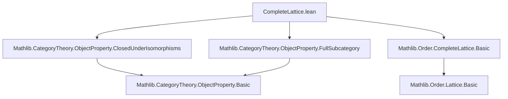

### Technical Brief: `CompleteLattice.lean` — ObjectProperty is a Complete Lattice

---

#### **1. Key Definitions & Theorems**

| Name | Type / Statement | Purpose |
|------|------------------|---------|
| `CompleteLattice (ObjectProperty C)` | `instance` | Establishes that the type of object properties in a category `C` forms a complete lattice. |
| `prop_inf_iff` | `(P ⊓ Q) X ↔ P X ∧ Q X` | Characterizes meet (infimum) pointwise as logical conjunction. |
| `prop_sup_iff` | `(P ⊔ Q) X X ↔ P X ∨ Q X` | Characterizes join (supremum) pointwise as logical disjunction. |
| `isoClosure_sup` | `(P ⊔ Q).isoClosure = P.isoClosure ⊔ Q.isoClosure` | Shows that iso-closure distributes over finite joins. |
| `isoClosure_iSup` | `((⨆ a, P a)).isoClosure = ⨆ a, (P a).isoClosure` | Extends distribution to arbitrary suprema (iSup). |
| `ι_map_top` | `(⊤).map P.ι = P.isoClosure` | Relates the top element’s map to the iso-closure of a property. |
| `IsClosedUnderIsomorphisms` instances | For `⊔`, `⊓`, `⊤`, `⨆` | Ensures closure under isomorphisms is preserved under lattice operations. |

---

#### **2. Naming Conventions**

- **`prop_*`**: Properties defined pointwise on objects (e.g., `prop_inf_iff`, `prop_sup_iff`, `prop_iSup_iff`).
- **`isoClosure_*`**: Lemmas about behavior of `isoClosure` under lattice operations.
- **`isClosedUnderIsomorphisms`**: Predicate used for closure under isomorphisms; instances often use `of_iso`.
- **`ι_map_*`**: Maps involving the inclusion functor `ι : P.isoClosure ↪ C`.
- **`le_*` / `mono*`**: Used in monotonicity arguments (e.g., `monotone_isoClosure`).
- **`ext X` / `ext Y`**: Extensionality proofs over objects.

---

#### **3. Tactic Stack**

| Tactic | Usage Frequency | Purpose |
|--------|-----------------|---------|
| `ext` | High | Prove equality of object properties by extensionality (pointwise equivalence). |
| `simp only [...]` | Very High | Simplify using `@[simp]` lemmas, especially `prop_*`, `isoClosure_*`, and closure lemmas. |
| `constructor` | Medium | Split biconditionals or existential/universal goals. |
| `obtain ... | ...` | Medium | Case analysis on disjunctions (`hY | hY`). |
| `rw [...]` | Medium | Rewrite using equalities like `isoClosure_eq_self`. |
| `refine ...` | Low | Construct proofs with holes filled later (e.g., `le_antisymm`). |
| `intro` / `intro h` | Medium | Introduce hypotheses for implications. |
| `exact` / `apply` | Medium | Apply known lemmas or instances. |

---

#### **4. Proof Logic**

- **Structure**: Proofs follow a *pointwise* strategy:
  1. Use `ext X` to reduce to showing equivalence at each object `X : C`.
  2. Simplify using `simp only [prop_*]` to reduce to logical statements.
  3. For closure properties, use `isClosedUnderIsomorphisms_iff_isoClosure_eq_self` to reduce to `isoClosure = self`.
  4. For iso-closure distributivity, apply `le_antisymm` and use:
     - `isoClosure_le_iff` or `le_isoClosure` for one direction,
     - `monotone_isoClosure` and lattice inequalities for the other.
- **Induction**: Not used — all proofs are direct and rely on extensionality and simplification.
- **Case analysis**: Used in `isoClosure_sup` to split on `P X ∨ Q X`.

---

#### **5. Imports**

| Module | Role |
|--------|------|
| `Mathlib.CategoryTheory.ObjectProperty.ClosedUnderIsomorphisms` | Defines `IsClosedUnderIsomorphisms` and related lemmas. |
| `Mathlib.CategoryTheory.ObjectProperty.FullSubcategory` | Defines `isoClosure`, `ι`, and full subcategory construction. |
| `Mathlib.Order.CompleteLattice.Basic` | Provides `CompleteLattice` typeclass and basic lattice theory. |

---

#### **6. Mermaid Diagrams**

##### **Dependency Graph (Module Level)**



##### **Overview of Theory Flow**

```mermaid
flowchart LR
  subgraph "Lattice Structure"
    P[ObjectProperty C] -->|meet| P ⊓ Q
    P -->|join| P ⊔ Q
    P -->|top| ⊤
    P -->|bot| ⊥
    P -->|iSup| ⨆ a, P a
  end

  subgraph "Closure Properties"
    P -->|isoClosure| P.isoClosure
    P -->|ι| ι : P.isoClosure ↪ C
    P -->|closed?| P.IsClosedUnderIsomorphisms
  end

  P -->|instance| CompleteLattice (ObjectProperty C)
  P -->|distributivity| isoClosure_sup, isoClosure_iSup
  P -->|mapping| ι_map_top
```

---

#### **7. Summary**

This file establishes that `ObjectProperty C`, the type of predicates on objects of a category `C` closed under isomorphisms, carries a **complete lattice structure**, where:
- Meet and join are defined pointwise (`∧`, `∨`),
- Arbitrary suprema are given by existential quantification,
- Closure under isomorphisms is preserved under all lattice operations,
- The `isoClosure` operation commutes with finite and arbitrary joins.

The proofs are largely *elementary* and *constructive*, relying on extensionality, simplification, and basic categorical constructions (full subcategories, isomorphisms). The main insight is that `isoClosure` is a *closure operator* commuting with joins, making the closed properties a *complete sublattice* of all object predicates.

--- 

Let me know if you'd like a formalized summary in Lean or a diagram of the `ObjectProperty` type hierarchy.
