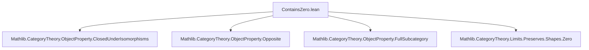
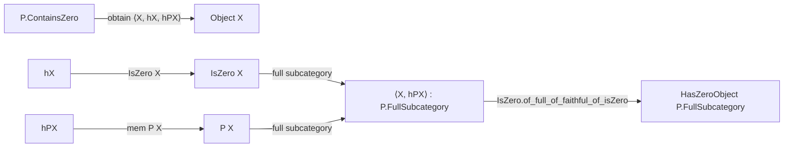

**Technical Brief: `ContainsZero.lean`**

---

### 1. **Key Definitions & Theorems**

| Name | Type / Signature | Purpose |
|------|------------------|---------|
| `ContainsZero` | `class ContainsZero (P : ObjectProperty C) : Prop` | Expresses that *some* zero object satisfies `P`. |
| `exists_prop_of_containsZero` | `[P.ContainsZero] : ∃ Z, IsZero Z ∧ P Z` | Extracts the existential witness from `ContainsZero`. |
| `prop_of_isZero` | `[P.ContainsZero] [P.IsClosedUnderIsomorphisms] {Z}, IsZero Z → P Z` | If `P` is closed under isomorphisms, then *any* zero object satisfies `P`. |
| `prop_zero` | `[P.ContainsZero] [P.IsClosedUnderIsomorphisms] [HasZeroObject C] : P 0` | Special case: the chosen zero object `0` satisfies `P`. |
| `Functor.kernel` | `abbrev Functor.kernel (F : C ⥤ D) : ObjectProperty C := inverseImage IsZero F` | Property of objects `X` such that `F X` is zero. |

---

### 2. **Naming Conventions**

- **Prefixes**:
  - `containsZero` → `ContainsZero` (class name)
  - `prop_of_` → properties derived from assumptions (e.g., `prop_of_isZero`, `prop_zero`)
  - `exists_` → extraction lemmas (e.g., `exists_prop_of_containsZero`)
- **Suffixes**:
  - `_closure`, `_op`, `_unop`, `_map`, `_inverseImage` — standard for constructions on `ObjectProperty`.
- **Notable pattern**: `P.prop_of_iso h hP` — uses isomorphism to transfer `P` along `h`.

---

### 3. **Tactic Stack**

Frequent tactics used in proofs:

| Tactic | Usage |
|--------|-------|
| `obtain ⟨…⟩ := …` | Destruct existential witnesses (e.g., from `P.exists_prop_of_containsZero`). |
| `exact` / `refine` | Construct witnesses for `Exists` or `ContainsZero`. |
| `simp` | Simplify goals involving `0`, `isZero_zero`, etc. |
| `apply` / `exact` with `P.prop_map_obj`, `P.le_isoClosure`, etc. | Apply instance lemmas or class members. |
| `cases` / `intro` | Rare, but used implicitly in `by`-mode proofs. |

No heavy automation (`aesop`, `ring`, `linarith`) appears — proofs are mostly *constructive* and rely on categorical structure.

---

### 4. **Proof Logic**

- **General pattern**:
  1. Assume `P.ContainsZero` → get `⟨Z₀, hZ₀, hP₀⟩`.
  2. Construct a candidate zero object (e.g., `F.obj Z₀`, `0`, `op Z`, etc.).
  3. Prove it is zero (e.g., `F.map_isZero hZ₀`, `isZero_zero`, `hZ.op`).
  4. Prove `P` holds (e.g., `P.prop_map_obj`, `P.le_isoClosure`, `P.prop_of_isZero`).
- **Key logical flow**:
  - *Existential introduction* → *isomorphism/closure* → *transport along functors*.
  - When `P` is closed under isomorphisms, all zero objects satisfy `P`; otherwise, only some.

---

### 5. **Imports & Dependencies**

| Import | Role |
|--------|------|
| `Mathlib.CategoryTheory.ObjectProperty.ClosedUnderIsomorphisms` | Defines `IsClosedUnderIsomorphisms` and related lemmas. |
| `Mathlib.CategoryTheory.ObjectProperty.Opposite` | Defines `P.op`, `P.unop`. |
| `Mathlib.CategoryTheory.ObjectProperty.FullSubcategory` | Defines `P.FullSubcategory`, used for `HasZeroObject P.FullSubcategory`. |
| `Mathlib.CategoryTheory.Limits.Preserves.Shapes.Zero` | Defines `PreservesZeroMorphisms`, `map_isZero`, etc. |

**Core theory scope**:  
This file sits in the *object property* hierarchy of `CategoryTheory`, especially around *zero objects*, *preservation*, and *closure properties*. It connects to:
- `FullSubcategory` (via `HasZeroObject P.FullSubcategory`)
- `PreservesZeroMorphisms` (via `map_isZero`, `prop_map_obj`)
- `Opposite` (via `op`, `unop`)
- `IsZero` and `ZeroObject` (via `isZero_zero`, `isZero_zero D`, etc.)

---

### 6. **Mermaid Diagrams**

#### **Dependency Graph (Module Level)**



#### **Conceptual Overview of `ContainsZero`**

```mermaid
flowchart LR
  P[ObjectProperty P] -->|ContainsZero| Z[∃ Z, IsZero Z ∧ P Z]
  Z -->|if closed under iso| AllZ[∀ Z, IsZero Z → P Z]
  Z -->|if has zero object| Zero[ P 0 ]
  Z -->|functor F| FZ[ (P.map F).ContainsZero ]
  Z -->|functor F (right adjoint-like)| IFZ[ (P.inverseImage F).ContainsZero ]
  Z -->|iso closure| ICZ[ P.isoClosure.ContainsZero ]
  Z -->|intersection| IntZ[ (P ⊓ Q).ContainsZero ]
```

#### **Full Subcategory Zero Object Construction**



---

### 7. **Summary**

This module formalizes the notion that a property `P` of objects *holds for some zero object*, without requiring `P` to be isomorphism-closed. It provides:
- A minimal class `ContainsZero` for existence,
- Lemmas to lift this to *all* zero objects when closure under isomorphisms is available,
- Instances for common constructions: pushforward (`map`), pullback (`inverseImage`), iso-closure, intersection, opposite/unop, and full subcategories.

It serves as a foundational building block for properties like “projective”, “injective”, or “acyclic” in homological/triangulated contexts, where zero-object behavior may vary.
