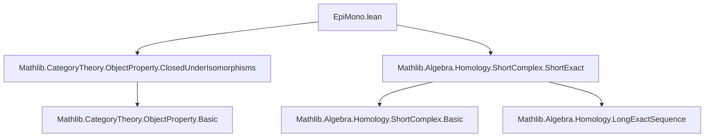

### Technical Brief: `EpiMono.lean`

---

#### **1. Key Definitions & Theorems**

| Name | Type / Signature | Purpose |
|------|------------------|---------|
| `IsClosedUnderSubobjects` | `class IsClosedUnderSubobjects : Prop` | Expresses that `P` is closed under subobjects: for any monomorphism $f : X \to Y$, $P(Y) \Rightarrow P(X)$. |
| `IsClosedUnderQuotients` | `class IsClosedUnderQuotients : Prop` | Expresses that `P` is closed under quotients: for any epimorphism $f : X \to Y$, $P(X) \Rightarrow P(Y)$. |
| `prop_of_mono` | `lemma prop_of_mono {X Y : C} (f : X ⟶ Y) [Mono f] (hY : P Y) : P X` | Instantiation of closure under subobjects. |
| `prop_of_epi` | `lemma prop_of_epi {X Y : C} (f : X ⟶ Y) [Epi f] (hX : P X) : P Y` | Instantiation of closure under quotients. |
| `prop_X₁_of_shortExact` | `lemma prop_X₁_of_shortExact {S : ShortComplex C} (hS : S.ShortExact) (h₂ : P S.X₂) : P S.X₁` | Uses closure under subobjects to deduce $P(S.X₁)$ from $P(S.X₂)$ in a short exact sequence $0 \to X₁ \xrightarrow{f} X₂ \xrightarrow{g} X₃ \to 0$. |
| `prop_X₃_of_shortExact` | `lemma prop_X₃_of_shortExact {S : ShortComplex C} (hS : S.ShortExact) (h₂ : P S.X₂) : P S.X₃` | Uses closure under quotients to deduce $P(S.X₃)$ from $P(S.X₂)$ in a short exact sequence. |
| `instance inverseImage_sub` | `(F : D ⥤ C) [F.PreservesMonomorphisms] : (P.inverseImage F).IsClosedUnderSubobjects` | Pullback of a subobject-closed property along a functor preserving monos remains subobject-closed. |
| `instance inverseImage_epi` | `(F : D ⥤ C) [F.PreservesEpimorphisms] : (P.inverseImage F).IsClosedUnderQuotients` | Pullback of a quotient-closed property along a functor preserving epis remains quotient-closed. |
| `instance top_sub` | `instance : (⊤ : ObjectProperty C).IsClosedUnderSubobjects` | Top property (always true) is closed under subobjects. |
| `instance top_epi` | `instance : (⊤ : ObjectProperty C).IsClosedUnderQuotients` | Top property is closed under quotients. |
| `instance isZero_sub` | `instance [HasZeroMorphisms C] : IsClosedUnderSubobjects (IsZero (C := C))` | Zero object property is closed under subobjects. |
| `instance isZero_epi` | `instance [HasZeroMorphisms C] : IsClosedUnderQuotients (IsZero (C := C))` | Zero object property is closed under quotients. |

---

#### **2. Naming Conventions**

- **Prefixes**:
  - `prop_of_`: Lemmas deriving $P(X)$ from $P(Y)$ via structural morphisms (`mono`, `epi`).
  - `inverseImage_`: For pullback properties along functors.
- **Suffixes**:
  - `_subobjects`, `_quotients`: Class names indicating closure direction.
  - `_of_shortExact`: Lemmas specialized to short exact sequences.
- **Class names**:
  - `IsClosedUnderSubobjects`, `IsClosedUnderQuotients`: Standard predicate naming for properties.

---

#### **3. Tactic Stack**

- `simp`: Used in `instance top_sub`, `instance top_epi`.
- `by simp` / `by aesop`: Implicit in instance proofs (likely `aesop` or `simp` + `apply`).
- `exact`: Used in `prop_of_mono`, `prop_of_epi`.
- `have := hS.mono_f` / `have := hS.epi_g`: Local extraction of structural facts.
- `intro`, `apply`, `assumption`: Likely used implicitly in instance proofs (not shown).

No heavy automation like `ring`, `linarith`, or `conv` is used — proofs are mostly structural.

---

#### **4. Proof Logic**

- **Structure**: Modular, with two main sections:
  1. **Subobject closure**:
     - Define class.
     - Derive lemma.
     - Prove isomorphism-closure (via mono + iso inverse).
     - Apply to short exact sequences (via mono $f$).
     - Show stability under pullback along mono-preserving functors.
  2. **Quotient closure**:
     - Symmetric structure: define class, lemma, iso-closure, short exact application (via epi $g$), pullback stability.

- **Common pattern**:
  - Use structural morphism (mono/epi) from context (e.g., `hS.mono_f`, `hS.epi_g`).
  - Apply closure lemma (`prop_of_mono`, `prop_of_epi`) to get desired $P$-property.
  - For pullbacks: map the morphism via $F$, apply closure of $P$, use preservation assumption.

- **Induction**: Not used — all arguments are categorical and diagrammatic.

---

#### **5. Imports**

| Import | Purpose |
|--------|---------|
| `Mathlib.CategoryTheory.ObjectProperty.ClosedUnderIsomorphisms` | Provides background on isomorphism-closed properties (used implicitly via `instance : P.IsClosedUnderIsomorphisms`). |
| `Mathlib.Algebra.Homology.ShortComplex.ShortExact` | Provides `ShortComplex`, `ShortExact`, and associated lemmas (`mono_f`, `epi_g`). |

---

#### **6. Mermaid Diagrams**

##### **Dependency Graph (Module-Level)**



##### **Conceptual Overview (Theory Flow)**

```mermaid
flowchart LR
  P[ObjectProperty P] -->|Closure under| Sub[Subobjects]
  P -->|Closure under| Quo[Quotients]
  Sub -->|via Mono| PropMono[prop_of_mono]
  Quo -->|via Epi| PropEpi[prop_of_epi]
  PropMono -->|Apply to| SE1[ShortExact: 0→X₁→X₂→X₃→0]
  PropEpi -->|Apply to| SE2[ShortExact: 0→X₁→X₂→X₃→0]
  SE1 -->|Deduce| P_X1[P(X₁)]
  SE2 -->|Deduce| P_X3[P(X₃)]
  P -->|Pullback| F[Functor F : D ⥤ C]
  F -->|Preserves Mono/Epi| PullSub[Pullback closed under Sub]
  F -->|Preserves Epi| PullQuo[Pullback closed under Quo]
```

---

#### **7. Summary**

This file formalizes foundational categorical properties of object properties closed under subobjects and quotients. It is tightly integrated with homological algebra (via `ShortComplex`) and category theory (via `ObjectProperty`, `PreservesMonomorphisms`, etc.). The structure is clean and reusable — the lemmas and instances are designed to be applied in homological contexts (e.g., abelian categories, Serre classes, torsion theories). The absence of heavy automation suggests a focus on *principled* categorical reasoning rather than brute-force proof search.

--- 

Let me know if you'd like a formalized summary in Lean docstring format or a dependency graph for `ObjectProperty` more broadly.
