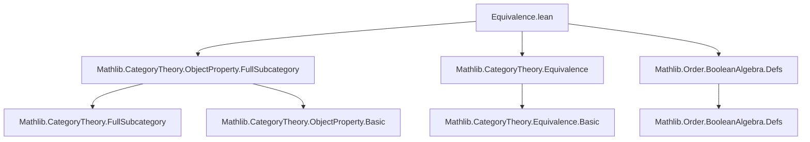

**Technical Brief: Equivalence.lean**

---

### 1. Key Definitions & Theorems

| Name | Type / Signature | Purpose |
|------|------------------|---------|
| `ιOfLE {P Q : ObjectProperty C} (h : P ≤ Q)` | `P.FullSubcategory ⥤ Q.FullSubcategory` | Inclusion functor induced by pointwise inequality of object properties. |
| `essSurj_ιOfLE_iff` | `(ιOfLE h).EssSurj ↔ Q ≤ P.isoClosure` | Characterizes essential surjectivity of the inclusion in terms of iso-closure containment. |
| `isEquivalence_ιOfLE_iff` | `(ιOfLE h).IsEquivalence ↔ Q ≤ P.isoClosure` | Equivalence of full subcategories induced by `P ≤ Q` iff `Q` is contained in the iso-closure of `P`. |
| `topEquivalence (C)` | `ObjectProperty.FullSubcategory ⊤ ≌ C` | Canonical equivalence between the full subcategory of all objects (`⊤`) and the ambient category `C`. |
| `congrFullSubcategory {e : C ≌ D} {P Q} [Q.IsClosedUnderIsomorphisms] (h : Q.inverseImage e.functor = P)` | `P.FullSubcategory ≌ Q.FullSubcategory` | Induced equivalence of full subcategories along a given equivalence of base categories, when `P` is the pullback of `Q`. |

---

### 2. Naming Conventions

- **Prefixes**:
  - `ιOfLE`: Indicates inclusion (Greek *iota*) induced by a monotone map (`≤`).
  - `essSurj_`, `isEquivalence_`: Predicate-based naming for properties of functors.
  - `inverseImage`: Standard categorical pullback of a property along a functor.
- **Suffixes**:
  - `_iff`: Logical equivalence (↔) characterizations.
  - `_closure`: Denotes closure under isomorphisms (`isoClosure`).
- **Other patterns**:
  - `lift`: Used for lifting functors through full subcategory inclusions.
  - `congrFullSubcategory`: “Congruence” of subcategories under equivalence.

---

### 3. Tactic Stack

Frequent tactics used in proofs:
- `rw`, `rwa`: Rewriting using equalities/implications.
- `simp`, `simp_rw`: Simplification with definitional equalities.
- `exact`, `refine`: Direct proof construction.
- `obtain`, `cases`: Destructive reasoning on existentials.
- `inferInstance`: Automatic typeclass resolution.
- `ObjectProperty.hom_ext _`: Extensionality principle for morphisms in full subcategories.

No heavy automation (e.g., `aesop`, `linarith`) appears—proofs are mostly structural and rely on categorical lemmas.

---

### 4. Proof Logic

- **Structure of `essSurj_ιOfLE_iff`**:
  - Proves two directions:
    - *⇒*: Given essential surjectivity, constructs an iso from any `X` satisfying `Q X` to some `P`-object via the preimage.
    - *⇐*: Given `Q ≤ P.isoClosure`, constructs a preimage object for any `Q`-object using the iso-closure witness.
- **Structure of `isEquivalence_ιOfLE_iff`**:
  - Reduces to essential surjectivity + fully faithful (already known for `ιOfLE`), using `fullyFaithfulι`.
- **Structure of `topEquivalence`**:
  - Uses `lift` to define the inverse; unit/counit are identity isos.
- **Structure of `congrFullSubcategory`**:
  - Constructs equivalence via lifting functors along inclusions, using `h : Q⁻¹(P) = P` and closure under isos to ensure well-definedness.

Induction is not used; proofs rely on:
- Universal properties of full subcategories (`lift`, `ι`)
- Properties of equivalences (`unitIso`, `counitIso`)
- Closure under isomorphisms (`IsClosedUnderIsomorphisms`)

---

### 5. Imports

| Import | Role |
|--------|------|
| `Mathlib.CategoryTheory.ObjectProperty.FullSubcategory` | Defines `FullSubcategory`, `ι`, `lift`, `isClosedUnderIsomorphisms`, `isoClosure`. |
| `Mathlib.CategoryTheory.Equivalence` | Defines `Equivalence`, `EssSurj`, `IsEquivalence`, `unitIso`, `counitIso`. |
| `Mathlib.Order.BooleanAlgebra.Defs` | Provides `ObjectProperty` as a typeclass (via `ObjectProperty C := C → Prop` with `IsClosedUnderIsomorphisms` instance). |

---

### 6. Mermaid Diagrams

#### Dependency Graph (Module-Level)



#### Overview of Theory Flow

```mermaid
flowchart LR
  P[ObjectProperty C] -->|P ≤ Q| I[ιOfLE h : P.FullSubcategory ⥤ Q.FullSubcategory]
  I -->|essSurj?| C1[Q ≤ P.isoClosure]
  I -->|IsEquivalence?| C2[Q ≤ P.isoClosure]
  C2 -->|instance| E1[(ιOfLE le_isoClosure).IsEquivalence]
  
  C[Category C] -->|⊤| FS1[FullSubcategory ⊤]
  FS1 -->|topEquivalence| C
  
  C1[Category C] -- e : C ≌ D --> C2[Category D]
  P[ObjectProperty C] -- inverseImage = P --> Q[ObjectProperty D]
  FS1[P.FullSubcategory] -- congrFullSubcategory --> FS2[Q.FullSubcategory]
```

---

### 7. Summary

This file formalizes the categorical principle that *inclusion of full subcategories induced by monotone object properties is an equivalence iff the larger property is contained in the iso-closure of the smaller one*. It also shows how equivalences of base categories induce equivalences of full subcategories when the subproperties correspond via pullback. The development is foundational for reasoning about reflective/localizing subcategories and localization theory in category theory.
