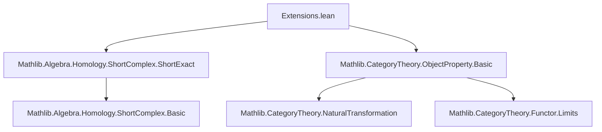
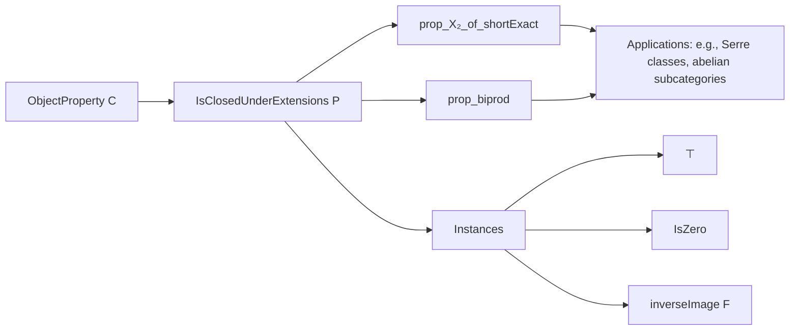
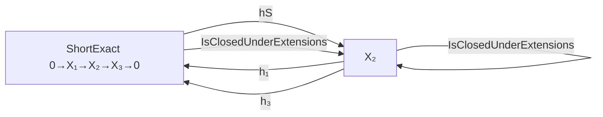

**Technical Brief: `Extensions.lean`**

---

### 1. **Key Definitions & Theorems**

| Name | Type / Signature | Purpose |
|------|------------------|---------|
| `IsClosedUnderExtensions` | `class IsClosedUnderExtensions (P : ObjectProperty C) : Prop` | Defines that a property $P$ is *closed under extensions*: for any short exact sequence $0 \to X_1 \to X_2 \to X_3 \to 0$, $P(X_1) \land P(X_3) \Rightarrow P(X_2)$. |
| `prop_X₂_of_shortExact` | `lemma` | Elimination rule for `IsClosedUnderExtensions`: extracts $P(X_2)$ from a short exact complex and $P(X_1), P(X_3)$. |
| `instance ⊤.IsClosedUnderExtensions` | `instance` | Shows the trivial (top) property $\top$ is closed under extensions. |
| `instance IsZero.IsClosedUnderExtensions` | `instance` | Shows the property “is zero” is closed under extensions, using exactness and zero morphism properties. |
| `instance inverseImage.IsClosedUnderExtensions` | `instance` | Shows that if $P$ is closed under extensions and $F : D \to C$ is a finite (co)limit-preserving, zero-morphism-preserving functor, then the pullback property $P \circ F$ is also closed under extensions. |
| `prop_biprod` | `lemma` | Uses closure under extensions to deduce $P(X_1 \oplus X_2)$ from $P(X_1), P(X_2)$, via the canonical split short exact sequence associated to a biproduct. |

---

### 2. **Naming Conventions**

- **Prefixes**:
  - `prop_`: for lemmas that *apply* the closure property (e.g., `prop_X₂_of_shortExact`, `prop_biprod`).
- **Class names**:
  - `IsClosedUnderExtensions`: predicate class for the closure property.
- **Instance names**:
  - Implicit via typeclass inference (e.g., `⊤`, `IsZero`, `inverseImage F`).
- **Variable naming**:
  - `P`: generic object property.
  - `S`: short complex.
  - `X₁, X₂, X₃`: objects in a short exact sequence.
  - `h₁, h₃`: hypotheses that $P$ holds on the ends.

---

### 3. **Tactic Stack**

- `simp`: used in trivial instance proofs (e.g., for $\top$).
- `exact`: used in `IsZero` instance to apply `exact.isZero_of_both_zeros`.
- `have := ...`: to extract intermediate facts (e.g., mono/epi from short exact).
- `by`-block tactics: mostly `simp`, `exact`, and implicit `intro`/`apply` via typeclass inference.

No heavy automation (e.g., `ring`, `linarith`, `aesop`) is used—proofs are mostly direct and rely on categorical lemmas.

---

### 4. **Proof Logic**

- **Structure**: Most proofs follow a *direct application* pattern:
  1. Use assumptions (e.g., $P$ closed under extensions, short exactness).
  2. Apply the class’s elimination rule (`prop_X₂_of_shortExact`) or construct a short exact sequence (e.g., biproduct splitting).
  3. Use existing lemmas (e.g., `exact.isZero_of_both_zeros`, `map_preserves_shortExact`).
- **Key reasoning pattern**:
  - For `inverseImage`: lift the short exact sequence along $F$, use preservation properties to ensure it remains short exact, then apply $P$’s closure.
  - For `prop_biprod`: use the canonical split short exact sequence induced by a biproduct.

Induction or case analysis is *not* used—proofs are categorical and structural.

---

### 5. **Imports**

| Import | Purpose |
|--------|---------|
| `Mathlib.Algebra.Homology.ShortComplex.ShortExact` | Provides `ShortComplex`, `ShortExact`, and related constructions (e.g., `ShortComplex.Splitting.ofHasBinaryBiproduct`). |
| `Mathlib.CategoryTheory.ObjectProperty.Basic` | Defines `ObjectProperty`, `inverseImage`, and basic constructions like `IsZero`, `⊤`. |
| `Limits` (via `open Limits`) | Provides biproducts, zero morphisms, finite (co)limits, etc. |

---

### 6. **Mermaid Diagrams**

#### **Dependency Graph (Module-Level)**

#### **Overview of Theory Flow**

#### **Short Exact Sequence Closure Logic**

---

### 7. **Domain-Specific AI Agent Notes**

- **Primary domain**: Homological algebra in category theory (preadditive/abelian categories, short exact sequences).
- **Key abstractions**: `ObjectProperty`, `ShortComplex`, `ShortExact`, `inverseImage`.
- **Typical queries**:
  - “How to prove $P(X \oplus Y)$ given $P(X), P(Y)$?” → use `prop_biprod`.
  - “If $P$ is closed under extensions, is $P \circ F$?” → use `inverseImage` instance.
- **Common proof patterns**:
  - Lift short exact sequences via functors.
  - Use split short exact sequences from biproducts.
  - Apply `prop_X₂_of_shortExact` with hypotheses.

--- 

Let me know if you'd like a formalization of a specific application (e.g., Serre subcategories, thick subcategories).
