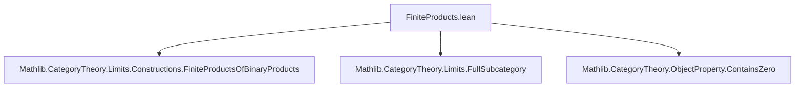
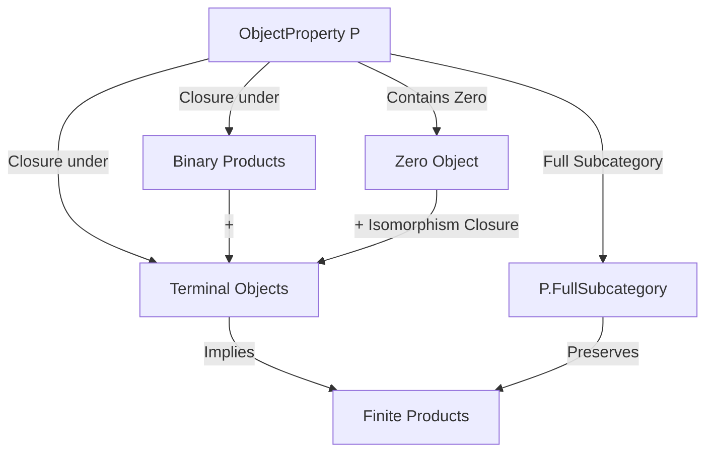

Here is the structured technical metadata extracted from `FiniteProducts.lean`:

---

### **1. Key Definitions & Theorems**

| Name | Type / Signature | Purpose |
|------|------------------|---------|
| `IsClosedUnderBinaryProducts` | `abbrev IsClosedUnderBinaryProducts := P.IsClosedUnderLimitsOfShape (Discrete WalkingPair)` | Typeclass expressing that property `P` is closed under binary products. |
| `prop_prod` | `P X → P Y → P (X ⨯ Y)` | If `P` is closed under binary products and `X, Y` satisfy `P`, then their product does. |
| `prop_of_isTerminal` | `IsTerminal X → P X` | If `P` is closed under empty diagrams (i.e., terminal objects), then terminal objects satisfy `P`. |
| `IsClosedUnderBinaryProducts.closedUnderIsomorphisms` | `P.IsClosedUnderIsomorphisms` | Shows closure under isomorphisms assuming closure under binary products and terminal objects. |
| `IsClosedUnderFiniteProducts` | `class` | Typeclass expressing closure under all finite products (i.e., limits over discrete finite categories). |
| `IsClosedUnderFiniteProducts.mk'` | `[HasFiniteProducts C] → [P.IsClosedUnderLimitsOfShape (Discrete PEmpty)] → [P.IsClosedUnderBinaryProducts] → P.IsClosedUnderFiniteProducts` | Constructor: if `P` is closed under binary products, terminal objects, and `C` has finite products, then `P` is closed under all finite products. |
| `instance [P.ContainsZero] [P.IsClosedUnderIsomorphisms] : P.IsClosedUnderLimitsOfShape (Discrete PEmpty)` | `P.IsClosedUnderLimitsOfShape (Discrete PEmpty)` | Shows that zero-object containment + closure under isomorphisms implies closure under empty diagrams (i.e., zero objects satisfy `P`). |

---

### **2. Naming Conventions**

- **Prefixes**:
  - `isClosedUnder...`: for typeclasses expressing closure under a shape of limits.
  - `prop_...`: for lemmas stating that `P` holds for a constructed limit, assuming closure.
  - `of_...`: for implications from structural properties (e.g., `of_isTerminal`, `of_iso`).
- **Suffixes**:
  - `_closedUnderIsomorphisms`: for proofs of isomorphism-closure.
  - `_of_preservesLimitsOfShape_ι`: for lemmas using preservation of limits by inclusion of full subcategory.

---

### **3. Tactic Stack**

Frequently used tactics:
- `intro` / `rintro`: for introducing hypotheses and destructing conjunctions/disjunctions.
- `exact`, `assumption`: for solving goals directly from context.
- `simp`: especially `simp` with `cat_disch` for category-theoretic simplification.
- `cat_disch`: custom tactic for discharging category-theoretic diagram commutativity.
- `obtain ⟨n, ⟨e⟩⟩`: destructing finite type equivalences.
- `apply`, `exact`, `convert`: for applying lemmas and constructing morphisms.
- `ext`, `funext`: for extensionality (implicit in `cat_disch` usage).
- `rw`, `simp_rw`: likely used in related files, though not explicit here.

---

### **4. Proof Logic**

- **Induction-free**: No explicit induction on natural numbers or structures.
- **Structure-based reasoning**:
  - Use of universal properties (limits, terminal objects, zero objects).
  - Reduction to known shapes: `Finite J ≃ Fin n`, `PEmpty`, `WalkingPair`.
  - Leveraging equivalences of diagram shapes to transfer closure.
- **Common pattern**:
  1. Show closure for basic shapes (`PEmpty`, `WalkingPair`).
  2. Use `IsClosedUnderLimitsOfShape.of_equivalence` or `of_preservesLimitsOfShape_ι` to extend to arbitrary finite shapes.
  3. Use isomorphism-closure + zero-object containment to derive closure for empty diagrams.

---

### **5. Imports**

| Import | Purpose |
|--------|---------|
| `Mathlib.CategoryTheory.Limits.Constructions.FiniteProductsOfBinaryProducts` | Provides equivalence between having binary products + terminal object and having all finite products. |
| `Mathlib.CategoryTheory.Limits.FullSubcategory` | For working with full subcategories defined by object properties (`P.FullSubcategory`). |
| `Mathlib.CategoryTheory.ObjectProperty.ContainsZero` | For reasoning about zero objects and `ContainsZero` typeclass. |

---

### **6. Mermaid Diagrams**

#### **Dependency Graph (Module Level)**



#### **Conceptual Overview of Theory Flow**



#### **Proof Strategy Flow (for `mk'`)**

```mermaid
graph LR
  A[HasFiniteProducts C] --> B[HasBinaryProducts + HasTerminal]
  C[P.IsClosedUnderBinaryProducts] --> D[Closed under Binary Products]
  E[P.IsClosedUnderLimitsOfShape (Discrete PEmpty)] --> F[Closed under Terminal]
  D & F --> G[Closed under Finite Products]
  G --> H[P.IsClosedUnderFiniteProducts]
```

---

Let me know if you'd like a formalization of this theory in a different style (e.g., as a `leanpkg` dependency map or a `doc`-string summary).
