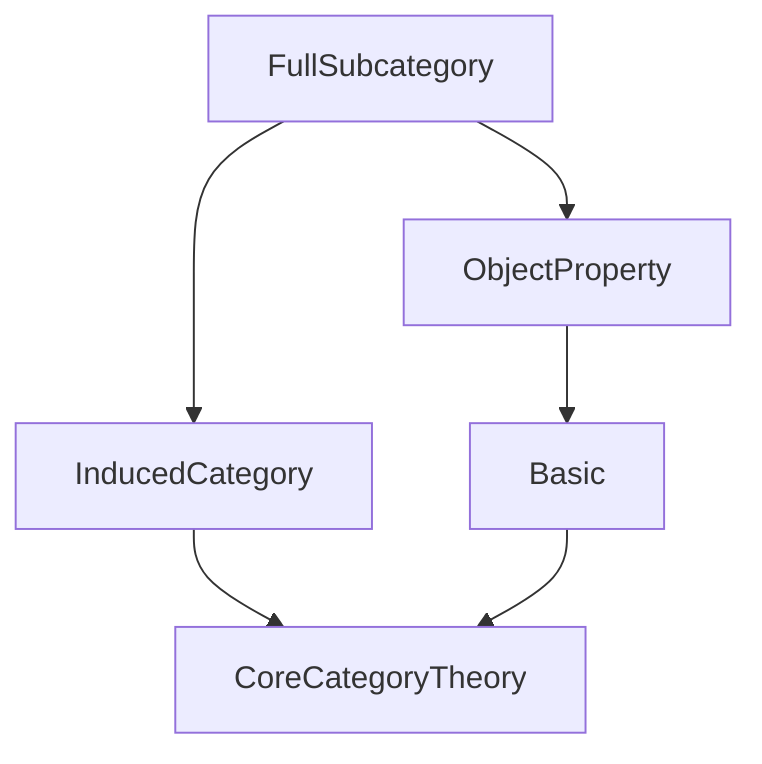
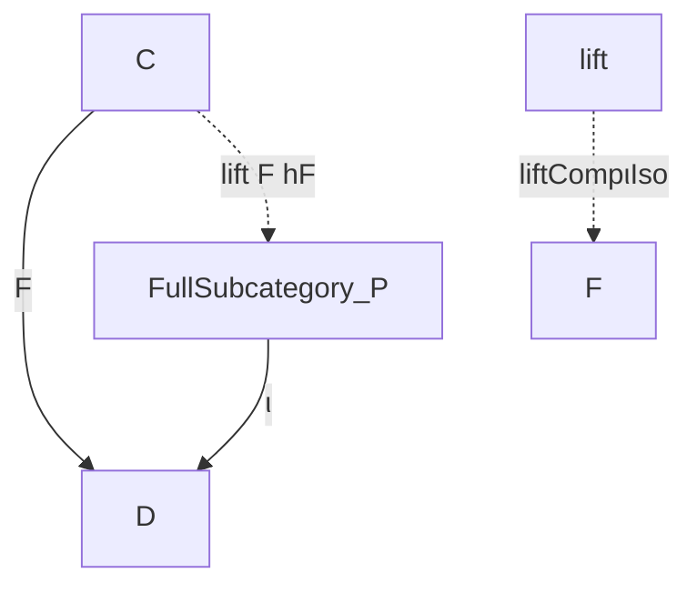
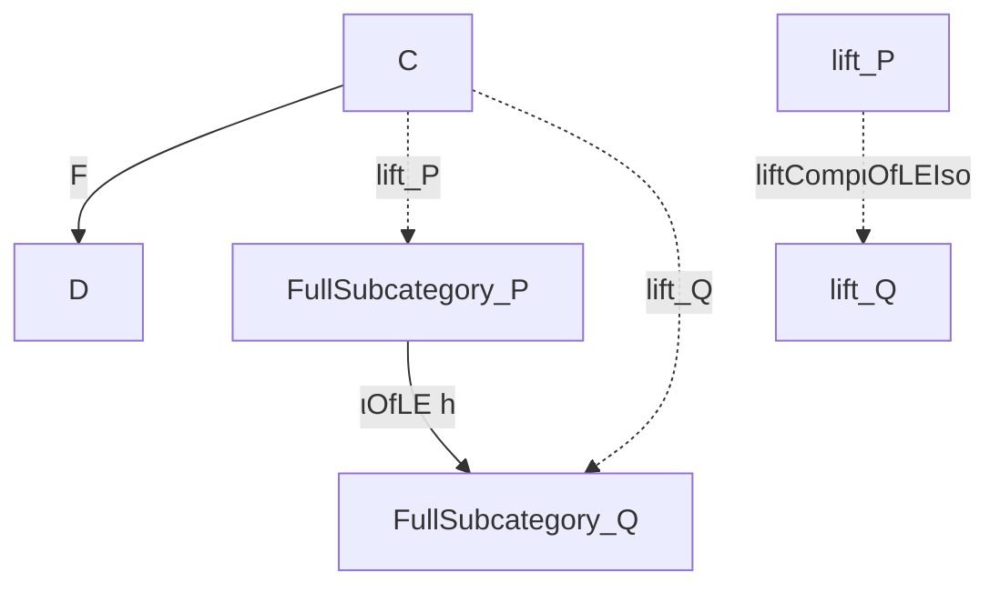

### Technical Brief: `FullSubcategory.lean`

---

#### **1. Key Definitions & Theorems**

| Name | Type / Structure | Purpose |
|------|------------------|---------|
| `FullSubcategory` | `Structure` | Represents objects of `C` satisfying property `P`, with morphisms inherited from `C`. |
| `FullSubcategory.category` | `Instance` | Equips `P.FullSubcategory` with a category structure via `InducedCategory`. |
| `ι` | `P.FullSubcategory ⥤ C` | Forgetful functor embedding the full subcategory into `C`. |
| `ι_obj`, `ι_map` | `@[simp]` lemmas | Describe action of `ι` on objects and morphisms (definitional equalities). |
| `homMk` | `def` | Constructor for morphisms in `P.FullSubcategory` from morphisms in `C`. |
| `homMk_surjective` | `lemma` | States that `homMk` is surjective — every hom in the subcategory arises this way. |
| `fullyFaithfulι` | `abbrev` | Proves `ι` is fully faithful. |
| `full_ι`, `faithful_ι` | `instance` | Consequences of full faithfulness. |
| `isoMk` | `def` | Constructor for isomorphisms in `P.FullSubcategory` from isos in `C`. |
| `isoHom_inv_id_hom`, `isoInv_hom_id_hom` | `@[reassoc]` lemmas | Verify inverse laws for `isoMk`, using `ι`’s functoriality. |
| `ιOfLE` | `def` | Induced functor between full subcategories when `P ≤ P'`. |
| `fullyFaithfulιOfLE` | `def` | Shows `ιOfLE` is fully faithful. |
| `ιOfLECompιIso` | `def` | Trivial isomorphism `ιOfLE h ⋙ ι' ≅ ι`. |
| `lift` | `def` | Lifts a functor `F : C ⥤ D` whose image lies in `P` through the full subcategory. |
| `liftCompιIso` | `def` | Definitional isomorphism `lift ⋙ ι ≅ F`. |
| `ι_obj_lift_obj`, `ι_obj_lift_map` | `@[simp]` lemmas | Describe how `ι ∘ lift` recovers `F`. |
| `liftCompιOfLEIso` | `def` | Canonical isomorphism comparing lifts along `P ≤ Q`. |

---

#### **2. Naming Conventions**

- **Prefixes**:
  - `ι_`: for the inclusion functor (from Latin *inclusio*).
  - `homMk`, `isoMk`: “maker” constructors for homs and isos.
  - `lift`: for universal property of lifting through full subcategory.
  - `ιOfLE`: functor induced by inclusion of predicates (`≤`).

- **Suffixes**:
  - `_hom`: refers to underlying morphism in `C`.
  - `_obj`: refers to underlying object in `C`.
  - `_iso`: for isomorphisms between functors.

- **Structure fields**:
  - `obj`, `property`: mimics subtype structure (`val`, `property`), but avoids coercion issues.

---

#### **3. Tactic Stack**

Frequent tactics used in proofs (though many lemmas are definitional):

- `rfl`: many lemmas are definitional equalities.
- `simp`: for simplification using `@[simp]` lemmas.
- `reassoc`: for rewriting compositions up to associators (used in `iso*` lemmas).
- `aesop`: likely used for routine category-theoretic reasoning (not explicit here, but standard in Mathlib).
- `ext`: via `@[ext]` attribute on `FullSubcategory`.
- `funext`, `cases'`: for structural reasoning on `FullSubcategory`.

---

#### **4. Proof Logic**

- **Structure-based reasoning**: Most constructions are *definitional* (e.g., `ι_obj`, `liftCompιIso`), so proofs reduce to `rfl`.
- **Morphism construction**: Morphisms are built via `homMk`, leveraging surjectivity (`homMk_surjective`) to reason about equality.
- **Faithfulness/fullness**: Proven by giving explicit preimages under `ι` via `homMk`.
- **Universal property of lift**: Uses `lift` to factor `F` through `P.FullSubcategory`; uniqueness is implicit (up to definitional equality).
- **Functor comparisons**: Isomorphisms between composite functors (e.g., `ιOfLE h ⋙ ι' ≅ ι`) are all `Iso.refl _`, i.e., identity isomorphisms.

---

#### **5. Imports**

- `Mathlib.CategoryTheory.InducedCategory`: Provides `InducedCategory`, used to define the hom-types and composition in `P.FullSubcategory`.
- `Mathlib.CategoryTheory.ObjectProperty.Basic`: Defines `ObjectProperty` (a predicate on objects of a category).

---

#### **8. Mermaid Diagrams**

##### **Dependency Graph (Module-Level)**



##### **Conceptual Overview of `FullSubcategory` Construction**

```mermaid
graph LR
  C[Category C] -->|P : ObjectProperty C| FullSubcategory[P.FullSubcategory]
  FullSubcategory -->|ι| C
  FullSubcategory -->|homMk| C[Homs in C]
  C[F : C ⥤ D] -->|∀X, P(FX)| lift[P.lift F hF]
  lift -->|ι ∘ lift = F| C
  P ≤ P' -->|ιOfLE| FullSubcategory'
```

##### **Lifting Diagram (Universal Property)**



##### **Comparison of Lifts along Inclusion of Properties**



---

### Summary

This module formalizes the **full subcategory** associated to an `ObjectProperty` $P$ on a category $C$. It leverages `InducedCategory` to avoid coercion pitfalls of subtypes, and emphasizes *definitional* equalities for simplicity. Key features include:

- A clean embedding functor $\iota : P.\text{FullSubcategory} \hookrightarrow C$,
- Full faithfulness of $\iota$,
- A universal property for lifting functors through full subcategories,
- Functoriality of the construction with respect to inclusion of properties $P \le P'$.

It is foundational for reasoning about *properties of objects* (e.g., “compact”, “projective”, “finitely presented”) in category theory within Lean.
