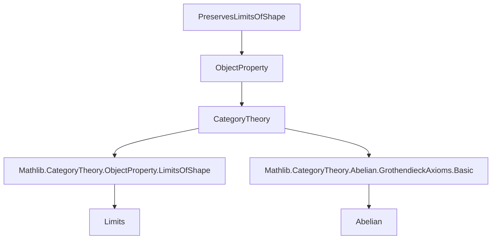

Here's a structured technical brief extracted from `PreservesLimits.lean`, focusing on formal metadata for building a domain-specific AI agent in the Lean/Category Theory domain.

---

### **1. Key Definitions & Theorems**

| Name | Type | Purpose |
|------|------|---------|
| `preservesLimit (F : K ⥤ J)` | `ObjectProperty (J ⥤ C)` | Defines the property that an object `G : J ⥤ C` preserves the limit of diagram `F : K ⥤ J`. |
| `preservesColimit (F : K ⥤ J)` | `ObjectProperty (J ⥤ C)` | Dual: preserves colimits of diagram `F`. |
| `preservesLimitsOfShape (K)` | `ObjectProperty (J ⥤ C)` | Property: `G` preserves *all* limits of shape `K`. Defined as `PreservesLimitsOfShape K`. |
| `preservesColimitsOfShape (K)` | `ObjectProperty (J ⥤ C)` | Dual: preserves all colimits of shape `K`. |
| `preservesFiniteLimits` | `ObjectProperty (J ⥤ C)` | Property: `G` preserves all finite limits. |
| `preservesFiniteColimits` | `ObjectProperty (J ⥤ C)` | Dual: preserves all finite colimits. |
| `preservesLimitsOfShape_eq_iSup` | `preservesLimitsOfShape K = ⨅ (F : K ⥤ J), preservesLimit F` | Shows `preservesLimitsOfShape K` is the infimum (intersection) over all `preservesLimit F`. |
| `congr_preservesLimit`, `congr_preservesColimit` | `F ≅ F' ⇒ preservesLimit F = preservesLimit F'` | Shows these properties are invariant under isomorphism of diagrams. |
| `congr_preservesLimitsOfShape`, `congr_preservesColimitsOfShape` | `K ≌ K' ⇒ preservesLimitsOfShape K = preservesLimitsOfShape K'` | Invariance under equivalence of shape categories. |
| `IsClosedUnderColimitsOfShape` instances | `preservesLimitsOfShape K` and `preservesFiniteLimits` are closed under colimits of shape `K'` when colimits of shape `K'` commute with limits of shape `K` (or finite limits). | Core structural result: stability of preservation properties under colimits. |

---

### **2. Naming Conventions**

- **Prefixes**:
  - `preserves_`: for properties of functors (objects in functor categories) that preserve certain limits/colimits.
  - `congr_`: for proofs of equality/identity under isomorphism/equivalence.
- **Suffixes**:
  - `_iff`: biconditional lemmas linking abbreviations to underlying typeclass properties.
  - `_eq_iSup`: lemmas expressing a property as an infimum over diagrams.
  - `_of_iso_diagram`, `_of_natIso`, `_of_isColimit`: constructors for preservation under categorical equivalences.

---

### **3. Tactic Stack**

Frequent tactics used in proofs:

| Tactic | Role |
|--------|------|
| `ext` | Extensionality (for proving equality of object properties, i.e., pointwise equality of predicates). |
| `simp_rw [preservesLimit_iff]` | Rewriting using definitional equivalences. |
| `exact` / `intro` / `apply` | Standard proof construction. |
| `congr` (via `congr_arg`-style reasoning) | Proving equality of predicates via pointwise equivalence. |
| `exact ⟨...⟩` / `intro ...` | Constructing/eliminating existential/universal quantifiers in Prop-valued predicates. |
| `inferInstance` | Automatically inferring typeclass instances (e.g., `PreservesLimitsOfShape K G`). |
| `have`, `let`, `exact` | Intermediate lemma introduction and isomorphism construction (e.g., `NatIso.ofComponents`). |

---

### **4. Proof Logic**

The logical flow in key proofs follows this pattern:

1. **Unfold definitions** using `simp_rw [preservesLimit_iff]`, `preservesLimitsOfShape_iff`, etc.
2. **Reduce to pointwise statements** via extensionality (`ext G`) and quantifier reasoning (`iInf_Prop_eq`).
3. **Use categorical universal properties**:
   - For closure under colimits: assume `G = colim H` for some `H : K' ⥤ J ⥤ C`, and show `G` preserves limits of shape `K` by:
     - Using the assumption that `colim` preserves limits of shape `K`.
     - Showing the diagonal cone `h.diag.flip` also preserves limits (via `evaluationJointlyReflectsLimits`).
     - Constructing a natural isomorphism `h.diag.flip ⋙ colim ≅ G` using uniqueness of colimit cocones.
4. **Leverage equivalences** (`K ≌ K'`) to transfer preservation properties between shapes.

---

### **5. Imports & Dependencies**

| Module | Role |
|--------|------|
| `Mathlib.CategoryTheory.ObjectProperty.LimitsOfShape` | Provides `PreservesLimit`, `PreservesLimitsOfShape`, and related infrastructure for object properties. |
| `Mathlib.CategoryTheory.Abelian.GrothendieckAxioms.Basic` | Supplies foundational abelian category results (e.g., `evaluationJointlyReflectsLimits`, `hasColimits`, `hasExactColimits`). |

---

### **6. Mermaid Diagrams**

#### **Dependency Graph (Module-Level)**



#### **Conceptual Overview of the File**

```mermaid
flowchart LR
  A[Functor Category J ⥤ C] --> B[Object Properties]
  B --> C[PreservesLimit F]
  B --> D[PreservesColimit F]
  B --> E[PreservesLimitsOfShape K]
  B --> F[PreservesFiniteLimits]
  E --> G[= ⨅_{F:K→J} PreservesLimit F]
  F --> H[Closed under colimits of shape K' if colimits of shape K' commute with finite limits]
  G --> H
  D --> I[PreservesColimitsOfShape K]
  I --> J[= ⨅_{F:K→J} PreservesColimit F]
```

---

### **7. Theory Scope**

This file formalizes a **property-theoretic perspective** on limit/colimit preservation in functor categories. It:

- Treats preservation as a *predicate* (object property) rather than a structure.
- Shows how such properties behave under categorical constructions (e.g., colimits).
- Provides a foundation for stability results (e.g., in Grothendieck abelian categories, filtered colimits preserve finite limits).

It bridges:
- **Object properties** (`ObjectProperty`)
- **Limit/colimit preservation** (`Limits`)
- **Abelian category theory** (`GrothendieckAxioms`)

---

Let me know if you'd like a formalization of the `IsClosedUnderColimitsOfShape` instance in natural language or a proof sketch for the main theorem.
