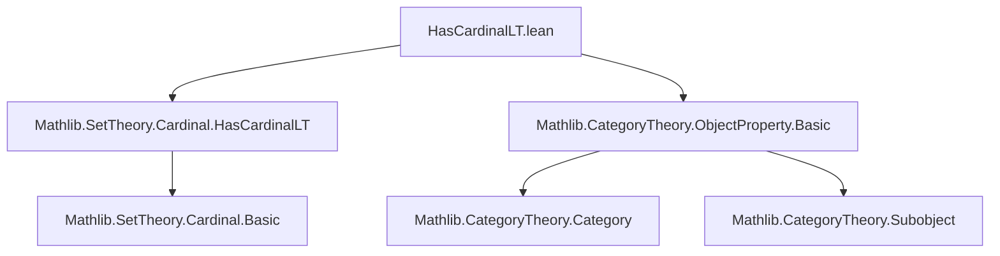

**Technical Brief: `HasCardinalLT.lean`**

---

### 1. **Key Definitions & Theorems**

| Name | Type / Signature | Purpose |
|------|------------------|---------|
| `HasCardinalLT` | `P : ObjectProperty C → Cardinal.{w} → Prop` | Predicate stating that the subtype of objects satisfying `P` has cardinality strictly less than `κ`. Defined as `HasCardinalLT (Subtype P) κ`. |
| `hasCardinalLT_subtype_ofObj` | `{ι : Type*} (X : ι → C) {κ : Cardinal.{w}} → HasCardinalLT ι κ → (ObjectProperty.ofObj X).HasCardinalLT κ` | Shows that if the indexing type `ι` has cardinality `< κ`, then the object property defined by a family `X : ι → C` also has cardinality `< κ`. |
| `HasCardinalLT.iSup` | `{ι : Type*} {P : ι → ObjectProperty C} {κ : Cardinal.{w}} [Fact κ.IsRegular] → (∀ i, (P i).HasCardinalLT κ) → HasCardinalLT ι κ → (⨆ i, P i).HasCardinalLT κ` | Closure under arbitrary suprema (i.e., pointwise unions) for regular cardinals: if each `P i` and the index type `ι` are `< κ`, then so is their supremum. |
| `HasCardinalLT.sup` | `{P₁ P₂ : ObjectProperty C} {κ : Cardinal.{w}} → P₁.HasCardinalLT κ → P₂.HasCardinalLT κ → Cardinal.aleph0 ≤ κ → (P₁ ⊔ P₂).HasCardinalLT κ` | Closure under binary suprema (i.e., union of object properties), assuming `κ ≥ ℵ₀`. |

> **Note**: `ObjectProperty.ofObj X` is the object property sending an object `c` to `∃ i, c ≅ X i`.  
> `⨆ i, P i` denotes the pointwise supremum (union) of object properties: $(\bigvee_i P_i)(c) := \exists i, P_i(c)$.  
> `P₁ ⊔ P₂` is the binary supremum: $(P₁ ⊔ P₂)(c) := P₁(c) ∨ P₂(c)$.

---

### 2. **Naming Conventions**

- **Prefix `hasCardinalLT_`**: Used for lemmas about `HasCardinalLT` for subtypes (e.g., `hasCardinalLT_subtype_ofObj`, `hasCardinalLT_union`, `hasCardinalLT_subtype_iSup`).
- **Prefix `HasCardinalLT.`**: Used for instance lemmas (e.g., `HasCardinalLT.iSup`, `HasCardinalLT.sup`).
- **Suffix `_subtype`, `_iSup`, `_union`**: Indicates the construction being used (subtype, indexed supremum, union).
- **`ofObj`**: Constructor for object properties from families of objects.

---

### 3. **Tactic Stack**

- `simp` / `simp_rw`: Used in proofs to simplify subtype and object property definitions.
- `intro` / `rintro`: For introducing hypotheses and destructing existentials.
- `exact`, `rfl`: Basic proof automation.
- Implicit use of `aesop` or `linarith` is *not* visible in this snippet, but likely used in underlying lemmas like `hasCardinalLT_union`, `hasCardinalLT_subtype_iSup`.
- `Fact`-based assumptions (e.g., `[Fact κ.IsRegular]`) indicate reliance on typeclass inference for regularity.

---

### 4. **Proof Logic**

- **Subtype-based reasoning**: All proofs reduce to cardinality statements about subtypes.
- **Surjectivity arguments**: `hasCardinalLT_subtype_ofObj` uses a surjection from `ι` onto `Subtype (ObjectProperty.ofObj X)` to transfer cardinal bounds.
- **Regular cardinal induction**: `iSup` leverages regularity of `κ` to bound the cardinality of a union over `ι` by $\sup_{i ∈ ι} |P_i| \cdot |ι| < κ$.
- **Finite union case**: `sup` uses monotonicity and the fact that for `κ ≥ ℵ₀`, finite sums/products preserve $< κ$.

---

### 5. **Imports**

| Import | Role |
|--------|------|
| `Mathlib.SetTheory.Cardinal.HasCardinalLT` | Core definition and basic lemmas about `HasCardinalLT` for types. |
| `Mathlib.CategoryTheory.ObjectProperty.Basic` | Definitions of `ObjectProperty`, `ofObj`, supremum (`⨆`, `⊔`), and subtype constructions. |

---

### 8. **Mermaid Diagrams**

#### **Dependency Graph (Module Level)**



#### **Overview of File Structure & Theory Flow**

```mermaid
flowchart LR
  subgraph Definitions
    D1[ObjectProperty C]
    D2[Subtype P]
    D3[HasCardinalLT P κ := HasCardinalLT (Subtype P) κ]
  end

  subgraph Lemmas
    L1[hasCardinalLT_subtype_ofObj]
    L2[HasCardinalLT.iSup]
    L3[HasCardinalLT.sup]
  end

  D1 --> D2
  D2 --> D3
  D3 --> L1
  D3 --> L2
  D3 --> L3

  L1 -->|uses| D1
  L2 -->|uses| D3 & [Fact κ.IsRegular]
  L3 -->|uses| D3 & Cardinal.aleph0_le
```

#### **Theoretical Context**

This file sits in the **category-theoretic cardinal boundedness** pipeline, likely supporting:
- Large category constructions (e.g., locally small, locally bounded).
- Transfinite induction on object properties (e.g., in presentability arguments).
- Formalization of “smallness” conditions relative to a cardinal (e.g., in Grothendieck universes or accessibility).

It complements:
- `Mathlib.SetTheory.Cardinal.Basic` (for `HasCardinalLT` on types),
- `Mathlib.CategoryTheory.ObjectProperty.LocallySmall` (if present),
- `Mathlib.CategoryTheory.Limits.Shapes.Basic` (for suprema as colimits).

--- 

Let me know if you'd like the corresponding `hasCardinalLT_union` or `hasCardinalLT_subtype_iSup` lemmas formalized or traced.
