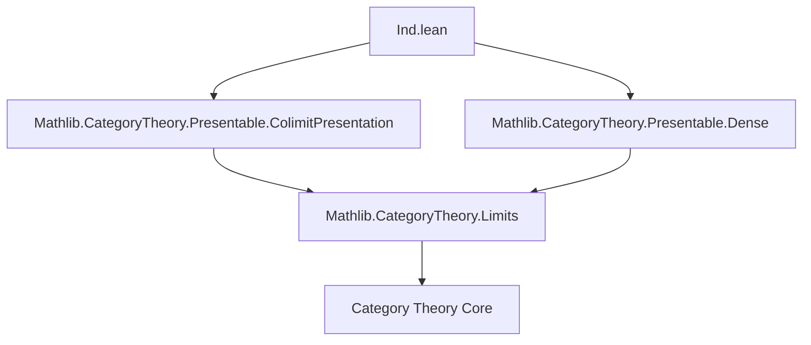
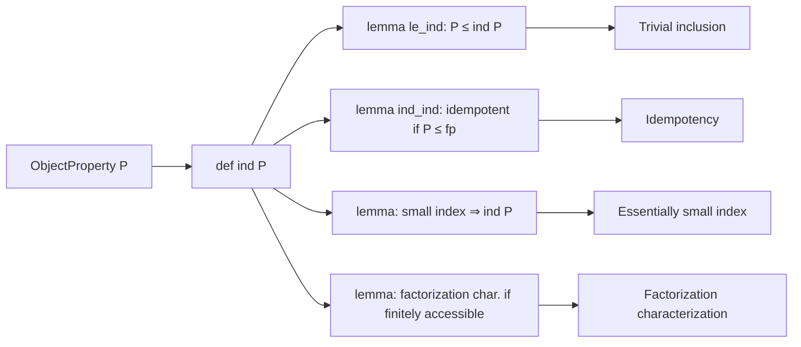

**Technical Brief: `Ind.lean` — Formalization of `ind`-properties in Category Theory**

---

### 1. KEY DEFINITIONS & THEOREMS

| Name | Type / Signature | Purpose |
|------|------------------|---------|
| `ind` | `ObjectProperty C → ObjectProperty C` | Defines the *ind-extension* of a property `P`: `X` satisfies `ind P` iff `X` is a filtered colimit of objects satisfying `P`. |
| `le_ind` | `P ≤ ind P` | Shows that `P` is contained in its ind-extension (i.e., every `P`-object trivially satisfies `ind P`). |
| `ind_ind` | `P ≤ isFinitelyPresentable C → ind (ind P) = ind P` | Idempotency of `ind` under the assumption that `P`-objects are finitely presentable. |
| `of_essentiallySmall_index` | `EssentiallySmall J → IsFiltered J → (∀ i, P (pres.diag.obj i)) → ind P X` | Allows constructing `ind P X` when the indexing category is essentially small. |
| `ind_iff_exists` | Under `P ≤ isFinitelyPresentable` and finite accessibility: `ind P X ↔ ∀ f: Z ⟶ X` (with `Z` f.p.), `f` factors through some `W` with `P W` | Characterizes `ind P` via factorization through `P`-objects from finitely presentable sources. |

---

### 2. NAMING CONVENTIONS

- **Prefixes**:
  - `ind_`: for lemmas/definitions about the `ind` construction (e.g., `ind_ind`, `of_essentiallySmall_index`).
  - `le_`: for monotonicity or inclusion lemmas (e.g., `le_ind`).
- **Suffixes**:
  - `_iff_`: for biconditional characterizations (`ind_iff_exists`).
  - `_of_`: for implications or constructions from structural assumptions (`of_essentiallySmall_index`).
- **General pattern**: `ind_` + `property` + `_lemma` or `_def`, often reflecting the categorical property being used (e.g., `IsFiltered`, `IsFinitelyPresentable`, `EssentiallySmall`).

---

### 3. TACTIC STACK

Frequently used tactics in proofs:

| Tactic | Usage |
|--------|-------|
| `refine` / `exact` | For constructing proofs by decomposition or direct application. |
| `choose` / `obtain` | To extract witnesses from existential quantifiers (e.g., from `ind` definition or factorization assumptions). |
| `simp` / `simp_rw` | Simplification using definitional equalities and lemmas (e.g., `by simpa` in `le_ind`). |
| `apply` / `exact` | For applying known lemmas (e.g., `Functor.final_of_exists_of_isFiltered_of_fullyFaithful`). |
| `intro` / `intro h` | Standard introduction of hypotheses. |
| `cases` / `rcases` | For destructuring structured hypotheses (e.g., `rcases h with ⟨J, _, _, pres, h⟩`). |
| `convert` / `congr'` | For equational reasoning with structure (e.g., equality of colimit presentations). |
| `aesop` / `tauto` | Not explicitly used here — leaner reliance on explicit `simp` and `rw`. |

---

### 4. PROOF LOGIC

The logical flow in proofs follows a standard pattern in categorical formalization:

1. **Decomposition of definitions**: Unfold `ind`, `ColimitPresentation`, `isFinitelyPresentable`, etc.
2. **Choice of witnesses**: Use `choose`/`obtain` to extract indexing categories, diagrams, and factorizations.
3. **Use of categorical properties**:
   - `IsFiltered` is often derived via `IsFiltered.of_equivalence`, `of_final`, or `of_exists_of_isFiltered_of_fullyFaithful`.
   - `EssentiallySmall` is handled via `equivSmallModel`, `essentiallySmall_of_fully_faithful`, or `SmallModel`.
4. **Factorization arguments**:
   - For `ind_iff_exists`, the forward direction uses finite presentability to factor morphisms through the diagram.
   - The reverse direction constructs a colimit presentation using the factorization condition and density arguments.
5. **Density & finality**: Key for constructing colimits from dense subcategories (e.g., using `Functor.IsDenseAt.of_final`).

---

### 5. IMPORTS

| Import | Purpose |
|--------|---------|
| `Mathlib.CategoryTheory.Presentable.ColimitPresentation` | Provides `ColimitPresentation`, diagrams, and their colimit properties. |
| `Mathlib.CategoryTheory.Presentable.Dense` | Provides density, finality, and related lemmas (e.g., `Functor.IsDenseAt`, `isDenseAt`, `final_of_exists_of_isFiltered_of_fullyFaithful`). |

These imports define the ambient categorical framework for presentable objects, colimits, and density.

---

### 6. MERMAID DIAGRAMS

#### Dependency Graph (Module-Level)



#### Overview of `ind` Construction & Key Lemmas



#### Proof Strategy for `ind_ind`

```mermaid
flowchart LR
  h[P ≤ fp] --> choose[choose J, pres, K, pres', hp]
  choose --> fp_obj[∀ j,i: (pres' j).diag.obj i is fp]
  fp_obj --> filtered[IsFiltered of Total diagram]
  filtered --> bind[bind/reindex colimit]
  bind --> simp[simplify using hp]
  simp --> ind_P[show X ∈ ind P]
```

---

### 7. SUMMARY

This file formalizes the *ind-construction* on object properties in locally small categories, providing foundational properties such as monotonicity, idempotency (under finite presentability), and a factorization-based characterization in finitely accessible categories. It leverages advanced categorical tools: colimit presentations, density, filteredness, and essential smallness. The structure is typical of modern Lean formalizations in category theory: definitions are precise, lemmas are modular, and proofs are highly structured around categorical universal properties.

--- 

Let me know if you'd like the dual `pro` construction formalized or a comparison with the `pro`-construction in the literature.
