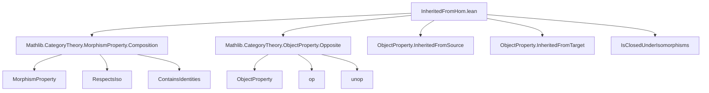
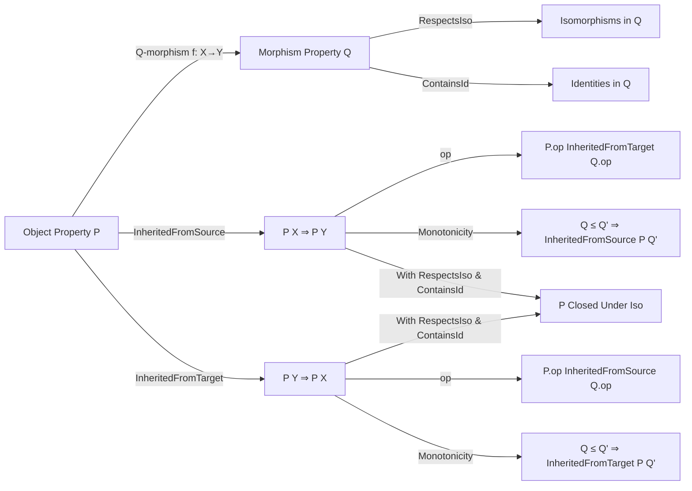

### Technical Brief: `InheritedFromHom.lean`

---

#### **1. Key Definitions & Theorems**

| Name | Type | Purpose |
|------|------|---------|
| `InheritedFromSource P Q` | `Prop` | States that $P$ is *inherited from the source* along $Q$: for all $f : X \to Y$ with $Q\,f$, $P\,X \Rightarrow P\,Y$. |
| `InheritedFromTarget P Q` | `Prop` | States that $P$ is *inherited from the target* along $Q$: for all $f : X \to Y$ with $Q\,f$, $P\,Y \Rightarrow P\,X$. |
| `of_hom_of_source` | `Q f → P X → P Y` | Eliminator for `InheritedFromSource`; used to derive $P\,Y$ from $P\,X$ and a $Q$-morphism. |
| `of_hom_of_target` | `Q f → P Y → P X` | Eliminator for `InheritedFromTarget`; used to derive $P\,X$ from $P\,Y$ and a $Q$-morphism. |
| `InheritedFromSource.op` | Instance | Transfers `InheritedFromSource P Q` to `InheritedFromTarget P.op Q.op` via opposite category. |
| `InheritedFromTarget.op` | Instance | Transfers `InheritedFromTarget P Q` to `InheritedFromSource P.op Q.op`. |
| `InheritedFromSource.inf` | Instance | `InheritedFromSource` is preserved under binary infimum (`⊓`) of object properties. |
| `InheritedFromTarget.inf` | Instance | Same as above for `InheritedFromTarget`. |
| `InheritedFromSource.of_le` | Lemma | Monotonicity in $Q$: if $Q \le Q'$ and $P$ inherits from $Q'$, then it inherits from $Q$. |
| `InheritedFromTarget.of_le` | Lemma | Same monotonicity for `InheritedFromTarget`. |
| `IsClosedUnderIsomorphisms.of_inheritedFromSource` | Lemma | If $P$ inherits from source along $Q$, and $Q$ respects isomorphisms and contains identities, then $P$ is closed under isomorphisms. |
| `IsClosedUnderIsomorphisms.of_inheritedFromTarget` | Lemma | Analogous for `InheritedFromTarget`. |

---

#### **2. Naming Conventions**

- **Prefixes**:
  - `of_`: Eliminator-style naming for class members (e.g., `of_hom_of_source`, `of_iso`).
  - `is_`: For morphism/object property constructors (e.g., `MorphismProperty.isomorphisms`, `IsClosedUnderIsomorphisms`).
- **Suffixes**:
  - `_source`, `_target`: Distinguish directionality of inheritance.
  - `_op`: For constructions involving opposite categories.
  - `_inf`/`_le`: For lattice-theoretic properties (infimum, monotonicity).
- **Structure names**:
  - `InheritedFromSource`, `InheritedFromTarget`: Class names (no `is_` prefix, unlike many other properties in Mathlib).

---

#### **3. Tactic Stack**

- **Core tactics**:
  - `intro`, `exact`, `apply`, `cases`, `constructor`
- **Category-theoretic automation**:
  - `simp` / `simp_rw` (for rewriting with `op`, `unop`, `hom`, `inv`, etc.)
  - `aesop` (likely used in instance proofs for closure under isomorphisms)
  - `ring` (unlikely here; no arithmetic)
- **Category-specific utilities**:
  - `asIso`, `.symm`, `.hom`, `.inv`, `.unop`
  - `Q.of_isIso`, `Q.ContainsIdentities`, `Q.RespectsIso` (used in instance/lemma proofs)

---

#### **4. Proof Logic**

- **Structure of proofs**:
  - **Instances**: Constructed by introducing variables, applying assumptions, and using `⟨...⟩` for product types.
    - E.g., `of_hom_of_source f hf h` → apply `P.of_hom_of_source`, split product.
  - **Lemmas**:
    - Use `of_hom_of_source`/`of_hom_of_target` with monotonicity (`of_le`) or isomorphism data.
    - For closure under isomorphisms: use `e.hom` or `e.inv` as the morphism, and `Q.of_isIso` to get $Q$-property.
- **Common pattern**:
  ```lean
  intro f hf,
  apply P.of_hom_of_source f hf,
  assumption
  ```
  or for isomorphism closure:
  ```lean
  intro e h,
  apply P.of_hom_of_source e.hom (Q.of_isIso e.hom),
  assumption
  ```

---

#### **5. Imports**

- `Mathlib.CategoryTheory.MorphismProperty.Composition`
  - Provides `MorphismProperty`, `RespectsIso`, `ContainsIdentities`, and related infrastructure.
- `Mathlib.CategoryTheory.ObjectProperty.Opposite`
  - Defines `ObjectProperty.op`, `unop`, and opposite-category constructions.

> **Scope**: This module sits in the *property transport* layer of category theory, formalizing how object properties propagate along morphism classes.

---

#### **8. Mermaid Diagrams**

##### **Dependency Graph**



##### **Overview of Theory Flow**



---

This file formalizes a foundational *transport principle* for object properties along morphism classes — a key ingredient for reasoning about categorical properties like “being a monomorphism”, “being projective”, etc., in terms of closure under certain morphisms.
