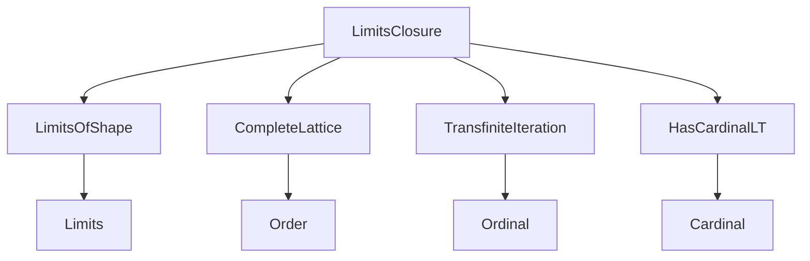

### Technical Brief: `LimitsClosure.lean`

---

#### **1. Key Definitions & Theorems**

| Name | Type / Signature | Purpose |
|------|------------------|---------|
| `limitsClosure` | `inductive limitsClosure : ObjectProperty C` | Closure of `P` under isomorphisms and limits of shapes `J a`. |
| `le_limitsClosure` | `P ≤ P.limitsClosure J` | Inclusion of `P` into its closure. |
| `limitsClosure_le` | `[Q.IsClosedUnderIsomorphisms] → [∀ a, Q.IsClosedUnderLimitsOfShape (J a)] → P ≤ Q → P.limitsClosure J ≤ Q` | Universal property: `limitsClosure` is the *least* such closed property. |
| `limitsClosure_monotone` | `P ≤ Q → P.limitsClosure J ≤ Q.limitsClosure J` | Monotonicity of closure under inclusion. |
| `limitsClosure_isoClosure` | `P.isoClosure.limitsClosure J = P.limitsClosure J` | Closure commutes with iso-closure. |
| `strictLimitsClosureStep` | `P ⊔ (⨆ a, P.strictLimitsOfShape (J a))` | One-step closure: add `P` and strict limits of `P`-objects over each `J a`. |
| `strictLimitsClosureIter` | `transfiniteIterate (Q ↦ Q.strictLimitsClosureStep J) b P` | Transfinite iteration of one-step closure up to ordinal `b`. |
| `strictLimitsClosureStep_strictLimitsClosureIter_eq_self` | `(P.strictLimitsClosureIter J κ.ord).strictLimitsClosureStep J = P.strictLimitsClosureIter J κ.ord` | Stabilization at `κ.ord`, where `κ` is regular and large enough. |
| `isoClosure_strictLimitsClosureIter_eq_limitsClosure` | `(P.strictLimitsClosureIter J κ.ord).isoClosure = P.limitsClosure J` | Equality of full closure and iso-closure of stabilized iteration. |
| `isEssentiallySmall_limitsClosure` | `[EssentiallySmall P] → [Small α] → [∀ a, Small (J a)] → EssentiallySmall (P.limitsClosure J)` | Closure remains essentially small under smallness assumptions. |
| `instance essentiallySmall_limitsClosure` | `[EssentiallySmall P] → [LocallySmall C] → [Small α] → [∀ a, Small (J a)] → [∀ a, LocallySmall (J a)] → EssentiallySmall (P.limitsClosure J)` | Final instance: closure is essentially small under mild hypotheses. |

---

#### **2. Naming Conventions**

- **Prefixes**:
  - `limitsClosure_`: main closure operator and its properties.
  - `strictLimitsClosureStep_`: one-step closure.
  - `strictLimitsClosureIter_`: transfinite iteration.
  - `le_`, `monotone`, `isoClosure_`, `isSuccLimit`, `isMin`, `succ`: standard Lean/Order theory patterns.

- **Suffixes**:
  - `_le`: inclusion or monotonicity lemmas.
  - `_eq_self`: stabilization or fixed-point lemmas.
  - `_eq_limitsClosure`: identification with full closure.
  - `_of_`: construction from data (e.g., `of_mem`, `of_isoClosure`, `of_limitPresentation`).

- **Inductive constructors**:
  - `of_mem`, `of_isoClosure`, `of_limitPresentation`: reflect closure under membership, isomorphism, and limits.

---

#### **3. Tactic Stack**

Frequently used tactics:
- `induction ... using ...RecOn`: transfinite induction on ordinals.
- `rw [...]`, `conv_rhs => rw [...]`: rewriting using lemmas and definitions.
- `simp only [...]`: simplification with precise control (e.g., for `iSup`, `sup`, `isoClosure`).
- `aesop`: for trivial logical reasoning (e.g., in `small_of_injective`).
- `exact`, `refine`, `obtain ⟨...⟩`: constructive reasoning and case analysis.
- `infer_instance`: typeclass resolution.
- `dsimp`, `unfold`: definitional simplification.

---

#### **4. Proof Logic**

- **Inductive definition** of `limitsClosure` ensures closure under:
  - membership (`of_mem`),
  - isomorphism (`of_isoClosure`),
  - limits of shape `J a` (`of_limitPresentation`).

- **Universal property** (`limitsClosure_le`) is proven by induction on the inductive definition.

- **Stabilization argument**:
  - Define transfinite iteration `strictLimitsClosureIter`.
  - Show it’s bounded above by `limitsClosure`.
  - Use regularity of `κ` and `HasCardinalLT` to bound the length needed for stabilization.
  - Prove fixed-point equation at `κ.ord`.

- **Essential smallness**:
  - Reduce to case where `P` is small (via `EssentiallySmall.exists_small_le`).
  - Use stability of smallness under transfinite iteration (via `Small.{w} (Set.Iio b)` and typeclass inference).
  - Conclude via iso-closure and stabilization.

---

#### **5. Imports**

| Module | Purpose |
|--------|---------|
| `Mathlib.CategoryTheory.ObjectProperty.LimitsOfShape` | Limits of shape, `LimitPresentation`, `strictLimitsOfShape`. |
| `Mathlib.CategoryTheory.ObjectProperty.CompleteLattice` | Lattice structure on `ObjectProperty`, closure operators. |
| `Mathlib.Order.TransfiniteIteration` | `transfiniteIterate`, transfinite induction principles. |
| `Mathlib.SetTheory.Cardinal.HasCardinalLT` | Regular cardinals, `HasCardinalLT`, `equivShrink`, cofinality. |

---

#### **6. Mermaid Diagrams**

##### **Dependency Graph (Module Level)**



##### **Overview of Theory Flow**

```mermaid
flowchart LR
  A[P : ObjectProperty C] --> B[limitsClosure J]
  B --> C[IsClosedUnderIsomorphisms]
  B --> D[IsClosedUnderLimitsOfShape (J a)]
  B --> E[Universal Property: least such]

  A --> F[strictLimitsClosureStep J]
  F --> G[transfiniteIterate up to κ.ord]
  G --> H[Stabilization: fixed point]
  H --> I[isoClosure = limitsClosure]
  I --> J[EssentiallySmall under smallness]
```

##### **Proof Strategy Flow (Stabilization)**


---

#### **7. Summary**

This file formalizes the *closure of a property under limits of certain shapes*, a foundational tool in categorical logic and homotopy theory. It constructs the smallest property containing `P` and closed under isomorphisms and limits of shapes `J a`, and shows that under mild smallness assumptions (e.g., `P` essentially small, `J a` small categories), the closure remains essentially small. The proof uses transfinite iteration, regular cardinals, and order-theoretic properties of `ObjectProperty`.
