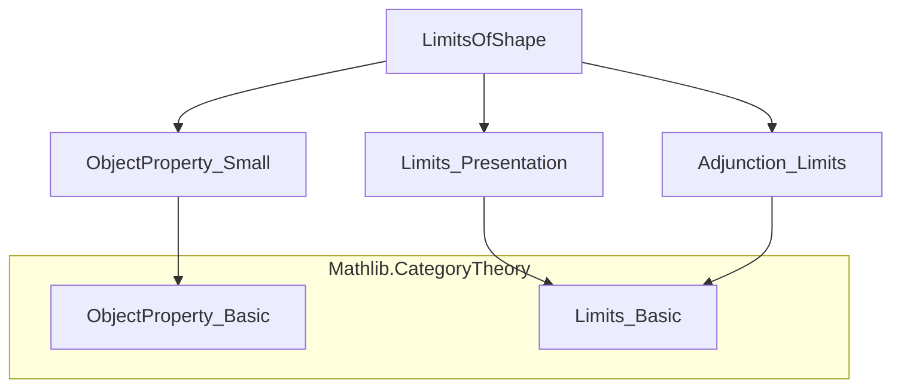
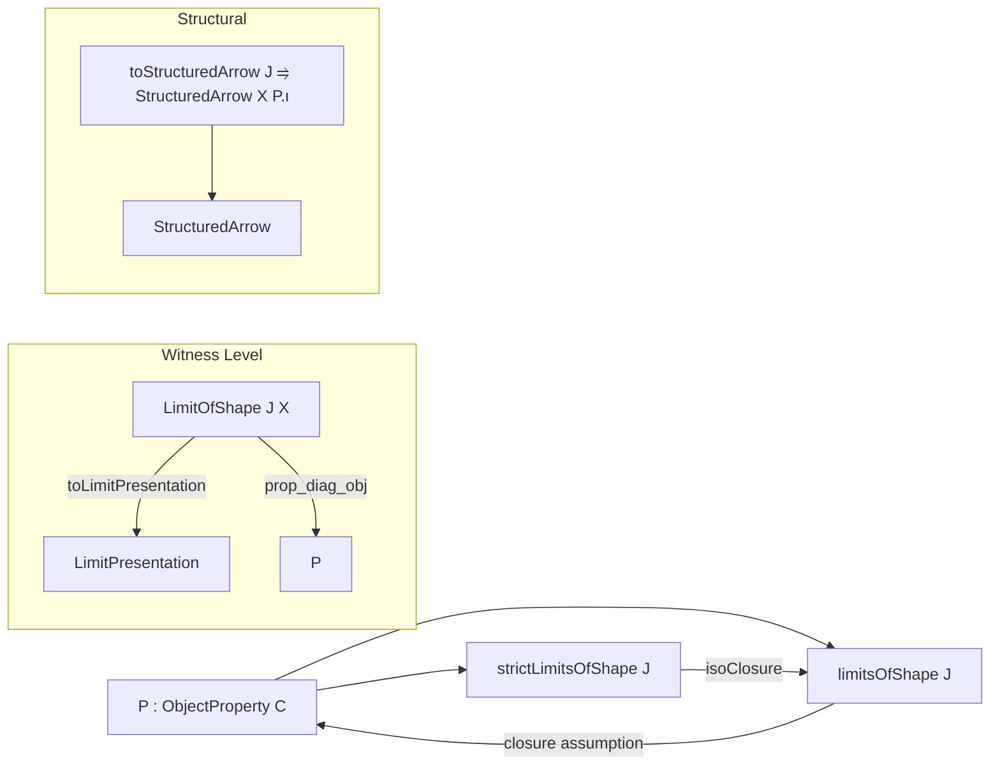
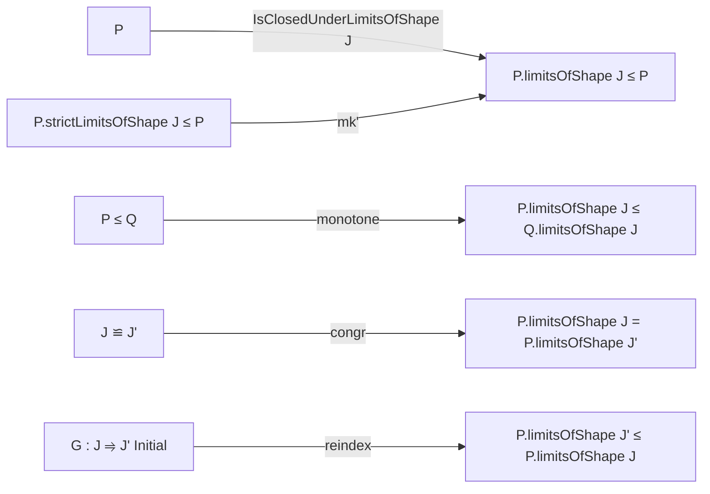

Here is a structured technical brief extracted from `LimitsOfShape.lean`, focusing on formal metadata for building a domain-specific AI agent in Lean 4.

---

### **1. Key Definitions & Theorems**

| Name | Type / Signature | Purpose |
|------|------------------|---------|
| `strictLimitsOfShape` | `inductive : ObjectProperty C → Type u' [Category J] → ObjectProperty C` | Defines objects *equal* to `limit F` where all `F.obj j` satisfy `P`. |
| `LimitOfShape` | `structure : C → Type u' [Category J] → Prop` | A structure witnessing that `X` is a limit of a diagram satisfying `P`. Extends `LimitPresentation`. |
| `limitsOfShape` | `def : ObjectProperty C → Type u' [Category J] → ObjectProperty C` | The *iso-closure* of `strictLimitsOfShape`: objects *isomorphic* to some `limit F` with `F` valued in `P`. |
| `limit` | `def : (F : J ⥤ C) → [HasLimit F] → (∀ j, P (F.obj j)) → P.LimitOfShape J (limit F)` | Constructs a `LimitOfShape` witness for `limit F`. |
| `ofIso` | `def : P.LimitOfShape J X → X ≅ Y → P.LimitOfShape J Y` | Propagates `LimitOfShape` along isomorphisms. |
| `ofLE` | `def : P.LimitOfShape J X → P ≤ Q → Q.LimitOfShape J X` | Monotonicity of `LimitOfShape` w.r.t. `P ≤ Q`. |
| `reindex` | `def : P.LimitOfShape J X → G : J' ⥤ J [G.Initial] → P.LimitOfShape J' X` | Change of indexing category via initial functor. |
| `toStructuredArrow` | `def : P.LimitOfShape J X → J ⥤ StructuredArrow X P.ι` | Encodes the diagram as a functor into the structured arrow category. |
| `strictLimitsOfShape_monotone` | `lemma : P ≤ Q → P.strictLimitsOfShape J ≤ Q.strictLimitsOfShape J` | Monotonicity of strict limits. |
| `strictLimitsOfShape_le_limitsOfShape` | `lemma : P.strictLimitsOfShape J ≤ P.limitsOfShape J` | Strict limits embed into limits (up to isomorphism). |
| `isoClosure_strictLimitsOfShape` | `lemma : (P.strictLimitsOfShape J).isoClosure = P.limitsOfShape J` | Core equivalence: `limitsOfShape` is the iso-closure of `strictLimitsOfShape`. |
| `limitsOfShape_monotone` | `lemma : P ≤ Q → P.limitsOfShape J ≤ Q.limitsOfShape J` | Monotonicity of `limitsOfShape`. |
| `limitsOfShape_isoClosure` | `lemma : P.isoClosure.limitsOfShape J = P.limitsOfShape J` | `limitsOfShape` is insensitive to replacing `P` by its iso-closure. |
| `small_strictLimitsOfShape` | `instance [Small P] [Small J] [LocallySmall C] [LocallySmall J] : Small (P.strictLimitsOfShape J)` | Ensures strict limits form a small type under size assumptions. |
| `essentiallySmall_limitsOfShape` | `instance [Small P] [Small J] [LocallySmall C] [LocallySmall J] : EssentiallySmall (P.limitsOfShape J)` | Deduces essential smallness of `limitsOfShape` via iso-closure. |
| `IsClosedUnderLimitsOfShape` | `class : ObjectProperty C → Type u' [Category J] → Prop` | `P` is closed under limits of shape `J` iff `P.limitsOfShape J ≤ P`. |
| `IsClosedUnderLimitsOfShape.mk'` | `lemma [IsClosedUnderIsomorphisms P] : P.strictLimitsOfShape J ≤ P → P.IsClosedUnderLimitsOfShape J` | Practical way to prove closure: check strict limits. |
| `prop_limit` | `lemma [P.IsClosedUnderLimitsOfShape J] : (∀ j, P (F.obj j)) → P (limit F)` | Closure under actual limits. |
| `prop_of_isLimit` | `lemma [P.IsClosedUnderLimitsOfShape J] : IsLimit c → (∀ j, P (F.obj j)) → P c.pt` | Closure under any limiting cone. |
| `prop_pi` | `lemma [P.IsClosedUnderLimitsOfShape (Discrete J)] : (∀ j, P (X j)) → P (∏ᶜ X)` | Closure under products (limits over discrete category). |
| `limitsOfShape_le_of_initial` | `lemma G : J ⥤ J' [G.Initial] : P.limitsOfShape J' ≤ P.limitsOfShape J` | Limits over a larger shape dominate those over an initial subshape. |
| `limitsOfShape_congr` | `lemma e : J ≌ J' : P.limitsOfShape J = P.limitsOfShape J'` | Invariance under equivalence of indexing categories. |
| `isClosedUnderLimitsOfShape_iff_of_equivalence` | `lemma e : J ≌ J' : P.IsClosedUnderLimitsOfShape J ↔ P.IsClosedUnderLimitsOfShape J'` | Closure property is invariant under equivalence of index categories. |
| `inverseImage_preserves_closure` | `instance (P : ObjectProperty D) (F : C ⥤ D) [P.IsClosedUnderLimitsOfShape J] [PreservesLimitsOfShape J F] : (P.inverseImage F).IsClosedUnderLimitsOfShape J` | Pullback of a closed property along a limit-preserving functor remains closed. |

---

### **2. Naming Conventions**

- **Prefixes**:
  - `strictLimitsOfShape`: for the *strict* (non-isomorphism-closed) variant.
  - `limitsOfShape`: for the *iso-closed* version.
  - `LimitOfShape`: for the *witness structure* (not a property, but a dependent type).
- **Suffixes**:
  - `_le_`: monotonicity lemmas (e.g., `strictLimitsOfShape_monotone`, `limitsOfShape_monotone`).
  - `_of_`: constructions from data (e.g., `ofIso`, `ofLE`, `prop_of_isLimit`).
  - `_congr`, `_equivalence`: invariance under equivalence.
  - `isClosedUnder...`: class and its lemmas.
- **`prop_` prefix**: lemmas that derive `P X` from closure assumptions (e.g., `prop_limit`, `prop_pi`).
- **`reindex`, `changeDiag`**: structural operations on diagrams.

---

### **3. Tactic Stack**

Frequent tactics used in proofs:
- `intro`, `rintro`, `exact`, `refine`, `convert`
- `rw`, `conv_rhs => rw [...]`
- `simp only [...]`, `simp`
- `apply`, `apply_fun`, `apply_fun at`
- `infer_instance`, `apply_instance`
- `ext`, `ext X`, `ext j`
- `have :=`, `have h :=`, `choose ... using`
- `rw [← ...]`, `rw [isoClosure_le_iff]`
- `apply le_antisymm`, `apply funext`, `apply funext j`
- `rwa [...]`, `rw [...] at *`

No heavy automation (e.g., `aesop`, `ring`, `linarith`) — proofs are mostly structural and rely on category-theoretic reasoning.

---

### **4. Proof Logic**

- **Inductive definitions** (`strictLimitsOfShape`) are handled via `intro`/`cases`.
- **Iso-closure arguments** rely on:
  - `isoClosure_le_iff`
  - `le_antisymm` with two directions: one using monotonicity, one constructing a witness via `limit` + `isLimit.conePointUniqueUpToIso`.
- **Closure proofs** (`IsClosedUnderLimitsOfShape.mk'`) use:
  - `rw [← P.isoClosure_eq_self]`
  - `rw [← isoClosure_strictLimitsOfShape]`
  - monotonicity of `isoClosure`.
- **Smallness proofs** use:
  - `small_of_surjective`
  - choice (`choose ... using`) to extract witnesses.
- **Equivalence invariance** uses:
  - `limitsOfShape_congr` + `isClosedUnderLimitsOfShape_iff_of_equivalence`
- **Change of index category** uses:
  - `reindex` + `reindex_comp` (via `toLimitPresentation.reindex`)

---

### **5. Imports**

| Module | Purpose |
|--------|---------|
| `Mathlib.CategoryTheory.ObjectProperty.Small` | Smallness and essentially smallness of object properties. |
| `Mathlib.CategoryTheory.Limits.Presentation` | `LimitPresentation`, structured cones, presentations of limits. |
| `Mathlib.CategoryTheory.Adjunction.Limits` | Preservation of limits, adjunctions and limits. |

---

### **6. Mermaid Diagrams**

#### **Dependency Graph (Module-Level)**

#### **Conceptual Overview of `P.limitsOfShape J`**

#### **Closure Property Flow**

---

### **7. Theory Scope**

This file formalizes:
- A hierarchy of object properties defined via limits of fixed shape.
- The distinction between *strict* (equality-based) and *non-strict* (iso-closed) limits.
- Closure properties under equivalences, initial functors, and pullbacks along limit-preserving functors.
- Smallness/essential smallness results under cardinality assumptions.
- A typeclass `IsClosedUnderLimitsOfShape` to reason about stability under limits.

It serves as a foundational module for higher-categorical closure properties (e.g., finite limits, regular cardinal bounds — see TODO).

---

Let me know if you'd like a **Lean 4 AST summary**, **proof automation suggestions**, or a **domain ontology mapping** to standard category theory literature.
