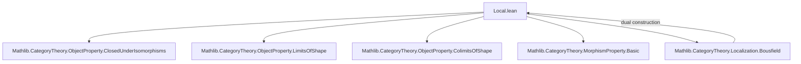
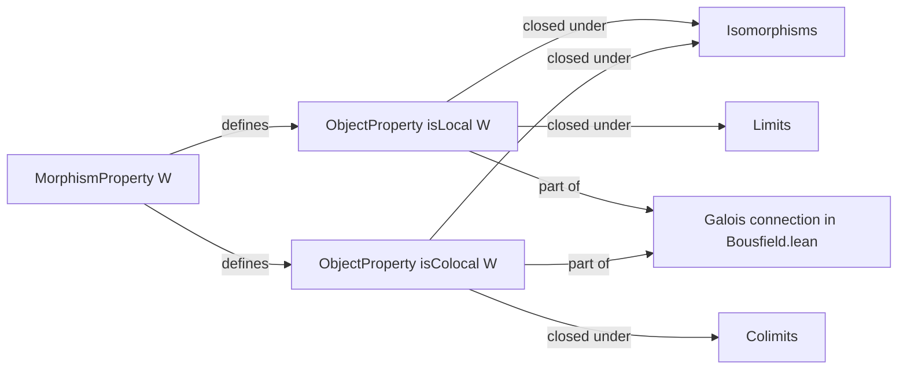

### Technical Brief: `Local.lean`

---

#### **1. Key Definitions & Theorems**

| Name | Type | Purpose |
|------|------|---------|
| `isLocal` | `MorphismProperty C → ObjectProperty C` | Defines the property of *$W$-local objects*: objects $Z$ such that for all $f : X \to Y$ with $W f$, precomposition $g \mapsto f \gg g$ is a bijection $(Y \to Z) \xrightarrow{\sim} (X \to Z)$. |
| `isColocal` | `MorphismProperty C → ObjectProperty C` | Dual: defines *$W$-colocal objects*: objects $X$ such that for all $g : Y \to Z$ with $W g$, postcomposition $f \mapsto f \gg g$ is a bijection $(X \to Y) \xrightarrow{\sim} (X \to Z)$. |
| `isLocal_iff` | `lemma` | Equivalence stating membership in `W.isLocal Z` is exactly the universal property above. |
| `isColocal_iff` | `lemma` | Same as above for colocal objects. |
| `IsClosedUnderIsomorphisms` (for `isLocal`, `isColocal`) | `instance` | Shows both properties are closed under isomorphisms: if $Z \cong Z'$ and $Z$ is $W$-local, then $Z'$ is too. |
| `IsClosedUnderLimitsOfShape` (for `isLocal`) | `instance` | Shows $W$-local objects are closed under limits of any shape $J$. |
| `IsClosedUnderColimitsOfShape` (for `isColocal`) | `instance` | Shows $W$-colocal objects are closed under colimits of any shape $J$. |

---

#### **2. Naming Conventions**

- **Prefixes**:
  - `isLocal`, `isColocal`: predicate constructors for object properties derived from a morphism property.
- **Suffixes**:
  - `_iff`: lemmas giving definitional equivalence.
  - `of_iso`: morphism used to transport structure along isomorphisms.
  - `limitsOfShape_le`, `colimitsOfShape_le`: witnesses for closure under (co)limits.
- **Variable naming**:
  - `W`: generic morphism property.
  - `Z`, `X`, `Y`: objects.
  - `f`, `g`: morphisms.
  - `p`, `app`, `h`: used in (co)limit constructions.

---

#### **3. Tactic Stack**

- `aesop`: used for automated reasoning with isomorphisms and bijections.
- `rw`: rewriting using lemmas like `Function.Bijective.of_comp_iff`, `Iso.homToEquiv`, etc.
- `convert`: for flexible equality proofs up to definitional equality.
- `simp [reassoc_of%, h, ...]`: simplification with associativity and custom lemmas.
- `choose ... using`: for dependent choice in constructing (co)limit mediating maps.
- `exact`, `refine`: standard proof construction.
- `hom_ext`: extensionality for (co)limit cones.

---

#### **4. Proof Logic**

- **Closure under isomorphisms**:
  - Use naturality of isomorphism-induced bijections (`Iso.homToEquiv`, `Iso.homFromEquiv`).
  - Show bijection composition preserves bijectivity.

- **Closure under limits** (`isLocal`):
  - Given a limit cone $p : \Delta Z \to D$, and $f : X \to Y$ with $W f$, construct a unique mediating map $Y \to Z$ using the universal property of the limit.
  - Uniqueness follows from `hom_ext` applied componentwise.
  - Surjectivity uses choice to pick components and verifies compatibility via `prop_diag_obj`.

- **Closure under colimits** (`isColocal`):
  - Dual: use colimit universal property.
  - Injectivity/surjectivity via `hom_ext` and componentwise lifting.

- **General pattern**:
  - Inductive/constructive use of (co)limit universal properties.
  - Verification of naturality and uniqueness via `hom_ext`.

---

#### **5. Imports**

| Import | Role |
|--------|------|
| `Mathlib.CategoryTheory.ObjectProperty.ClosedUnderIsomorphisms` | Provides typeclass `IsClosedUnderIsomorphisms`. |
| `Mathlib.CategoryTheory.ObjectProperty.LimitsOfShape` | Provides `IsClosedUnderLimitsOfShape`. |
| `Mathlib.CategoryTheory.ObjectProperty.ColimitsOfShape` | Provides `IsClosedUnderColimitsOfShape`. |
| `Mathlib.CategoryTheory.MorphismProperty.Basic` | Defines `MorphismProperty` and basic operations. |

---

#### **6. Theory Context & Dependencies**

- **Context**: Localizations in category theory (e.g., Bousfield localization).
- **Galois connection**: As noted in docstring, this construction (`MorphismProperty → ObjectProperty`) is part of a Galois connection with the dual map `ObjectProperty → MorphismProperty` defined in `Bousfield.lean`.
- **Related files**:
  - `Mathlib/CategoryTheory/Localization/Bousfield.lean`: defines the dual `ObjectProperty.isLocal` and establishes the Galois connection.
  - `LimitsOfShape`, `ColimitsOfShape`: foundational for closure properties.

---

#### **7. Mermaid Diagrams**

##### **Dependency Graph (Module-Level)**

##### **Conceptual Overview**

---

#### **8. Summary**

This file formalizes the categorical notion of *locality* and *colocality* with respect to a class of morphisms $W$. It defines two object properties (`isLocal`, `isColocal`) and proves they are stable under isomorphisms, limits, and colimits — foundational for localization theory. The proofs rely heavily on universal properties of (co)limits and bijection preservation under isomorphisms. The structure is clean, modular, and aligns with Lean’s category theory library conventions.
