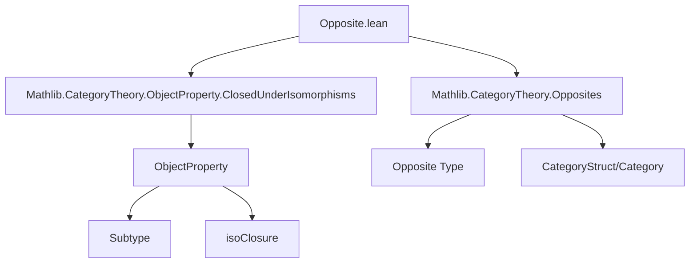
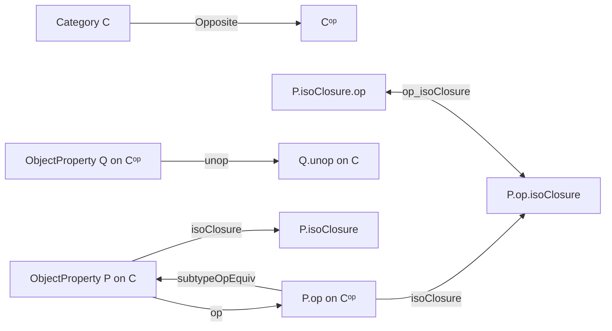

### Technical Brief: `Opposite.lean` — Opposite of an Object Property in Category Theory

---

#### **1. Key Definitions & Theorems**

| Name | Type / Signature | Purpose |
|------|------------------|---------|
| `op` | `P.op : ObjectProperty Cᵒᵖ` | Transfers a property `P` on objects of `C` to a property on `Cᵒᵖ` via `X ↦ P(X.unop)` |
| `unop` | `P.unop : ObjectProperty C` | Reverse construction: pulls back a property on `Cᵒᵖ` to `C` via `X ↦ P(op X)` |
| `op_iff`, `unop_iff` | `↔`-lemmas | Simplification lemmas showing `P.op X ↔ P X.unop` and `P.unop X ↔ P (op X)` |
| `op_unop`, `unop_op` | `rfl`-equalities | Show `op` and `unop` are inverses on properties |
| `op_injective`, `unop_injective` | Injectivity lemmas | Prove `op` and `unop` are injective on properties |
| `op_injective_iff`, `unop_injective_iff` | `↔`-versions | Characterize equality of properties via their opposites |
| `op_monotone`, `unop_monotone` | Monotonicity lemmas | Show `op`/`unop` preserve the pointwise order `≤` on properties |
| `op_monotone_iff`, `unop_monotone_iff` | `↔`-versions | Equivalence of monotonicity under `op`/`unop` |
| `subtypeOpEquiv` | `Subtype P.op ≃ Subtype P` | Equivalence of subtypes induced by `P` and its opposite |
| `op_ofObj`, `unop_ofObj` | `ofObj` compatibility | Show `op`/`unop` commute with `ofObj` (indexed families) |
| `op_singleton`, `unop_singleton` | `singleton` compatibility | Show `op`/`unop` commute with singleton properties |
| `op_isoClosure`, `unop_isoClosure` | `isoClosure` compatibility | Show `op`/`unop` commute with iso-closure (under isomorphisms) |
| `IsClosedUnderIsomorphisms` instances | `P.op`, `P.unop` inherit closure | If `P` is closed under isomorphisms, so are `P.op` and `P.unop` |

---

#### **2. Naming Conventions**

- **Prefixes**:
  - `op_`: for constructions going from `C` → `Cᵒᵖ`
  - `unop_`: for constructions going from `Cᵒᵖ` → `C`
- **Suffixes**:
  - `_iff`: for `↔`-lemmas (equivalences)
  - `_injective[_iff]`: for injectivity and its equivalence formulation
  - `_monotone[_iff]`: for monotonicity and its equivalence formulation
- **`[simp]` / `[simp high]`**: used for lemmas that simplify well with `simp`, especially those defining or commuting with basic constructors (`singleton`, `ofObj`, etc.)

---

#### **3. Tactic Stack**

- **Core tactics**:
  - `rfl`, `rw`, `ext`, `simp`, `simp only`
  - `intro`, `exact`, `constructor`
  - `apply`, `cases`, `subst`
- **Category-theoretic automation**:
  - `simp` heavily used with `op_iff`, `unop_iff`, `op_unop`, `unop_op`
  - `ext` + `simp only [ofObj_iff]` for extensionality proofs over `ofObj`
  - `rw [← h]` patterns for reversing equalities using inverse laws

---

#### **4. Proof Logic**

- **Structure**:
  - Most proofs follow a *definition → simplification → equivalence/injectivity/monotonicity* pattern.
  - For bijection/iso-closure lemmas: construct forward/backward directions explicitly, often using:
    - `op Y`, `Y.unop`, `e.op`, `e.unop`, `e.symm.op`, etc.
  - Closure under isomorphisms: use `prop_of_iso` with `e.symm.op` or `e.symm.unop` to “transport” the isomorphism back to the original category.
- **Induction**: Not used here — all proofs are *elementary* and rely on definitional equalities and categorical properties of opposites.

---

#### **5. Imports**

- `Mathlib.CategoryTheory.ObjectProperty.ClosedUnderIsomorphisms`: provides `IsClosedUnderIsomorphisms` typeclass and related lemmas.
- `Mathlib.CategoryTheory.Opposites`: defines `Opposite`, `unop`, `op`, `CategoryStruct`, `Category`, `ofObj`, `singleton`, `isoClosure`, etc.

---

#### **6. Mermaid Diagrams**

##### **Dependency Graph (Module-Level)**

##### **Overview of Theory Flow**

---

#### **7. Summary**

This file formalizes the *contravariant* action of taking opposites on *object properties* in category theory. It establishes that `op` and `unop` form a Galois connection (in fact, a bijection) on the lattice of object properties, preserving monotonicity and closure under isomorphisms. It also shows compatibility with standard constructions (`singleton`, `ofObj`, `isoClosure`), making it foundational for reasoning about properties that behave well under duality.

This is essential for dualizing results about object properties (e.g., “monomorphisms are stable under pullback” ↔ “epimorphisms are stable under pushout”) without re-proving them in the opposite category.

--- 

Let me know if you'd like a formalized summary in Lean or a plan for extending this theory (e.g., to morphism properties or functors).
