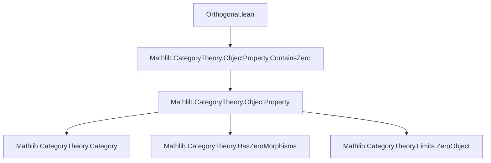
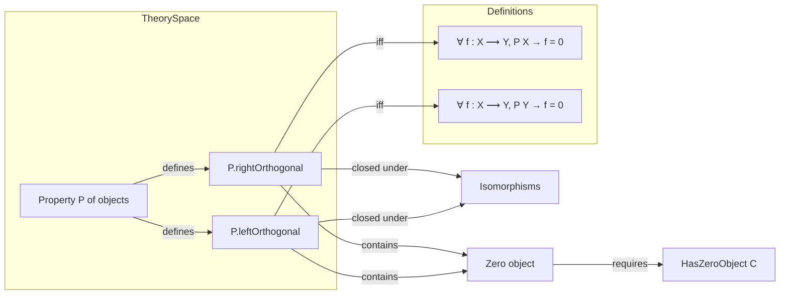

**Technical Metadata Brief: `Orthogonal.lean`**

---

### 1. **Key Definitions & Theorems**

| Name | Type | Purpose |
|------|------|---------|
| `rightOrthogonal` | `ObjectProperty C → ObjectProperty C` | Defines the property of objects `Y` such that every morphism `f : X ⟶ Y` with `P X` is zero. |
| `leftOrthogonal` | `ObjectProperty C → ObjectProperty C` | Defines the property of objects `X` such that every morphism `f : X ⟶ Y` with `P Y` is zero. |
| `rightOrthogonal_iff` | `∀ Y, P.rightOrthogonal Y ↔ ∀ ⦃X⦄ (f : X ⟶ Y), P X → f = 0` | Characterizes `rightOrthogonal` via logical equivalence (definition unfolding). |
| `leftOrthogonal_iff` | `∀ X, P.leftOrthogonal X ↔ ∀ ⦃Y⦄ (f : X ⟶ Y), P Y → f = 0` | Same as above for `leftOrthogonal`. |
| `IsClosedUnderIsomorphisms` instances | `P.rightOrthogonal.IsClosedUnderIsomorphisms`, `P.leftOrthogonal.IsClosedUnderIsomorphisms` | Prove orthogonality is preserved under isomorphism (via cancellation of mono/epi). |
| `ContainsZero` instances | `P.rightOrthogonal.ContainsZero`, `P.leftOrthogonal.ContainsZero` | Show orthogonality classes contain the zero object (when it exists). |

---

### 2. **Naming Conventions**

- **Prefixes**:
  - `rightOrthogonal`, `leftOrthogonal`: indicate direction of orthogonality relative to `P`.
- **Suffixes**:
  - `_iff`: standard Lean convention for lemmas equating a definition with its unpacked form.
- **Structure fields**:
  - `of_iso`, `exists_zero`: follow Lean’s typeclass naming for proof fields (e.g., `IsClosedUnderIsomorphisms.of_iso`, `ContainsZero.exists_zero`).

---

### 3. **Tactic Stack**

Frequent tactics used in proofs:
- `rw`: for rewriting using definitions (`rightOrthogonal_iff`, `leftOrthogonal_iff`, etc.).
- `ext`: for extensionality proofs (e.g., proving morphisms equal by extension).
- `cancel_mono`, `cancel_epi`: specialized tactics for canceling monos/epis in equalities.
- `zero_comp`, `comp_zero`: simplification lemmas for composition with zero morphisms.
- `exact`: used in trivial proof steps (e.g., `exact h _ hX`).
- `by ext`: used to prove morphism equality in hom-sets (common in category theory).

No heavy automation (e.g., `aesop`, `ring`, `simp_rw`) is used—proofs are mostly manual and structural.

---

### 4. **Proof Logic**

- **Structure of proofs**:
  - Definitions are unfolded via `rw` or `iff`.
  - Isomorphism closure proofs:
    - Use `rw [← cancel_mono e.inv, zero_comp]` (for right orthogonal) or `rw [← cancel_epi e.hom, comp_zero]` (for left orthogonal).
    - Then apply the hypothesis `h` on the transformed morphism.
  - Zero object containment:
    - Construct witness `⟨0, isZero_zero _, ...⟩`.
    - Use `by ext` to show the zero morphism is zero (trivial by definition).

- **Logical flow**:
  - Most proofs are *direct*: unfold definition → apply hypothesis → simplify using categorical identities.

---

### 5. **Imports**

- **Primary dependency**:
  ```lean
  Mathlib.CategoryTheory.ObjectProperty.ContainsZero
  ```
  - Provides the `ContainsZero` typeclass and related lemmas (e.g., `isZero_zero`).

- **Implicit imports** (via `CategoryTheory` and `Limits`):
  - `CategoryTheory.Category`: basic category theory.
  - `CategoryTheory.HasZeroMorphisms`: zero morphisms structure.
  - `CategoryTheory.Limits`: limits, zero objects, etc.
  - `CategoryTheory.ObjectProperty`: base theory of object properties (e.g., `IsClosedUnderIsomorphisms`).

---

### 8. **Mermaid Diagrams**

#### **Dependency Graph**



#### **Overview of File & Theory**



---

**Summary**: This file formalizes *orthogonal complements* of object properties in categories with zero morphisms. It is foundational for stability properties and reflective/localization constructions (e.g., in t-structures or torsion theories). The proofs are minimal and rely on categorical cancellation and zero-morphism properties.
