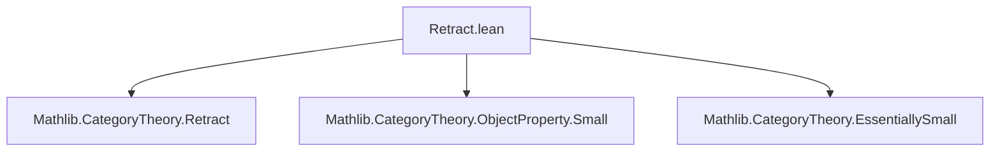
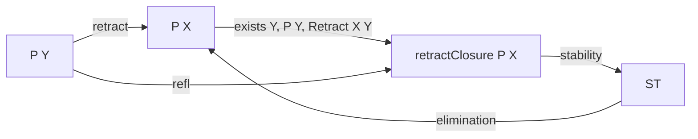

### Technical Brief: `Retract.lean`

---

#### **1. Key Definitions & Theorems**

| Name | Type / Signature | Purpose |
|------|------------------|---------|
| `IsStableUnderRetracts` | `class IsStableUnderRetracts (P : ObjectProperty C)` | States that if $ P(Y) $ holds, then any retract $ X \hookrightarrow Y $ also satisfies $ P(X) $. |
| `prop_of_retract` | `P Y → Retract X Y → P X` | Instantiation of the class: gives $ P(X) $ from $ P(Y) $ and a retract. |
| `retractClosure` | `ObjectProperty C := fun X ↦ ∃ Y, P Y × Nonempty (Retract X Y)` | Smallest predicate containing $ P $ and closed under retracts. |
| `prop_retractClosure_iff` | `retractClosure P X ↔ ∃ Y, P Y × Nonempty (Retract X Y)` | Definition unfolding. |
| `prop_retractClosure` | `P Y → Retract X Y → retractClosure P X` | Witness for closure: if $ Y $ satisfies $ P $ and $ X $ retracts from $ Y $, then $ X $ is in the closure. |
| `le_retractClosure` | `P ≤ retractClosure P` | $ P $ is contained in its retract closure. |
| `monotone_retractClosure` | `P ≤ Q ⇒ retractClosure P ≤ retractClosure Q` | Monotonicity of closure under pointwise order. |
| `retractClosure_eq_self` | `[IsStableUnderRetracts P] ⇒ retractClosure P = P` | Closure fixes predicates already stable under retracts. |
| `retractClosure_le_iff` | `[IsStableUnderRetracts Q] ⇒ retractClosure P ≤ Q ↔ P ≤ Q` | Universal property: retract closure is left adjoint to inclusion of stable predicates. |
| `retractClosure_isoClosure` | `P.isoClosure.retractClosure = P.retractClosure` | Retract closure commutes with iso-closure. |
| `instance IsStableUnderRetracts (retractClosure P)` | `IsStableUnderRetracts (retractClosure P)` | Closure is always stable under retracts. |
| `instance EssentiallySmall retractClosure` | `[EssentiallySmall P] [LocallySmall C] ⇒ EssentiallySmall (retractClosure P)` | Closure preserves essential smallness under mild assumptions. |

---

#### **2. Naming Conventions**

- **Predicates on objects**: `P`, `Q`, `R`, etc., of type `ObjectProperty C` (i.e., `C → Prop`).
- **Retract-related**:
  - `retractClosure`: closure under retracts.
  - `of_retract`: constructor for stability.
  - `prop_of_retract`: elimination rule.
- **Order-theoretic**:
  - `le_`: pointwise order $ P ≤ Q $.
  - `monotone_`: monotonicity lemmas.
- **Equational reasoning**:
  - `retractClosure_eq_self`, `retractClosure_le_iff`, `retractClosure_isoClosure`: structural equalities.
- **Instance naming**:
  - `instance : IsStableUnderRetracts (retractClosure P)` — implicit inference.
  - `instance EssentiallySmall retractClosure` — preservation of smallness.

---

#### **3. Tactic Stack**

- `rfl`: definition unfolding.
- `intro`, `rintro`, `exact`: basic intro/elimination.
- `apply`, `refine`: constructing proofs with holes.
- `rw [reassoc_of% ...]`, `simp [reassoc_of% ...]`: simplification using associativity lemmas.
- `congr_arg`, `Subtype.ext_iff.1`, `Sigma.ext_iff`, `heq_eq_eq`: equality reasoning in dependent types.
- `choose ... using`: choice principle for constructing witnesses.
- `obtain ... := ...`: destructuring existential/dependent pairs.
- `have ... := ...`: intermediate lemma introduction.
- `by simp`, `by rw`, `by aesop`: fallback automation (likely `aesop` used implicitly in `simp`-based proofs).

---

#### **4. Proof Logic**

- **General pattern**:
  - **Induction/definition unfolding**: often start with `rw` or `rfl` to expand definitions (`retractClosure`, `isoClosure`).
  - **Existential witness construction**: e.g., `⟨Y, hY, ⟨r⟩⟩` for `retractClosure`.
  - **Equality via antisymmetry**: `le_antisymm` used for predicate equality (e.g., `retractClosure_eq_self`).
  - **Monotonicity + universal property**: `retractClosure_le_iff` proven via monotonicity + fixed-point property.
  - **Retract composition**: `r₁.trans r₂` used to lift retracts through chains.
  - **Dependent choice + lifting**: in `EssentiallySmall` instance, uses choice to pick representatives and constructs a new retract via iso-compatibility.

- **Key logical flow in `EssentiallySmall` instance**:
  1. Use `EssentiallySmall.exists_small_le` to get a small predicate $ Q ≤ P $.
  2. Encode retractions from objects satisfying $ Q $ as a type $ α $.
  3. Define a predicate $ R $ on $ α $ to quotient equivalent retractions.
  4. Construct a small predicate $ .ofObj Y $ covering $ retractClosure P $ via:
     - Monotonicity: $ Q ≤ P ⇒ retractClosure Q ≤ retractClosure P $,
     - Iso-closure equivalence: $ retractClosure (P.isoClosure) = retractClosure P $,
     - Explicit construction of a retract from a representative of $ R $.

---

#### **5. Imports**

- `Mathlib.CategoryTheory.EssentiallySmall`: for `EssentiallySmall` class.
- `Mathlib.CategoryTheory.ObjectProperty.Small`: for smallness-related lemmas.
- `Mathlib.CategoryTheory.Retract`: core definitions of `Retract`, `Iso`, etc.

> **Scope**: This module lies in the intersection of *category theory* and *type theory*, focusing on *object properties* (predicates on objects) and their closure under categorical constructions — specifically *retracts*.

---

#### **8. Mermaid Diagrams**

##### **Dependency Graph (Module Level)**



##### **Theoretical Overview (Conceptual Flow)**

```mermaid
flowchart TD
  P[Object Property P : C → Prop]
  CL[retractClosure P]
  ST[IsStableUnderRetracts P]

  P -- define --> CL
  CL -- define --> ST[instance]
  ST -- iff --> CL
  P -- closure --> ST
  ST -- fixpoint --> CL = P
  CL -- monotone --> CL Q
  CL -- iso-closure --> CL (P.isoClosure)
  CL -- smallness --> EssentiallySmall

  subgraph "Closure Properties"
    CL -->|universal| LE[retractClosure P ≤ Q ↔ P ≤ Q]
    CL -->|monotone| MON[P ≤ Q ⇒ CL P ≤ CL Q]
  end

  subgraph "Smallness Preservation"
    ES[EssentiallySmall P] -->|+ LocallySmall| CL_ES[EssentiallySmall (CL P)]
  end
```

##### **Retract Closure Construction (High-Level)**



---

This file formalizes the *closure under retracts* operation in category theory, establishing its categorical and type-theoretic properties, and proving preservation of essential smallness — a key step toward developing *sheaf-like* or *compactness-like* closure operations in categorical logic.
