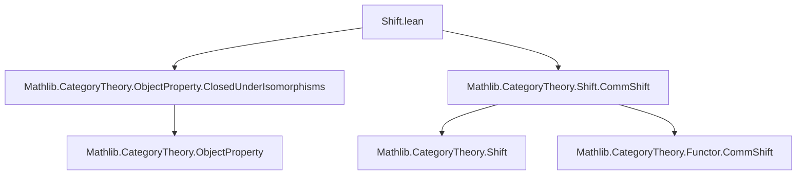

Here is the structured technical metadata extracted from `Shift.lean`:

---

### **1. Key Definitions & Theorems**

| Name | Type / Signature | Purpose |
|------|------------------|---------|
| `shift` | `def shift (a : A) : ObjectProperty C := fun X => P (X⟦a⟧)` | Defines the *shifted predicate* $P.shift\ a$ by $a \in A$: $X \mapsto P(X[a])$. |
| `prop_shift_iff` | `lemma prop_shift_iff (a : A) (X : C) : P.shift a X ↔ P (X⟦a⟧)` | Equivalence expressing the definition of `shift`. |
| `IsStableUnderShiftBy` | `class IsStableUnderShiftBy (a : A) : Prop where le_shift : P ≤ P.shift a` | Typeclass stating $P X \Rightarrow P(X[a])$ for a fixed $a$. |
| `le_shift` | `lemma le_shift (a : A) [P.IsStableUnderShiftBy a] : P ≤ P.shift a` | Projection of the class witness. |
| `shift_zero` | `lemma shift_zero [P.IsClosedUnderIsomorphisms] : P.shift (0 : A) = P` | Shift by zero is equivalent to original predicate (up to iso-closure). |
| `shift_shift` | `lemma shift_shift (a b c : A) (h : a + b = c) [P.IsClosedUnderIsomorphisms] : (P.shift b).shift a = P.shift c` | Compatibility of shift with addition: shifting by $b$ then $a$ equals shifting by $a + b = c$. |
| `IsStableUnderShift` | `class IsStableUnderShift where isStableUnderShiftBy (a : A) : P.IsStableUnderShiftBy a` | Typeclass stating stability under *all* shifts by $A$. |
| `prop_shift_iff_of_isStableUnderShift` | `lemma prop_shift_iff_of_isStableUnder_shift {G : Type*} [AddGroup G] ... (X : C) (g : G) : P (X⟦g⟧) ↔ P X` | In presence of group structure and stability, shift is invertible: $P(X[g]) \Leftrightarrow P(X)$. |
| `hasShift` | `noncomputable instance hasShift : HasShift P.FullSubcategory A` | Induces a shift on the full subcategory defined by $P$, assuming stability. |
| `commShiftι` | `instance commShiftι : P.ι.CommShift A` | The inclusion $\iota : P.\text{FullSubcategory} \to C$ commutes with shifts. |
| `lift.CommShift` | `noncomputable instance [F.CommShift A] : (P.lift F hF).CommShift A` | Lifts shift structure along a functor $F$ valued in $P$-objects. |
| `inverseImage.IsStableUnderShift` | `instance (F : E ⥤ C) [F.CommShift A] : (P.inverseImage F).IsStableUnderShift A` | Stability descends along pullback of $P$ along $F$. |

---

### **2. Naming Conventions**

- **Prefixes**:
  - `shift_`: for operations/lemmas involving shifting predicates or functors.
  - `isStableUnderShift`: for stability properties (by element or whole monoid/group).
  - `prop_`: for propositional equivalences/characterizations (e.g., `prop_shift_iff`).
  - `lift_`, `inverseImage_`: for constructions involving functors and pullbacks.

- **Suffixes**:
  - `_by`: in `IsStableUnderShiftBy`, indicating dependency on a single shift parameter.
  - `_iso`: in `shiftFunctorZero`, `shiftFunctorAdd'`, indicating use of isomorphisms from functoriality.

- **Notable patterns**:
  - `P.shift a` — shifted predicate.
  - `X⟦a⟧` — shift action of $a$ on object $X$.
  - `P ≤ Q` — pointwise implication between predicates.

---

### **3. Tactic Stack**

Frequently used tactics in proofs:
- `ext` — extensionality for predicates/functors.
- `exact`, `refine`, `rw`, `simp` — basic rewriting and solving.
- `intro`, `rintro`, `cases` — for destructuring hypotheses.
- `convert`, `apply`, `assumption` — for constructing morphisms/proofs.
- `aesop` — not explicitly used here, but `simp` + `rw` dominate.
- `exact?` / `infer_instance` — for typeclass resolution.

---

### **4. Proof Logic**

- **Structure of proofs**:
  - Most lemmas are *extensionality-based*: prove equality of predicates/functors by showing pointwise equivalence.
  - Use of `P.prop_of_iso` and `P.prop_iff_of_iso` to transport properties along isomorphisms (enabled by `IsClosedUnderIsomorphisms`).
  - Induction or algebraic manipulation on $A$ (monoid/group) via `shift_zero`, `shift_shift`, and group inverse (`-g`).
  - For stability under constructions (e.g., `isoClosure`, `lift`, `inverseImage`), proofs follow the universal property: construct witnesses using stability of $P$ and functoriality.

- **Typical flow**:
  1. Unfold definitions (`ext`, `rw [shift]`).
  2. Apply stability or iso-closure assumptions.
  3. Use functoriality of shift (`shiftFunctorZero`, `shiftFunctorAdd'`) to relate shifted objects.
  4. Conclude via `iff rfl` or `prop_of_iso`.

---

### **5. Imports**

- `Mathlib.CategoryTheory.ObjectProperty.ClosedUnderIsomorphisms`  
  → Provides `IsClosedUnderIsomorphisms` typeclass and `prop_of_iso`.
- `Mathlib.CategoryTheory.Shift.CommShift`  
  → Provides `HasShift`, `CommShift`, `shiftFunctor`, and related lemmas.

---

### **6. Mermaid Diagrams**

#### **Dependency Graph (Module-Level)**



#### **Overview of Theory Flow**

```mermaid
flowchart LR
  P[Predicate P on Ob C] -->|shift by a ∈ A| P_shift_a[P.shift a]
  P_shift_a -->|stability| P_le_P_shift[P ≤ P.shift a]
  P_le_P_shift -->|for all a| P_stab[IsStableUnderShift A]
  P_stab -->|induces| FullSubcat_shift[HasShift on P.FullSubcategory]
  FullSubcat_shift -->|inclusion| ι_comm[P.ι.CommShift A]
  F[F : E ⥤ C] -->|F values in P| P_lift_F[P.lift F hF]
  P_lift_F -->|if F.CommShift| lift_comm[(P.lift F hF).CommShift]
  F -->|inverse image| inv_img[(P.inverseImage F)]
  inv_img -->|if F.CommShift| inv_img_stab[IsStableUnderShift A]
```

---

Let me know if you'd like a formalization of the core lemmas in a separate file or a summary of how this fits into the broader theory of *sheaves with shift* or *periodic objects*.
