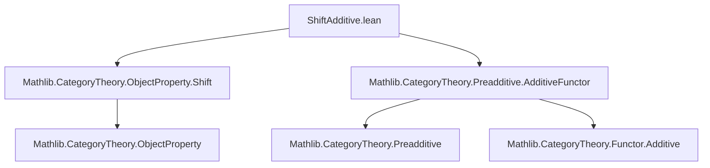

**Technical Brief: `ShiftAdditive.lean`**

---

### 1. **Key Definitions & Theorems**

| Name | Type / Signature | Purpose |
|------|------------------|---------|
| `shiftFunctor C n` | `C ⥤ C` | The shift functor associated to an element `n : A` in a category `C` equipped with a shift by additive monoid `A`. |
| `P.IsStableUnderShift A` | `Prop` | Predicate asserting that the object property `P` is stable under the shift functors indexed by `A`. |
| `P.ι : P.FullSubcategory ⥤ C` | Faithful functor | The inclusion of the full subcategory defined by `P` into `C`. |
| `P.ι.commShiftIso n` | `(shiftFunctor C n).comp P.ι ≅ P.ι.comp (shiftFunctor P.FullSubcategory n)` | Natural isomorphism expressing compatibility of the inclusion with shift functors. |
| **Main theorem (instance)** | `{(shiftFunctor C n).Additive} → {(shiftFunctor P.FullSubcategory n).Additive}` | If the shift functor on `C` is additive and `P` is stable under shift, then the induced shift on the full subcategory `P.FullSubcategory` is also additive. |

---

### 2. **Naming Conventions**

- **Prefixes / Suffixes**:
  - `shiftFunctor _ _`: denotes shift functors parameterized by monoid element.
  - `IsStableUnderShift`: predicate naming pattern for stability under shift.
  - `commShiftIso`: indicates an isomorphism expressing *commutativity up to iso* between inclusion and shift.
  - `FullSubcategory`: standard Lean category theory notation for full subcategory defined by an object property.
  - `ι`: standard symbol for inclusion functor of a subcategory.

---

### 3. **Tactic Stack**

- `have := ...`: to introduce intermediate facts (here, an isomorphism).
- `Functor.additive_of_iso`: used to transport additivity along isomorphisms of functors.
- `Functor.additive_of_comp_faithful`: used to deduce additivity of a functor from additivity of a composite with a faithful functor.
- `apply ...`: to apply the above lemmas in sequence.

No heavy automation (e.g., `aesop`, `ring`, `simp`) is used — the proof is mostly algebraic/categorical reasoning.

---

### 4. **Proof Logic**

1. Assume `P` is stable under shift and `(shiftFunctor C n).Additive`.
2. Use stability to obtain the natural isomorphism `P.ι.commShiftIso n`.
3. Apply `Functor.additive_of_iso` to transport additivity along the inverse isomorphism.
4. Use `Functor.additive_of_comp_faithful` with the faithful inclusion `P.ι` to conclude that the shift on the full subcategory is additive.

**Logical flow**:  
> *Given* additivity on ambient category + stability under shift ⇒ *deduce* additivity on full subcategory via factorization through faithful inclusion and isomorphism.

---

### 5. **Imports**

- `Mathlib.CategoryTheory.ObjectProperty.Shift`: defines shift functors and stability conditions for object properties.
- `Mathlib.CategoryTheory.Preadditive.AdditiveFunctor`: provides lemmas about additive functors, especially `Functor.additive_of_iso` and `Functor.additive_of_comp_faithful`.

These imports define the core categorical and additive-theoretic infrastructure used.

---

### 6. **Mermaid Diagrams**

#### **Dependency Graph (Module Level)**



#### **Overview of Theoretical Flow**

```mermaid
graph LR
  C[Preadditive Category C] -->|shift by A| C
  P[Object Property P] -->|stable under shift| C
  P -->|Full subcategory| P.FullSubcategory
  P.FullSubcategory -->|ι faithful| C
  shift_C_n[shiftFunctor C n] -->|additive| C
  shift_P_n[shiftFunctor P.FullSubcategory n] -->|? additive| P.FullSubcategory
  shift_C_n -.->|iso via ι.commShiftIso| shift_P_n
  shift_P_n <--additive--|Functor.additive_of_iso + comp_faithful| shift_C_n
```

---

### 7. **Summary**

This file formalizes a key stability property of additive shift functors under passage to full subcategories defined by shift-stable object properties. It is a small but crucial lemma for building derived or stable homotopy-theoretic contexts in preadditive settings (e.g., in the development of triangulated or stable ∞-categories). Its modular placement (`separate file to reduce imports`) reflects Lean’s emphasis on modularity and import economy.
