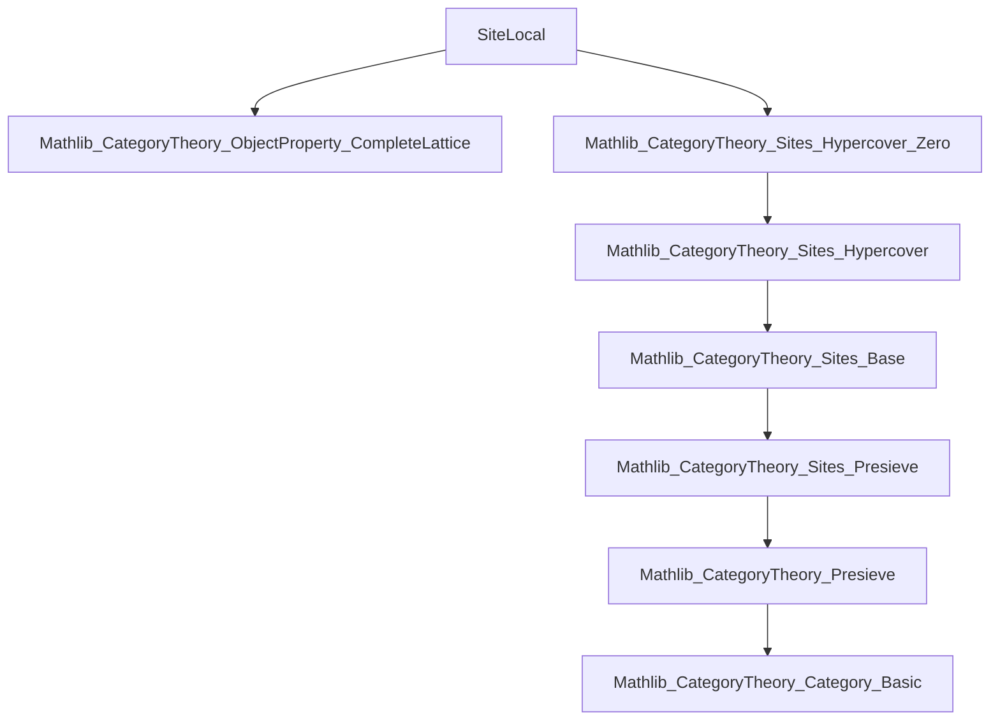

**Technical Brief: `SiteLocal.lean`**

---

### 1. KEY DEFINITIONS & THEOREMS

| Name | Type / Signature | Purpose |
|------|------------------|---------|
| `IsLocal` | `class IsLocal (P : ObjectProperty C) (K : Precoverage C) extends IsClosedUnderIsomorphisms P` | Defines when an object property `P` is *local* with respect to a precoverage `K`: `P X ↔ ∀ (f ∈ R), P Y` for all `R ∈ K X` and `f : Y → X` in the presieve. |
| `IsLocal.component` | `{X : C} {R : Presieve X} (hR : R ∈ K X) {Y : C} (f : Y ⟶ X) (hf : R f) : P X → P Y` | “Restriction” direction: if `P X` holds, then `P Y` holds for all maps `f` in a `K`-cover. |
| `IsLocal.of_presieve` | `{X : C} {R : Presieve X} (hR : R ∈ K X) (H : ∀ ⦃Y⦄ ⦃f : Y ⟶ X⦄, R f → P Y) : P X` | “Gluing” direction: if `P` holds on all elements of a `K`-cover presieve, then it holds on the base object. |
| `iff_of_presieve` | `P X ↔ ∀ ⦃Y⦄ ⦃f : Y ⟶ X⦄, R f → P Y` | Equivalence version of locality for a given presieve `R ∈ K X`. |
| `mk_of_zeroHypercover` | `P.IsClosedUnderIsomorphisms → (∀ 𝒰, P X ↔ ∀ i, P (𝒰.X i)) → P.IsLocal K` | Constructs `P.IsLocal K` using zero hypercovers (a special kind of cover in the hypercover tower). |
| `of_le` | `IsLocal P L → K ≤ L → IsLocal P K` | Monotonicity: locality descends along coarser precoverages. |
| `top` | `IsLocal (⊤ : ObjectProperty C) K` | The top (always-true) property is always local. |
| `inf` | `[IsLocal P K] → [IsLocal Q K] → IsLocal (P ⊓ Q) K` | Locality is preserved under binary infimum (conjunction) of properties. |
| `of_zeroHypercover` | `[P.IsLocal K] → 𝒰 : K.ZeroHypercover X → (∀ i, P (𝒰.X i)) → P X` | Direct gluing over a zero hypercover. |
| `iff_of_zeroHypercover` | `[P.IsLocal K] → 𝒰 : K.ZeroHypercover X → P X ↔ ∀ i, P (𝒰.X i)` | Equivalence version of locality for zero hypercovers. |

---

### 2. NAMING CONVENTIONS

- **Prefixes**:
  - `is_` / `Is_`: for class names (`IsLocal`, `IsClosedUnderIsomorphisms`).
  - `of_`: for “gluing” or “from” directions (e.g., `of_presieve`, `of_zeroHypercover`).
  - `mk_`: for constructor lemmas (`mk_of_zeroHypercover`).
- **Suffixes**:
  - `_of_`: for derived properties from a stronger condition (`of_le`, `of_zeroHypercover`).
  - `iff_of_`: for biconditional versions (`iff_of_presieve`, `iff_of_zeroHypercover`).
- **Notation**:
  - `P X`, `𝒰.X i`: evaluation of object property / hypercover at object / index.
  - `R f`: membership of morphism `f` in presieve `R`.
  - `𝒰.mem₀`: proof that a zero hypercover is a valid cover.

---

### 3. TACTIC STACK

Frequently used tactics in proofs:

| Tactic | Usage |
|--------|-------|
| `rw` | Rewriting using equivalences (`iff_of_presieve`, `H 𝒰`) and definitions (`mem_iff_exists_zeroHypercover`). |
| `obtain` / `cases` | Extracting witnesses from existential statements (e.g., `𝒰`, `⟨i⟩`). |
| `simp` | Simplifying trivial goals (used in `top`, `inf` instances). |
| `intro` / `exact` | Standard intro/apply style in `component` and `of_presieve`. |
| `aesop` (implied) | Not explicitly used, but could replace `by simp` in some cases. |
| `ring` (not used) | Not needed here — no arithmetic. |

---

### 4. PROOF LOGIC

- **Structure of proofs**:
  - Most proofs follow a *two-directional* pattern: prove `→` and `←` separately.
  - For `IsLocal` class proofs: verify both `component` (restriction) and `of_presieve` (gluing).
  - When using zero hypercovers:
    - Use `mem_iff_exists_zeroHypercover` to rewrite membership in `K X`.
    - Reduce to indexing over `𝒰.X i`, then apply hypothesis over indices.
- **Induction / recursion**: Not used — all arguments are categorical and pointwise.
- **Key logical flow**:
  1. Assume locality or hypercover condition.
  2. Unfold definitions (`mem_iff_exists_zeroHypercover`, `IsLocal.component`, etc.).
  3. Use indexing to reduce to known cases (`𝒰.X i`).
  4. Apply hypothesis or construct witness.

---

### 5. IMPORTS

| Import | Purpose |
|--------|---------|
| `Mathlib.CategoryTheory.ObjectProperty.CompleteLattice` | Provides lattice structure on `ObjectProperty C`, including `⊤`, `⊔`, `⊓`, etc. |
| `Mathlib.CategoryTheory.Sites.Hypercover.Zero` | Defines zero hypercovers and their relation to precoverages (`mem_iff_exists_zeroHypercover`). |

---

### 6. DEPENDENCY & THEORY OVERVIEW (Mermaid Diagrams)

#### Dependency Graph (Module Level)



#### Overview of `SiteLocal.lean`

```mermaid
flowchart LR
  A[ObjectProperty C] --> B[IsClosedUnderIsomorphisms P]
  B --> C[IsLocal P K]
  C --> D[component: restriction]
  C --> E[of_presieve: gluing]
  C --> F[iff_of_presieve]
  C --> G[mk_of_zeroHypercover]
  C --> H[of_le]
  C --> I[top instance]
  C --> J[inf instance]
  C --> K[of_zeroHypercover]
  C --> L[iff_of_zeroHypercover]
  G --> M[ZeroHypercover K X]
  M --> N[𝒰.X i]
  N --> O[P (𝒰.X i)]
```

#### Theory Context

- **Domain**: Category theory, specifically *site theory* and *sheaf-like locality conditions*.
- **Goal**: Formalize when an object property descends/ascends along covers — foundational for descent theory and sheafification.
- **Key abstraction**: `Precoverage` and `ZeroHypercover` provide a flexible notion of “cover” (weaker than Grothendieck topology).
- **Novelty**: Uses *zero hypercovers* (level-0 hypercovers) to simplify locality checks, avoiding full hypercover machinery.

---

Let me know if you'd like a formalization roadmap for extending this module (e.g., to Grothendieck topologies, sheaves, or cohomological descent).
