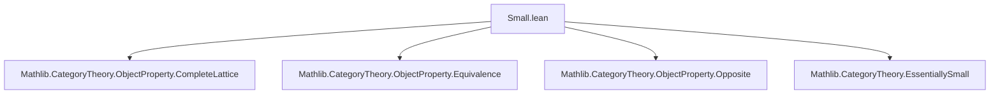

### Technical Brief: `Small.lean` — Smallness and Essential Smallness of Object Properties

---

#### **1. Key Definitions & Theorems**

| Name | Type / Signature | Purpose |
|------|------------------|---------|
| `ObjectProperty.Small.{w} P` | `abbrev` | Says that the subtype `{X : C // P X}` is small (i.e., equivalent to a type in universe `w`). |
| `ObjectProperty.EssentiallySmall.{w} P` | `class` | Says that `P` is *contained* in the isomorphism-closure of a small property: `∃ Q : ObjectProperty C, Small Q ∧ P ≤ Q.isoClosure`. |
| `small_of_surjective` / `small_of_injective` | Lemmas | Standard tools to prove smallness via surjective/injective maps to/from small types. |
| `small_op_iff`, `small_unop_iff` | `@[simp] lemma` | Equivalence between smallness of `P` and its opposite/unop. |
| `essentiallySmall_op_iff`, `essentiallySmall_unop_iff` | `@[simp] lemma` | Equivalence between essential smallness of `P` and its opposite/unop. |
| `exists_equivalence_iff` | `lemma` | Characterizes essential smallness of `P` by existence of an equivalence `P.FullSubcategory ≌ J` for some small `J`. |
| `exists_equivalence_iff_of_locallySmall` | `lemma` | Special case for `⊤`, i.e., `C ≌ J` iff `C` is essentially small. |
| `Small.of_le` | `lemma` | If `P ≤ Q` and `Q` is small, then `P` is small. |
| `EssentiallySmall.of_le` | `lemma` | If `P ≤ Q` and `Q` is essentially small, then `P` is essentially small. |
| `instance` for `P ⊓ Q`, `P ⊔ Q`, `⨆ a, P a` | `instance` | Closure properties: smallness/essential smallness preserved under finite meets, joins, and indexed suprema. |
| `instance` for `P.strictMap F`, `P.map F` | `instance` | Stability under functors: if `P` is (essentially) small, so is its pullback along `F`. |
| `instance` for `P.FullSubcategory` | `instance` | If `P` is essentially small and `C` is locally small, then its full subcategory is essentially small. |

---

#### **2. Naming Conventions**

- **Prefixes**:
  - `Small.` / `EssentiallySmall.` — namespace for definitions and instances.
  - `small_` / `essentiallySmall_` — used in lemmas and instances (e.g., `small_of_surjective`, `essentiallySmall_of_small_of_locallySmall`).
- **Suffixes**:
  - `_iff` — for equivalences (e.g., `small_op_iff`, `essentiallySmall_unop_iff`).
  - `_of_le` — for monotonicity lemmas.
  - `_of_small_of_locallySmall` — for combining smallness with local smallness.
- **Operational terms**:
  - `op`, `unop`, `isoClosure`, `FullSubcategory`, `strictMap`, `map` — standard categorical constructions.

---

#### **3. Tactic Stack**

Frequently used tactics in proofs:

| Tactic | Role |
|--------|------|
| `aesop` | Automated reasoning for simple goals (e.g., discharging `or`, `and`, `exists` intro/elim). |
| `simp` / `simp only` | Simplification using `@[simp]` lemmas, especially for `Subtype`, `Sum`, `Sigma`, `funext`. |
| `rwa` | Rewrite + assumption (used in `essentiallySmall_op_iff`, etc.). |
| `rw` | Rewriting using equivalences or definitions. |
| `exact`, `refine`, `obtain` | Proof construction and destructuring. |
| `infer_instance` | Automatically infer class instances. |
| `simpa` | Simplify and discharge goal using assumptions. |
| `dsimp` | Definitional simplification (e.g., unfolding `pair`). |
| `tauto` | Tactic for propositional logic (used in `Set.mem_range` reasoning). |

---

#### **4. Proof Logic**

- **Inductive/structural style**: Most proofs follow a pattern:
  1. **Unfold definitions** (`dsimp`, `rw`, `simp only`).
  2. **Apply smallness criteria** via `small_of_surjective` / `small_of_injective`.
  3. **Construct explicit maps** (e.g., from `Subtype P ⊕ Subtype Q → Subtype (P ⊔ Q)`).
  4. **Use closure properties** (e.g., `Small.of_le`, `EssentiallySmall.of_le`) to reduce to known cases.
  5. **Leverage equivalences** (`small_congr`, `essentiallySmall_congr`) to transfer smallness across isomorphic constructions.

- **Key logical flow**:
  - For *smallness*: reduce to existence of a surjection/injection from/to a small type.
  - For *essential smallness*: extract a small `Q ≤ P.isoClosure`, then use monotonicity and closure under operations.
  - For *equivalence characterizations*: construct functors using `ιOfLE`, `Shrink`, and `equivSmallModel`.

---

#### **5. Imports**

| Module | Purpose |
|--------|---------|
| `Mathlib.CategoryTheory.ObjectProperty.CompleteLattice` | Lattice structure on `ObjectProperty C`. |
| `Mathlib.CategoryTheory.ObjectProperty.Equivalence` | Equivalences between full subcategories. |
| `Mathlib.CategoryTheory.ObjectProperty.Opposite` | Opposite/unop operations on object properties. |
| `Mathlib.CategoryTheory.EssentiallySmall` | General theory of essentially small categories (used for `C ≌ J`). |

---

#### **6. Mermaid Diagrams**

##### **Dependency Graph (Module-Level)**



##### **Conceptual Overview of Theory**

```mermaid
flowchart LR
  P[ObjectProperty C] -->|Small.{w}| S[Subtype P is small]
  P -->|EssentiallySmall.{w}| EC[∃ small Q, P ≤ Q.isoClosure]
  S -->|closure| Inf[meet P ⊓ Q]
  S -->|closure| Sup[join P ⊔ Q]
  S -->|closure| SupI[⨆ a, P a]
  EC -->|closure| InfE[meet]
  EC -->|closure| SupE[join]
  EC -->|closure| SupIE[⨆]
  P -->|Functoriality| F[P.map F]
  P -->|Opposite| Op[P.op]
  P -->|FullSubcategory| FS[P.FullSubcategory]
  S & LocallySmall -->|instance| FS
  EC & LocallySmall -->|instance| FS
  S -->|equivalence| E[∃ J small, P.FullSubcategory ≌ J]
  EC -->|equivalence| E
```

##### **Proof Strategy Flow (Example: `P ⊔ Q` small)**

```mermaid
flowchart TD
  A[Assume Small P, Small Q] --> B[Consider Subtype (P ⊔ Q) ≃ Subtype P + Subtype Q]
  B --> C[Use small_of_surjective from Sum]
  C --> D[Construct surjection: inl/inr ↦ ⟨x, or.inl/inr⟩]
  D --> E[Show surjectivity via aesop]
  E --> F[Conclude Small (P ⊔ Q)]
```

---

#### **7. Summary**

This file formalizes *smallness* and *essential smallness* for object properties in category theory, building on the lattice structure of `ObjectProperty`. It provides:

- A clean abstraction: `Small P ↔ Small (Subtype P)`.
- Closure under all standard categorical constructions: meets, joins, suprema, opposites, functorial pullbacks, full subcategories (under local smallness).
- A characterization of essential smallness via equivalence to a small category.
- A bridge between *small* (strictly small subtype) and *essentially small* (up to isomorphism), mirroring the distinction in category theory between small categories and essentially small ones.

This is foundational for higher-categorical and homotopical applications where size conditions are critical (e.g., presentable categories, Grothendieck universes, sheaf theory).
