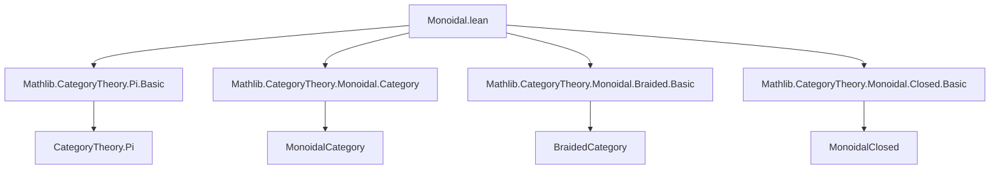
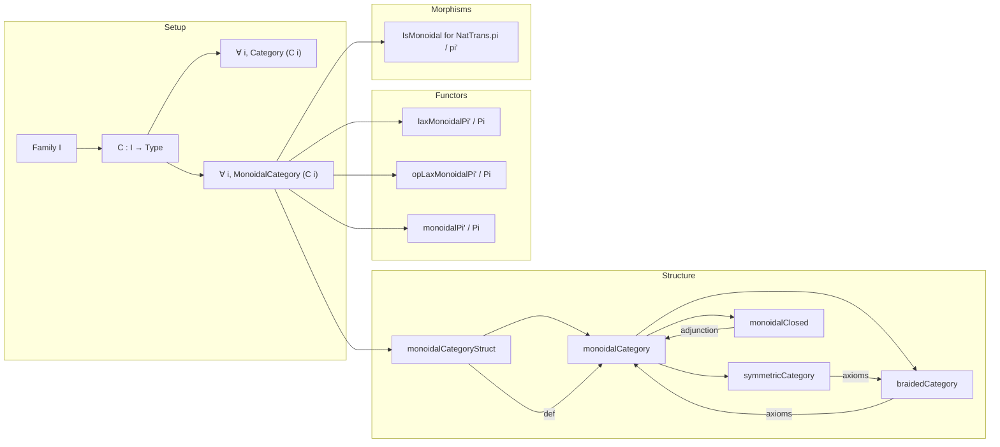

### Technical Brief: `Monoidal.lean`

---

#### **1. Key Definitions & Theorems**

| Name | Type / Purpose |
|------|----------------|
| `monoidalCategoryStruct` | Instance defining the *pointwise* monoidal structure on `Π i, C i`: tensor object, tensor morphism, unit, associator, unitors. |
| `monoidalCategory` | Instance upgrading `monoidalCategoryStruct` to a full `MonoidalCategory` (verifies coherence axioms via `tensorHom_def`). |
| `braidedCategory` | Instance showing that if each `C i` is braided, then `Π i, C i` inherits a braided structure pointwise. |
| `symmetricCategory` | Instance showing symmetry lifts pointwise from each `C i`. |
| `ihom` | Internal hom functor `X ⟶ -` defined pointwise: `(ihom X Y) i = X i ⟶[C i] Y i`. |
| `closedUnit`, `closedCounit` | Unit and counit of the adjunction `tensorLeft X ⊣ ihom X`, defined pointwise. |
| `monoidalClosed` | Instance equipping `Π i, C i` with a closed monoidal structure when each `C i` is closed. |
| `Pi.eval C i` | Evaluation functor at `i`; instance shows it is *strictly* monoidal (all structure maps are identities). |
| `laxMonoidalPi'`, `opLaxMonoidalPi'`, `monoidalPi'` | Instances lifting lax/oplax/monoidal functors `D → Π i, C i` (via `Functor.pi'`) from pointwise data. |
| `laxMonoidalPi`, `opLaxMonoidalPi`, `monoidalPi` | Analogous for functors `∀ i, D i → C i` (via `Functor.pi`). |
| `IsMonoidal` for `NatTrans.pi'` / `NatTrans.pi` | Natural transformations between product functors inherit monoidality pointwise. |

**Simp lemmas** (e.g., `associator_hom_apply`, `braiding_hom_apply`, `isoApp_*`) ensure that applying structure morphisms componentwise recovers the component-wise structure in each `C i`.

---

#### **2. Naming Conventions**

- **Prefixes / Suffixes**:
  - `monoidal*`, `braided*`, `symmetric*`, `closed*`: denote structure instances.
  - `*Hom`, `*Obj`: morphism / object parts of functors or natural transformations.
  - `*Unit`, `*Counit`: unit/counit of adjunctions.
  - `isoApp_*`, `hom_apply`, `inv_apply`: componentwise behavior of isomorphisms/morphisms.
  - `laxMonoidal*`, `opLaxMonoidal*`, `monoidal*`: for lifting structure to product functors.
  - `IsMonoidal`: for natural transformations preserving monoidal structure.

- **No overloading of `tensor`**: always qualified as `tensorObj`, `tensorHom`, `tensorLeft`, etc.

---

#### **3. Tactic Stack**

- **`ext`**: used repeatedly to prove equality of natural transformations / morphisms by extensionality (componentwise).
- **`simp` / `simp_rw`**: heavily used in `@[simp]` lemmas and proofs to reduce to componentwise definitions.
- **`rfl`**: for trivial equalities (e.g., componentwise definitions match).
- **`apply`**: in proofs like `hexagon_forward`, `symmetry`, where componentwise application suffices.
- **`simpa`**: in `IsMonoidal` proofs to discharge goals using assumptions per component.

---

#### **4. Proof Logic**

- **Structure lifting**: Most proofs follow a *componentwise* pattern:
  1. Define structure (e.g., tensor, associator) pointwise.
  2. Prove coherence axioms (e.g., pentagon, hexagon) by `ext i; apply axiom_in_Ci`.
  3. Use `@[simps]` to ensure definitional equality of components.
- **Adjunctions**: For closed structure, construct unit/counit pointwise and verify triangle identities via `ext i; simp`.
- **Functor lifting**: For `Functor.pi` / `Functor.pi'`, define structure maps componentwise and verify naturality/coherence using `ext i; simp`.

---

#### **5. Imports**

| Module | Purpose |
|--------|---------|
| `Mathlib.CategoryTheory.Pi.Basic` | Product categories, evaluation functors, `Pi.eval`, `Functor.pi`, `Functor.pi'`. |
| `Mathlib.CategoryTheory.Monoidal.Category` | Basic monoidal category definitions (`MonoidalCategory`, `tensorObj`, `associator`, etc.). |
| `Mathlib.CategoryTheory.Monoidal.Braided.Basic` | Braided and symmetric monoidal categories. |
| `Mathlib.CategoryTheory.Monoidal.Closed.Basic` | Closed monoidal categories, internal hom, `ihom`, `ev`, `coev`. |

---

#### **6. Mermaid Diagrams**

##### **Dependency Graph (Module-Level)**

##### **Overview of Theory Flow**

---

#### **7. Summary**

This file formalizes the *pointwise* monoidal structure on dependent products of monoidal categories (`Π i, C i`). It systematically lifts:
- Monoidal, braided, symmetric, and closed structures,
- Lax/oplax/monoidal functors and natural transformations,
- Evaluation functors (`Pi.eval`) as strict monoidal.

All constructions are *definitional* in components, verified via extensionality and `simp`-friendly lemmas. The design reflects Lean’s emphasis on *definitional equality* and *componentwise reasoning* in dependent types.

--- 

Let me know if you'd like a formalized dependency graph in `leanpkg` format or a visualization of the coherence proofs.
