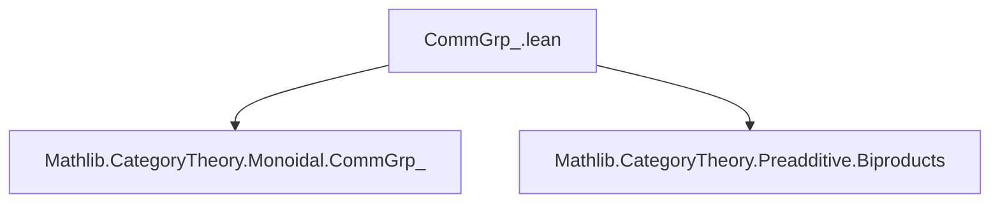
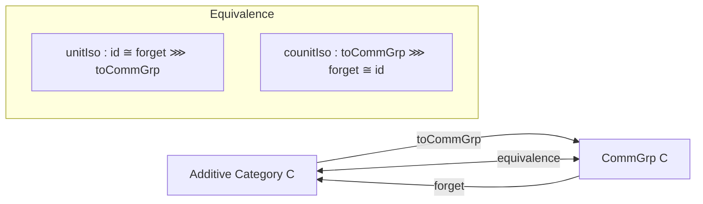
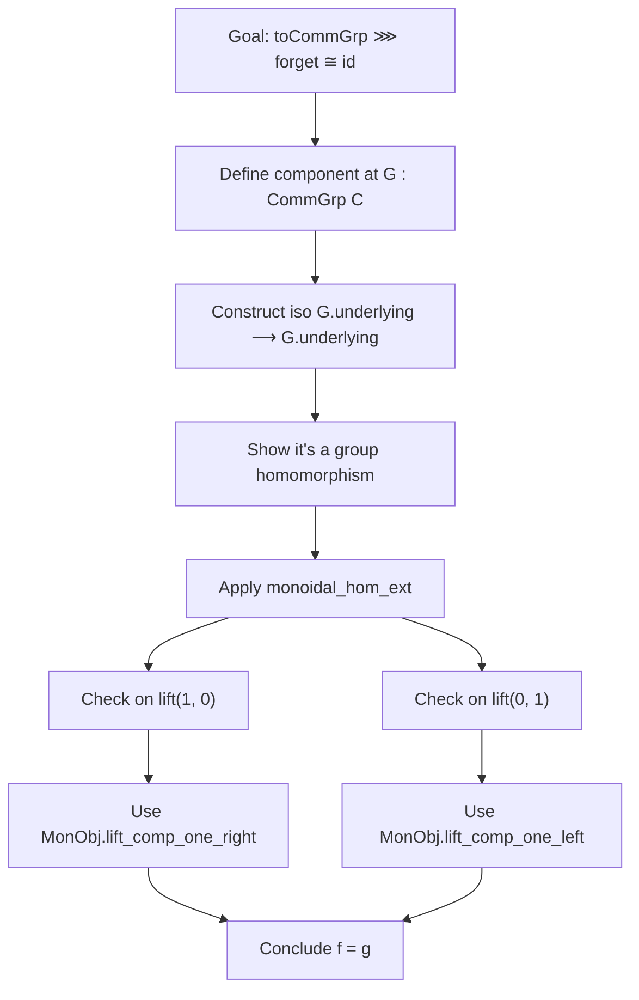

**Technical Brief: `CommGrp_.lean`**

---

### 1. **Key Definitions & Theorems**

| Name | Type / Signature | Purpose |
|------|------------------|---------|
| `GrpObj` | `instance (X : C) : GrpObj X` | Equips every object $X$ in a preadditive cartesian monoidal category with a *group object structure*, where multiplication is $+ \circ \langle \pi_1, \pi_2 \rangle$, unit is $0$, and inverse is $-1_X$. |
| `IsCommMonObj` | `instance (X : C) : IsCommMonObj X` | Shows the above group object is *commutative*, using `add_comm`. |
| `toCommGrp` | `def toCommGrp : C ⥤ CommGrp C` | Canonical functor sending an object $X$ to the commutative group object $\langle X \rangle$, and a morphism $f$ to the induced group homomorphism. |
| `monoidal_hom_ext` | `private theorem monoidal_hom_ext {X Y Z : C} {f g : X ⊗ Y ⟶ Z}` | A technical extensionality lemma: two morphisms out of $X \otimes Y$ are equal if they agree precomposed with the two canonical inclusions $X \to X \otimes Y$ and $Y \to X \otimes Y$. |
| `commGrpEquivalenceAux` | `def commGrpEquivalenceAux : CommGrp.forget C ⋙ toCommGrp C ≅ 𝟭 (CommGrp C)` | Constructs the natural isomorphism showing that composing the forgetful functor with `toCommGrp` is naturally isomorphic to the identity on `CommGrp C`. |
| `commGrpEquivalence` | `def commGrpEquivalence : C ≌ CommGrp C` | Main theorem: the canonical functor `toCommGrp` is an *equivalence of categories* between an additive category $C$ and its category of commutative group objects. |

---

### 2. **Naming Conventions**

- **Prefixes**:
  - `is_`: e.g., `IsCommMonObj`, indicating a *property* (not structure).
  - `GrpObj`: indicates *group object structure* on an object.
  - `to_`: e.g., `toCommGrp`, for canonical constructions.
  - `commGrp_`: e.g., `commGrpEquivalence`, naming scheme for results about `CommGrp`.

- **Suffixes**:
  - `_hom`: for morphism parts of constructions (e.g., `lift_hom`, `tensorHom`).
  - `_obj`: for object parts (e.g., `toCommGrp_obj_X`, `toCommGrp_obj_grp`).
  - `_aux`: for auxiliary definitions used in proofs (e.g., `commGrpEquivalenceAux`).

- **Notable patterns**:
  - `lift` used for universal property of biproducts/tensor products.
  - `InducedCategory.homMk` used to lift morphisms into `CommGrp`.
  - `Grp.homMk''` for constructing group homomorphisms.

---

### 3. **Tactic Stack**

| Tactic | Usage Frequency | Purpose |
|--------|-----------------|---------|
| `simp` | Very High | Simplifies using `@[simps]`, `@[simps!]`, and definitional equalities (e.g., `mul_def`, `tensorHom_id`). |
| `exact` / `refine` | High | For constructing isomorphisms and natural transformations. |
| `convert` | Medium | Used to align goals modulo definitional equalities (e.g., in `commGrpEquivalenceAux`). |
| `cat_disch` | Low | Category-theoretic tactic to discharge trivial categorical goals. |
| `infer_instance` | Medium | To resolve typeclass instances (e.g., `Preadditive`, `CartesianMonoidalCategory`). |
| `monoidal_hom_ext` | Medium | Custom lemma applied via `apply`/`exact`. |
| `rw` / `simp_rw` | Not present | Not used — `simp` suffices. |
| `aesop` / `linarith` | Not present | Not needed — proofs are mostly definitional or categorical. |

---

### 4. **Proof Logic**

- **Structure**:
  1. **Construct group object structure** on any object $X$ using additive structure:
     - Unit = zero morphism $0$,
     - Multiplication = addition $+ : X \times X \to X$,
     - Inverse = negation $- : X \to X$.
  2. **Verify group axioms** using `simp` and properties of preadditive categories (`add_assoc`, `add_zero`, etc.).
  3. **Verify commutativity** using `add_comm`.
  4. **Define `toCommGrp`** as the identity on objects and morphisms, lifted to `CommGrp`.
  5. **Prove equivalence**:
     - `unitIso` is trivial (`Iso.refl`).
     - `counitIso` (`commGrpEquivalenceAux`) requires checking that the induced group homomorphism from $X$ to itself (via `toCommGrp`) is the identity — done by checking equality on the two canonical inclusions using `monoidal_hom_ext`.
     - The two checks correspond to verifying:
       - $f \circ \iota_1 = \iota_1$,
       - $f \circ \iota_2 = \iota_2$,
       where $\iota_1 = \mathrm{lift}(\mathbf{1}_X, 0)$, $\iota_2 = \mathrm{lift}(0, \mathbf{1}_Y)$.

- **Key insight**: In additive categories, the *additive* structure (biproducts, zero morphisms, addition) encodes the *multiplicative* structure of commutative group objects.

---

### 5. **Imports**

| Import | Role |
|--------|------|
| `Mathlib.CategoryTheory.Monoidal.CommGrp_` | Defines `CommGrp`, group objects, and basic theory. |
| `Mathlib.CategoryTheory.Preadditive.Biproducts` | Provides biproducts, tensor product as biproduct, and related lemmas (e.g., `tensorProductIsBinaryProduct`, `binaryBiconeIsBilimitOfLimitConeOfIsLimit`). |

Other open imports:
- `CategoryTheory.Limits`
- `CategoryTheory.MonoidalCategory`
- `CategoryTheory.CartesianMonoidalCategory`

---

### 6. **Mermaid Diagrams**

#### **Dependency Graph (Module Level)**

#### **Theoretical Overview (Category Equivalence)**

#### **Proof Structure of `commGrpEquivalenceAux`**

---

### 7. **Domain-Specific AI Agent Notes**

- **Focus Areas**:
  - Understanding how additive structure encodes group object structure.
  - Leveraging `monoidal_hom_ext` for extensionality in tensor-hom contexts.
  - Using `simp` heavily with `@[simps]`/`@[simps!]` attributes.

- **Common Patterns**:
  - `lift` + `add` = biproduct universal property.
  - `Grp.homMk''` + `InducedCategory.homMk` = lifting morphisms to `CommGrp`.
  - `IsZero.iff_id_eq_zero` + `Subsingleton.elim` = proving morphisms are zero.

- **Suggested Tactics**:
  - `simp` with `add_comm`, `add_zero`, `add_left_neg`, `tensorHom_id`.
  - `apply monoidal_hom_ext` + `simp only [comp_add, lift_fst, lift_snd]`.
  - `convert` + `MonObj.lift_comp_one_left/right`.

--- 

Let me know if you'd like a formalized summary in Lean or a visualization of the `monoidal_hom_ext` proof.
