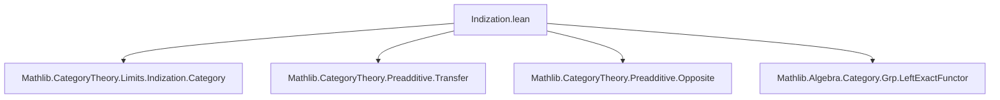

**Technical Brief: `Indization.lean`**

---

### 1. **Key Definitions & Theorems**

| Name | Type / Statement | Purpose |
|------|------------------|---------|
| `Preadditive (Ind C)` | `instance : Preadditive (Ind C)` | Shows the category of ind-objects over a preadditive category $C$ with finite colimits is itself preadditive. |
| `HasFiniteBiproducts (Ind C)` | `instance : HasFiniteBiproducts (Ind C)` | Establishes that finite biproducts exist in $\mathsf{Ind}(C)$, derived from finite coproducts. |
| `Ind.leftExactFunctorEquivalence C` | Equivalence `Ind C ≌ [Cᵒᵖ, AddCommGrp]ₗₑ𝒻ₜ` | The canonical equivalence between ind-objects in $C$ and left exact functors from $C$ to abelian groups. |
| `AddCommGrpCat.leftExactFunctorForgetEquivalence _` | Equivalence `[Cᵒᵖ, AddCommGrp]ₗₑ𝒻ₜ ≌ [Cᵒᵖ, Grp]ₗₑ𝒻ₜ]` | Relates left exact functors to abelian groups vs. general groups (used to transfer structure). |
| `ObjectProperty.fullyFaithfulι _` | Fully faithful inclusion of objects with a property into the functor category | Used to embed the category of left exact functors (with certain properties) fully faithfully. |
| `Preadditive.ofFullyFaithful` | Criterion to lift preadditivity along a fully faithful functor | Core tool: if $F : \mathcal{D} \to \mathcal{E}$ is fully faithful and $\mathcal{E}$ is preadditive, then $\mathcal{D}$ inherits preadditivity. |

---

### 2. **Naming Conventions**

- **Prefixes**:
  - `Ind.`: for constructions related to ind-objects (e.g., `Ind.leftExactFunctorEquivalence`).
  - `leftExactFunctor`: for categories/functors of left exact functors.
  - `fullyFaithful`: for functors or constructions relying on full faithfulness (e.g., `fullyFaithfulFunctor`, `fullyFaithfulι`).
- **Suffixes**:
  - `Equivalence`: for categorical equivalences.
  - `of_...`: for instances derived via a general criterion (e.g., `of_hasFiniteCoproducts`, `ofFullyFaithful`).
- **Category prefixes**:
  - `Preadditive`, `HasFiniteBiproducts`, `HasFiniteColimits`: typeclass predicates on categories.

---

### 3. **Tactic Stack**

- `instance := .ofFullyFaithful (...)`: uses the `ofFullyFaithful` constructor tactic (part of `Preadditive` typeclass).
- Implicit use of `simp`, `rw`, `convert`, `exact` in the background (via typeclass resolution and equational reasoning).
- No explicit tactic annotations (e.g., `by aesop`, `by ring`) — relies on Lean’s typeclass inference and definitional equality.

---

### 4. **Proof Logic**

The proof proceeds by **structural transfer**:

1. Start with $C$ preadditive, small, and with finite colimits.
2. Use the known equivalence:
   $$
   \mathsf{Ind}(C) \simeq \mathsf{Lex}({C}^{\mathrm{op}}, \mathsf{Ab})
   $$
   (via `Ind.leftExactFunctorEquivalence`).
3. Further identify $\mathsf{Lex}({C}^{\mathrm{op}}, \mathsf{Ab})$ with a full subcategory of $\mathsf{Lex}({C}^{\mathrm{op}}, \mathsf{Grp})$ via `AddCommGrpCat.leftExactFunctorForgetEquivalence`.
4. Embed this subcategory fully faithfully into a preadditive category (via `ObjectProperty.fullyFaithfulι`).
5. Apply `Preadditive.ofFullyFaithful` to conclude $\mathsf{Ind}(C)$ is preadditive.
6. For biproducts, use `HasFiniteBiproducts.of_hasFiniteCoproducts`, justified by finite colimits in $C$ implying finite coproducts in $\mathsf{Ind}(C)$.

---

### 5. **Imports**

| Module | Role |
|--------|------|
| `Mathlib.CategoryTheory.Limits.Indization.Category` | Defines $\mathsf{Ind}(C)$ and its basic properties. |
| `Mathlib.CategoryTheory.Preadditive.Transfer` | Tools for transferring preadditivity along functors (e.g., `ofFullyFaithful`). |
| `Mathlib.CategoryTheory.Preadditive.Opposite` | Basic facts about opposites of preadditive categories. |
| `Mathlib.Algebra.Category.Grp.LeftExactFunctor` | Theory of left exact functors into $\mathsf{Grp}$ / $\mathsf{Ab}$, including equivalences. |

---

### 6. **Mermaid Diagrams**

#### Dependency Graph (Module-Level)



#### Proof Strategy Overview

```mermaid
graph LR
  C[Preadditive C, finite colimits] --> Ind[Ind C]
  Ind --> Equiv1[Ind C ≃ Lex(Cᵒᵖ, Ab)]
  Equiv1 --> Equiv2[Lex(Cᵒᵖ, Ab) ≃ Lex(Cᵒᵖ, Grp)]
  Equiv2 --> Embed[Full subcat of [Cᵒᵖ, Grp]]
  Embed --> Preadd[Preadditive via fully faithful]
  C --> Coprod[Finite coproducts in Ind C]
  Coprod --> Biprod[Finite biproducts in Ind C]
```

#### Key Equivalences & Functors

```mermaid
graph LR
  IndC[Ind C] -- Equiv --> LexAb[Lex(Cᵒᵖ, Ab)]
  LexAb -- Forgetful --> LexGrp[Lex(Cᵒᵖ, Grp)]
  LexGrp -- fully faithful ι --> [Cᵒᵖ, Grp]
  IndC -- fully faithful --> [Cᵒᵖ, Grp]
```

---

### 7. **Summary**

This file establishes foundational structural properties of the indization construction: that if $C$ is a small preadditive category with finite colimits, then $\mathsf{Ind}(C)$ is preadditive and has finite biproducts. The proof leverages the equivalence between ind-objects and left exact functors, and transfers algebraic structure along fully faithful functors. It is a key step toward developing homological algebra in ind-categories (e.g., for derived categories of ind-objects).
